# AstrContinuum / 星续

English | [简体中文](./README.zh-CN.md)

[](./CHANGELOG.md)
[](https://github.com/AstrBotDevs/AstrBot)
[](./LICENSE)
[](https://github.com/2718labs/astrbot_plugin_astrcontinuum/actions/workflows/ci.yml)

**A non-blocking, durable long-context runtime for AstrBot.**

AstrContinuum records authoritative conversation events in an append-only SQLite Journal,
assembles a bounded request view from a committed Snapshot plus an uncompacted Delta, and
temporarily projects only AstrContinuum-owned context into the provider request. The host's
native message objects are restored by identity before AstrBot persists the completed turn.

> [!IMPORTANT]
> `v0.1.0` is a repository-stage technical preview. It is deliberately **not listed in the
> AstrBot plugin market**. The AstrBot hook bridge, durable Journal, request-view invariants,
> reversible projection, storage contracts, and compaction core are implemented and tested.
> The background compaction worker is not yet started by the plugin lifecycle, so automatic
> long-running Snapshot production is not complete. See [Current status](#current-status)
> before installing.

## Quick navigation

- [Current status](#current-status)
- [Why AstrContinuum exists](#why-astrcontinuum-exists)
- [Architecture at a glance](#architecture-at-a-glance)
- [AstrBot hook ownership](#astrbot-hook-ownership)
- [Durable data model](#durable-data-model)
- [Context assembly and projection](#context-assembly-and-projection)
- [Installation](#installation)
- [Configuration](#configuration)
- [Compatibility](#compatibility)
- [Operations and privacy](#operations-and-privacy)
- [Development and verification](#development-and-verification)
- [Detailed architecture](./docs/ARCHITECTURE.md)

## Current status

AstrContinuum separates the durable core from the AstrBot composition root. That makes it
possible to test persistence, concurrency, budgeting, and recovery independently, but it also
means “implemented in the core” and “active in the installed plugin” are not the same claim.

| Capability | `v0.1.0` status | Notes |
| --- | --- | --- |
| Official AstrBot `PluginManager` loading | Implemented and verified | Tested against `4.24.0`, `4.24.2`, and `4.26.7` |
| Idempotent user/assistant/tool Journal capture | Implemented and wired | Four authoritative hook/event mappings only |
| Stable per-session identity | Implemented and wired | Seven-component `SessionKey` |
| Snapshot-plus-Delta request reads | Implemented and wired | Uses logical `EMPTY_BASE` before the first Snapshot |
| Deterministic budget assembly | Implemented and wired | Normal and emergency modes |
| Provider-only temporary context projection | Implemented and wired | Uses `_no_save` and exact object-identity restoration |
| Durable compaction intent | Implemented and wired | Intent is persisted after an assistant completion |
| Capsule compiler, validator, auditor, and publication contracts | Implemented in the core | Covered by unit, SQLite integration, and crash-atomicity tests |
| Background compaction worker lifecycle | **Not wired yet** | The Star class does not currently claim and execute queued jobs |
| Provider-backed semantic audit | **Not wired yet** | Mechanical validation remains mandatory in the core |
| Time-travel/rollback user interface | **Not exposed yet** | Storage primitives exist; no AstrBot command or WebUI is published |
| Sylanne external-memory adapter | Experimental core only | No external memory payload is written into the Journal |

The repository is suitable for architecture review, compatibility testing, and controlled
development environments. It should not yet be treated as the sole production mechanism for
long-term conversation compaction.

## Why AstrContinuum exists

Long conversations cannot be handled safely by repeatedly summarizing an ever-growing prompt.
A useful long-context system must preserve exact facts, distinguish committed state from recent
raw events, remain available while compaction is slow or broken, and never let temporary prompt
material leak into AstrBot's persisted native history.

AstrContinuum therefore follows five rules:

1. **The live request path never waits for compaction.**
2. **Raw authoritative events are append-only.**
3. **Only audited, atomically published Snapshots become readable.**
4. **Uncompacted events always remain a contiguous Delta after Snapshot coverage.**
5. **Temporary projection must be reversible by exact object identity.**

## Architecture at a glance

```mermaid
flowchart LR
    H["AstrBot authoritative hooks"] --> J["Append-only Journal"]
    J --> V["Committed Snapshot + contiguous Delta"]
    V --> R["Deterministic retrieval and budget assembly"]
    R --> P["Temporary provider-only Message"]
    P --> L["LLM / agent run"]
    L --> X["Exact native-object restoration"]
    X --> H

    J --> I["Durable compaction intent"]
    I -. "worker lifecycle not wired in v0.1.0" .-> C["Compile Capsules"]
    C --> A["Mechanical and optional semantic audit"]
    A --> S["Atomic Snapshot publication"]
    S --> V
```



The design has three logical lanes:

- **Live lane:** capture → read committed view → select evidence → assemble budget → project →
  run provider → restore. It must stay bounded and non-blocking.
- **Compaction lane:** claim durable intent → compile immutable Capsules → validate/audit →
  publish with fencing and compare-and-swap. Its core exists; automatic plugin lifecycle
  execution is pending.
- **Archive lane:** preserve immutable user, assistant, tool-call, and tool-result facts with
  provenance.

The complete component and transaction design is documented in
[Architecture](./docs/ARCHITECTURE.md), [Data flow](./docs/DATA_FLOW.md),
[Database schema](./docs/DATABASE_SCHEMA.md), and
[Concurrency state machine](./docs/CONCURRENCY_STATE_MACHINE.md).

## AstrBot hook ownership

AstrContinuum uses one `Star` subclass in `main.py`. The priorities below were inspected through
the real AstrBot handler registry in all verified host versions.

| Hook | Priority | Authoritative responsibility |
| --- | ---: | --- |
| `on_llm_request` | `2000` | Capture one user event and freeze one immutable request view |
| `on_agent_begin_guard` | `2000` | Record native request/message identities before projection |
| `on_agent_begin_project` | `-100` | Append only AstrContinuum-owned temporary provider content |
| `on_agent_done_restore` | `2000` | Restore the exact native graph plus provider-appended Delta |
| `on_agent_done_finalize` | `900` | Verify restoration, capture assistant output, persist compaction intent |
| `on_using_llm_tool` | `0` | Capture bounded, deterministic tool-call metadata |
| `on_llm_tool_respond` | `0` | Capture bounded, deterministic tool-result metadata |
| `on_llm_response` | `0` | Observation only; never writes a Journal event |

The only valid durable event mappings are:

| Event | Role | Source hook |
| --- | --- | --- |
| `USER_MESSAGE` | `USER` | `ON_LLM_REQUEST` |
| `ASSISTANT_MESSAGE` | `ASSISTANT` | `ON_AGENT_DONE` |
| `TOOL_CALL` | `TOOL` | `ON_USING_LLM_TOOL` |
| `TOOL_RESULT` | `TOOL` | `ON_LLM_TOOL_RESPOND` |

Duplicate callback delivery converges through deterministic idempotency keys and SQLite unique
constraints. `on_llm_response` is intentionally excluded from the durable source-hook enum to
avoid double-writing assistant content.

## Durable data model

Each conversation is isolated by a seven-component `SessionKey`:

```text
platform_instance_id
+ message_type
+ session_id
+ group_id
+ user_id
+ conversation_id
+ persona_id
```

The canonical serialization is hashed only for physical lookup. Every wire envelope retains the
full identity object.

| Table | Responsibility |
| --- | --- |
| `sessions` | Canonical session identity and per-session event sequence allocation |
| `journal_events` | Append-only user, assistant, tool-call, and tool-result facts |
| `capsules` | Immutable multi-resolution structured semantic envelopes |
| `snapshots` | Immutable committed context versions and coverage |
| `snapshot_capsules` | Ordered Snapshot-to-Capsule membership |
| `active_snapshots` | One compare-and-swap protected active pointer per session |
| `compaction_jobs` | Durable intent, leases, fencing epochs, retries, and terminal outcomes |

SQLite foreign keys, uniqueness constraints, transactions, savepoints, lease epochs, and active
pointer CAS form the correctness boundary. In-process locks and queues are never required for
durable correctness.

## Context assembly and projection

For each request, the reader obtains one consistent high-water mark `H` and constructs:

```text
request view = active committed Snapshot + Journal events (coverage + 1 .. H)
```

Before the first Snapshot, the reader uses a logical `EMPTY_BASE` with coverage `0`; it does not
fabricate a database Snapshot row.

The assembler computes:

```text
B_input = min(
    target_input_budget,
    hard_input_ceiling,
    model_context_limit - reserved_output_and_tools
)

B_ac = max(
    0,
    B_input
    - opaque_host_history_cost
    - current_input_cost
    - fixed_required_cost
    - safety_margin
)
```

Candidates are selected deterministically by runtime slot, required status, score, event order,
and stable identifiers. If required material does not fit normally, `EMERGENCY_ASSEMBLY`
preserves critical blocks and the longest contiguous recent raw suffix that fits. It never
deletes Journal rows or changes Snapshot coverage.

> [!NOTE]
> `v0.1.0` uses a conservative `Utf8ByteTokenCounter`: one UTF-8 byte equals one budget unit.
> Configuration values are therefore safety budgets, not exact provider-token counts. A
> provider-aware tokenizer adapter is future work.

Projection uses AstrBot's internal `Message`/`TextPart` capability only behind a runtime probe.
The injected part and message are marked `_no_save`. AstrContinuum then restores the exact native
objects by identity before finalization. If the capability is missing or the identity invariant
fails, enhancement is skipped and AstrBot continues without AstrContinuum context.

## Installation

The plugin is not in the AstrBot market yet. Install only from this repository in a controlled
environment.

### Manual clone

```bash
cd AstrBot/data/plugins
git clone https://github.com/2718labs/astrbot_plugin_astrcontinuum
```

Restart AstrBot or reload the plugin from WebUI.

### AstrBot local installation

AstrBot `v4.26.3+` can install a local plugin directory through WebUI. Select the checked-out
`astrbot_plugin_astrcontinuum` directory, then verify the plugin log contains:

```text
AstrContinuum initialized
```

As an AstrBot administrator, run `/context_status`; a ready instance returns:

```text
AstrContinuum is ready.
```

## Configuration

The WebUI schema intentionally exposes only settings that are connected to the `v0.1.0` Star
lifecycle.

| Key | Type | Default | Effect |
| --- | --- | ---: | --- |
| `enabled` | `bool` | `true` | Enables durable capture and temporary projection |
| `model_context_limit` | `int` | `200000` | Total conservative context budget |
| `target_input_budget` | `int` | `130000` | Preferred input budget |
| `hard_input_ceiling` | `int` | `150000` | Hard input ceiling |

Invalid budget values fall back to the built-in defaults and emit the content-free warning code
`BUDGET_CONFIG_INVALID`.

Reserved output/tool capacity (`32000`) and the assembly safety margin (`2000`) are fixed in
`v0.1.0`.

## Commands

| Command | Permission | Description |
| --- | --- | --- |
| `/context_status` | Administrator | Reports whether the durable AstrContinuum bridge is ready |

No compaction, rollback, or database-administration command is exposed in `v0.1.0`.

## Compatibility

The committed plugin archive was exercised through the official AstrBot `PluginManager`, not
through local framework stubs.

| AstrBot | Python | Result | Notes |
| --- | --- | --- | --- |
| `4.24.0` | `3.12.13` | Passed | Host emits its own `StarMetadata.pages` fallback warning; lifecycle and behavior pass |
| `4.24.2` | `3.12.13` | Passed | Full load, hook, projection, Journal, and termination probe |
| `4.26.7` | `3.12.13` | Passed | Full load, hook, projection, Journal, and termination probe |

The declared range is `>=4.24.0,<5.0.0`. The upper bound is a compatibility guard, not evidence
that every future `4.x` release has already been tested.

The plugin does not modify transport-specific message semantics, but no platform adapter is
listed in `metadata.yaml` until adapter-specific field evidence is collected.

## Operations and privacy

### Data location

AstrBot allocates the plugin data directory. The primary database is:

```text
AstrBot/data/plugin_data/astrbot_plugin_astrcontinuum/astrcontinuum.sqlite3
```

SQLite may also create `-wal` and `-shm` files while the database is active.

### What is stored

- complete user and assistant text captured from authoritative hooks;
- bounded deterministic tool metadata;
- canonical session identity;
- Snapshot, Capsule, membership, and compaction-job state when produced by the core.

Tool values are depth- and item-bounded. Oversized metadata falls back to a content-free
truncation record. External Sylanne memory payloads are not admissible Journal or Capsule
sources.

### Backup and recovery

Disable the plugin or stop AstrBot before copying the database files, or use SQLite's online
backup mechanism. Do not copy only the main `.sqlite3` file while WAL mode is active.

On startup, migrations are idempotent. Expired worker leases can be requeued without mutating
committed Snapshots or Journal events. The current Star lifecycle does not yet start that worker,
so queued jobs may remain pending until the worker integration is completed.

### Failure behavior

AstrContinuum is designed to fail open on the request path:

- missing host identity → skip AstrContinuum for that request;
- projection API mismatch → keep the native AstrBot request unchanged;
- projection or restoration invariant failure → record a redacted code and continue;
- invalid budget configuration → use safe defaults;
- failed candidate publication → keep the previous active Snapshot.

Message contents, host object representations, and secrets are not written into fault logs.

## Development and verification

The repository uses Python `>=3.10`; the checked development version is recorded in
`.python-version`.

```bash
uv sync --extra dev
uv run ruff check .
uv run ruff format --check .
uv run mypy astrcontinuum main.py
uv run pytest -q
```

The current suite covers domain envelopes, deterministic identity, budget assembly, retrieval,
SQLite migrations, idempotency, concurrent publication, crash atomicity, failure recovery,
AstrBot hook ownership, and reversible projection.

Before proposing a change, also perform one real AstrBot local load. Static tests cannot prove
that AstrBot's dynamic plugin registry, handler priorities, and internal provider message types
still match.

## Documentation map

| Document | Purpose |
| --- | --- |
| [Architecture](./docs/ARCHITECTURE.md) | Detailed runtime boundaries, invariants, component graph, and current wiring |
| [AstrBot integration](./docs/ASTRBOT_INTEGRATION.md) | Hook ownership, priorities, private capability boundary, and lifecycle |
| [Data flow](./docs/DATA_FLOW.md) | Canonical request, completion, tool, compaction, and recovery flows |
| [Database schema](./docs/DATABASE_SCHEMA.md) | SQLite tables, constraints, wire projections, and atomic transactions |
| [Concurrency state machine](./docs/CONCURRENCY_STATE_MACHINE.md) | Leases, fencing, CAS, retries, and race outcomes |
| [Context model](./docs/CONTEXT_MODEL.md) | Events, Capsules, Snapshots, Delta, exact anchors, and dependency closure |
| [Compaction protocol](./docs/COMPACTION_PROTOCOL.md) | Non-blocking compaction protocol and recovery model |
| [Test matrix](./docs/TEST_MATRIX.md) | Normative invariants and required verification levels |
| [Roadmap](./docs/ROADMAP.md) | Repository stabilization, controlled preview, and production gates |
| [Architecture decisions](./docs/ADR-001-NONBLOCKING.md) | ADR series for the system's non-negotiable choices |

## Contributing

Issues and pull requests are welcome. Architecture-changing proposals must identify affected
invariants, durable migrations, failure semantics, and evidence. Read
[CONTRIBUTING.md](./CONTRIBUTING.md) before opening a pull request.

Security-sensitive reports should follow [SECURITY.md](./SECURITY.md).

## Acknowledgements

The repository-governance layout is adapted from
[DBJD-CR/astrbot_plugin_helloworld](https://github.com/DBJD-CR/astrbot_plugin_helloworld),
itself based on the official AstrBot plugin template. AstrContinuum is built for
[AstrBot](https://github.com/AstrBotDevs/AstrBot).

## License

Copyright © 2026 2718labs contributors.

Licensed under the [GNU Affero General Public License v3.0 or later](./LICENSE).
