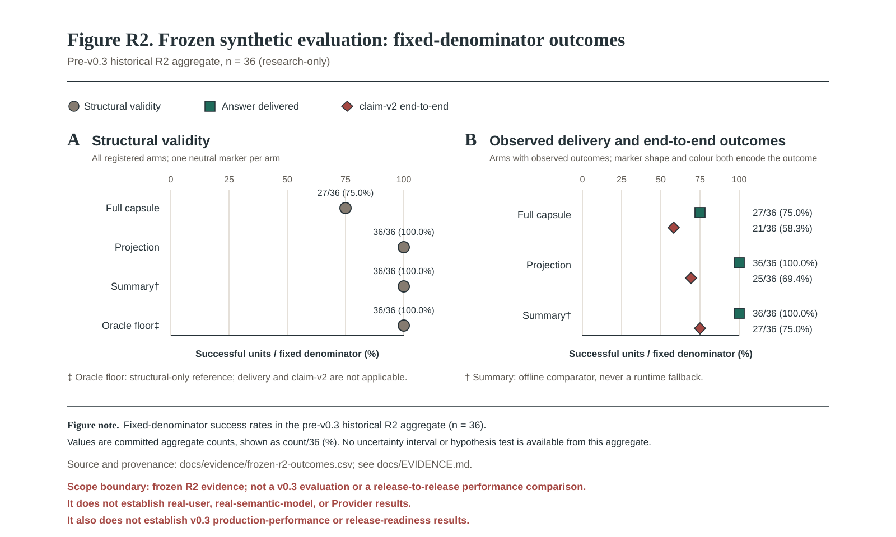

# AstrContinuum

English | [简体中文](./README.zh-CN.md)

[](./CHANGELOG.md)
[](https://github.com/AstrBotDevs/AstrBot)
[](./LICENSE)
[](https://github.com/2718labs/astrbot_plugin_astrcontinuum/actions/workflows/ci.yml)

**A durable, non-blocking long-context runtime for AstrBot.** AstrContinuum keeps authoritative conversation events in a SQLite journal, reads a committed Snapshot plus a contiguous Delta, and projects only its own temporary context into the provider request before restoring AstrBot's native objects by identity.

> **v0.3.0 Technical Preview.** This release adds an immutable reorganization ledger to the durable publication boundary. The normal `CompactionWorker` does not call a reorganization engine and therefore publishes an empty ledger in ordinary operation. CRM/reorganization integration, user-facing rollback, and broad performance certification remain future work.

## What is available now

| Area | Current boundary |
| --- | --- |
| Durable authority | Append-only Journal, immutable Capsules/Snapshots, SQLite transactions, fencing, and compare-and-swap publication. |
| Request path | Snapshot-plus-Delta reads, deterministic bounded assembly, and temporary provider-only projection with exact restoration. |
| Compaction | Durable intent and background worker lifecycle; exact-source candidate validation before publication. |
| Token and storage baseline | Offline token profiles, context-window fallback, encrypted durable values, and bounded metric backfill. |
| v0.3 ledger | An immutable, storage-only audit ledger written only when an explicit publisher supplies records. |

The durable core and the AstrBot composition root are deliberately separate. “Implemented in the core” is not automatically a promise that a capability is exposed as an AstrBot command or background runtime behavior.

## Experimental evidence, kept separate

The chart below is an **isolated, deterministic CRM experiment**, not a production benchmark, semantic-quality result, or evidence that reorganization is wired into v0.3. It is included so that the released documentation has a traceable visual reference without hiding its boundary.



Source provenance, hashes, revisions, exclusions, and the companion workflow are recorded in [Evidence](./docs/EVIDENCE.md) / [证据说明](./docs/EVIDENCE.zh-CN.md) and [Workflow](./docs/WORKFLOW.md) / [工作流](./docs/WORKFLOW.zh-CN.md).

## Installation

Clone this repository into AstrBot's plugin directory, then restart AstrBot or reload the plugin from WebUI.

```bash
cd AstrBot/data/plugins
git clone https://github.com/2718labs/astrbot_plugin_astrcontinuum
```

The declared compatibility range is **AstrBot `>=4.24.2,<5.0.0`**. A local AstrBot load remains a release gate because static tests cannot prove dynamic hook registration or provider-message behavior.

## Operations at a glance

- `/context_status` provides content-free administrator health and aggregate status.
- `/context_inspect` provides content-free evidence for the current session.
- No public command exposes compaction, reorganization, rollback, key management, or destructive database administration.
- Conversation-derived durable values are encrypted; keep external key material outside the plugin data directory and out of source control.

For configuration, privacy, recovery, and failure behavior, follow the [configuration reference](./docs/CONFIGURATION.md), [AstrBot integration](./docs/ASTRBOT_INTEGRATION.md), and [the database schema](./docs/DATABASE_SCHEMA.md), not this overview.

## Documentation

| Topic | English | 简体中文 |
| --- | --- | --- |
| Architecture and runtime boundaries | [Architecture](./docs/ARCHITECTURE.md) | [架构](./docs/ARCHITECTURE.zh-CN.md) |
| Configuration and key-management boundaries | [Configuration](./docs/CONFIGURATION.md) | [配置参考](./docs/CONFIGURATION.zh-CN.md) |
| AstrBot hook ownership and operations | [AstrBot integration](./docs/ASTRBOT_INTEGRATION.md) | [AstrBot 集成](./docs/ASTRBOT_INTEGRATION.zh-CN.md) |
| Compaction and v0.3 publication boundary | [Compaction protocol](./docs/COMPACTION_PROTOCOL.md) | [压缩协议](./docs/COMPACTION_PROTOCOL.zh-CN.md) |
| Data movement | [Data flow](./docs/DATA_FLOW.md) | [数据流](./docs/DATA_FLOW.zh-CN.md) |
| Evidence boundary | [Evidence](./docs/EVIDENCE.md) | [证据说明](./docs/EVIDENCE.zh-CN.md) |
| Release workflow | [Workflow](./docs/WORKFLOW.md) | [工作流](./docs/WORKFLOW.zh-CN.md) |
| Delivery limits and next gates | [Roadmap](./docs/ROADMAP.md) | [路线图](./docs/ROADMAP.zh-CN.md) |
| Durable tables and transactions | [Database schema](./docs/DATABASE_SCHEMA.md) | [数据库模式](./docs/DATABASE_SCHEMA.zh-CN.md) |
| Verification scope | [Test matrix](./docs/TEST_MATRIX.md) | [测试矩阵](./docs/TEST_MATRIX.zh-CN.md) |

## Development and verification

```bash
uv sync --extra dev
uv run ruff check .
uv run ruff format --check .
uv run mypy astrcontinuum main.py
uv run pytest -q
```

Do not add local Atlas indexes, caches, task packages, or machine-specific artifacts to a release commit. Use [CONTRIBUTING.md](./CONTRIBUTING.md) for contribution and verification expectations, and [SECURITY.md](./SECURITY.md) for security reports.

## License

Copyright © 2026 Ayleovelle.

Licensed under the [GNU Affero General Public License v3.0 or later](./LICENSE).
