# AstrContinuum

English | [简体中文](./README.zh-CN.md)

[](./CHANGELOG.md)
[](https://github.com/AstrBotDevs/AstrBot)
[](./LICENSE)
[](https://github.com/2718labs/astrbot_plugin_astrcontinuum/actions/workflows/ci.yml)

**A non-blocking, durable long-context runtime for AstrBot.**

AstrContinuum records authoritative conversation events in an encrypted append-only SQLite
Journal, builds a bounded request-local context from a committed Snapshot plus an uncompacted
Delta, and temporarily projects only AstrContinuum-owned context into the provider request.
The host's native message objects are restored by identity before AstrBot persists the completed
turn.

`v0.2.0` is an architectural refactor of the context runtime, not a bolt-on ranking feature.
It preserves the authoritative Journal and reversible AstrBot hook boundary while rebuilding
the context decision plane around request-local sparse graphs, explicit constraints, verification
certificates, deterministic recovery, and background candidate verification.

> [!IMPORTANT]
> `v0.2.0` is prepared as a local playable package and is deliberately **not listed in the
> AstrBot plugin market** yet. It combines encrypted persistence, pressure-triggered exact-source
> compilation, a verified request-local context engine, deterministic fallback, reversible
> projection, and content-free administrator diagnostics. Review
> [Configuration](#configuration) and [Operations and privacy](#operations-and-privacy) before
> installing.

## Quick navigation

- [Current status](#current-status)
- [Why AstrContinuum exists](#why-astrcontinuum-exists)
- [Architecture at a glance](#architecture-at-a-glance)
- [The matrix context engine](#the-matrix-context-engine)
- [AstrBot hook ownership](#astrbot-hook-ownership)
- [Durable data model](#durable-data-model)
- [Context assembly and projection](#context-assembly-and-projection)
- [Installation](#installation)
- [Configuration](#configuration)
- [Compatibility](#compatibility)
- [Operations and privacy](#operations-and-privacy)
- [Development and verification](#development-and-verification)
- [Detailed architecture](./docs/ARCHITECTURE.md)

## Current status

AstrContinuum separates the durable core from the AstrBot composition root. That makes it
possible to test persistence, concurrency, budgeting, and recovery independently, but it also
means “implemented in the core” and “active in the installed plugin” are not the same claim.

| Capability | `v0.2.0` status | Notes |
| --- | --- | --- |
| Official AstrBot `PluginManager` loading | Implemented and verified | Tested against `4.24.0`, `4.24.2`, and `4.26.7` |
| Idempotent user/assistant/tool Journal capture | Implemented and wired | Four authoritative hook/event mappings only |
| Stable per-session identity | Implemented and wired | Seven-component `SessionKey` |
| Snapshot-plus-Delta request reads | Implemented and wired | Uses logical `EMPTY_BASE` before the first Snapshot |
| Pressure trigger and deterministic budget assembly | Implemented and wired | Near-window pressure, not a fixed turn count |
| Provider-only temporary context projection | Implemented and wired | Uses `_no_save` and exact object-identity restoration |
| Durable compaction intent | Implemented and wired | Intent is persisted after an assistant completion |
| Exact-span Capsule compilation and publication | Implemented and wired | The model selects event ids and verbatim spans; code validates and renders |
| Background compaction worker lifecycle | Implemented and wired | Automatic claim, renewal, retry, cancellation, and atomic publication |
| Request-local sparse context engine | Implemented | Active, Shadow, and Off modes; unverified output cannot replace fallback |
| Encrypted durable persistence | Implemented and wired | AES-256-GCM envelopes, locked startup, migration, rotation, and scrub |
| Administrator effectiveness evidence | Implemented and wired | `/context_status` and current-session `/context_inspect`, without content |
| Time-travel/rollback user interface | **Not exposed yet** | Storage primitives exist; no AstrBot command or WebUI is published |

The sparse engine is a derived request-time computation, not a second conversation store.
NumPy is the required native numerical baseline. The core exposes SciPy through an explicit
sparse-backend opt-in; the v0.2 plugin composition defaults to NumPy. Every graph, solver, or
certificate failure returns to the deterministic path without blocking native AstrBot processing.

The refactor deliberately keeps durable authority separate from derived context decisions:
the Journal remains the source of truth, while graph state is rebuilt per request and is never
stored as a competing conversation history.

## Why AstrContinuum exists

Long conversations cannot be handled safely by repeatedly summarizing an ever-growing prompt.
A useful long-context system must preserve exact facts, distinguish committed state from recent
raw events, remain available while compaction is slow or broken, and never let temporary prompt
material leak into AstrBot's persisted native history.

AstrContinuum therefore follows five rules:

1. **The live request path never waits for compaction.**
2. **Raw authoritative events are append-only.**
3. **Only audited, atomically published Snapshots become readable.**
4. **Uncompacted events always remain a contiguous Delta after Snapshot coverage.**
5. **Temporary projection must be reversible by exact object identity.**

## Architecture at a glance

```mermaid
flowchart LR
    H["AstrBot authoritative hooks"] --> J["Append-only Journal"]
    J --> V["Committed Snapshot + contiguous Delta"]
    V --> R["Deterministic retrieval and fallback assembly"]
    R --> G["Request-local graph / activation / verification"]
    G --> P["Temporary provider-only Message"]
    P --> L["LLM / agent run"]
    L --> X["Exact native-object restoration"]
    X --> H

    J --> I["Durable compaction intent"]
    I --> W["Background worker: claim / renew / retry"]
    W --> C["Select event ids and exact source spans"]
    C --> A["Mechanical and optional semantic audit"]
    A --> B["Candidate graph verification"]
    B --> S["Atomic Snapshot publication"]
    S --> V
```



The design has three logical lanes:

- **Live lane:** capture → read one committed view → build fallback → activate and verify the
  request-local graph → assemble budget → project → run provider → restore. It stays bounded,
  non-blocking, and falls back deterministically.
- **Compaction lane:** claim durable intent → compile immutable Capsules → validate/audit →
  verify the candidate graph → publish with fencing and compare-and-swap. A candidate that
  fails verification never reaches `READY_TO_COMMIT`. One worker is started and stopped by the
  plugin lifecycle.
- **Archive lane:** preserve immutable user, assistant, tool-call, and tool-result facts with
  provenance.

The complete component and transaction design is documented in
[Architecture](./docs/ARCHITECTURE.md), [Data flow](./docs/DATA_FLOW.md),
[Database schema](./docs/DATABASE_SCHEMA.md), and
[Concurrency state machine](./docs/CONCURRENCY_STATE_MACHINE.md).

## The matrix context engine

The live engine turns one immutable request view into a bounded numerical problem. It does not
ask another model to retell the conversation, and it never persists its derived graph. The
important part is not the presence of a matrix symbol. It is the complete numerical loop:
**discretize state → build local operators → assemble globally → restrict the admissible affine
set → eliminate unretained coordinates → solve → certify the full state**; an eligible
reduced-solve failure may trigger one bounded full-state retry.

The method is defined by four invariants: relations contribute independently, global behavior
emerges only through sparse assembly, constraints restrict the state before solving, and every
reduced solution is checked against the unreduced system.

### 1. State discretization and local-to-global assembly

For $n$ candidate blocks, the request-local state is $x\in\mathbb R^n$. Coordinate $x_i$ is a
continuous activation value, not a Boolean decision or a probability; thresholding happens only
after the numerical solve.

For one bounded pair relation $r=(i,j)$, define the local extractor, signed difference vector,
and local operator

$$
A_r=
\begin{bmatrix}
e_i^{\mathsf T}\\
e_j^{\mathsf T}
\end{bmatrix}
\in\mathbb R^{2\times n},
\qquad
g=
\begin{bmatrix}
1\\
-1
\end{bmatrix},
\qquad
k_r=w_rgg^{\mathsf T}
=w_r
\begin{bmatrix}
1 & -1\\
-1 & 1
\end{bmatrix}.
$$

Its local state is $x_r=A_rx$, and its local quadratic contribution is

$$
\Pi_r(x)=\frac12x_r^{\mathsf T}k_rx_r
=\frac12w_r(x_i-x_j)^2.
$$

The current deterministic builder derives $w_r$ from exact structural evidence:

$$
\begin{aligned}
w_r
={}&1.0\,\mathbf 1_{\text{shared provenance}}
+0.75\,\mathbf 1_{\text{same capsule}} \\
&+0.50\,\mathbf 1_{\text{adjacent raw events}}
+0.25\,\mathbf 1_{\text{same candidate kind}}
+0.125\,\mathbf 1_{\text{same slot}}.
\end{aligned}
$$

Every local operator is scattered into one bounded global CSR operator:

$$
K=D+\varepsilon I+\sum_{r\in\mathcal R}A_r^{\mathsf T}k_rA_r.
$$

Here $e_i\in\mathbb R^n$ is the $i$-th coordinate basis vector,
$D=\operatorname{diag}(\delta_1,\ldots,\delta_n)$, $\delta_i\ge0$, and $\varepsilon>0$.
The current builder uses $\delta_i=1$ and $\varepsilon=10^{-9}$. Assembly is not merely an
implementation detail: for every nonzero $y$,

$$
y^{\mathsf T}Ky
=\sum_{i=1}^{n}(\delta_i+\varepsilon)y_i^2
+\sum_{r=(i,j)\in\mathcal R}w_r(y_i-y_j)^2
\ge\varepsilon\lVert y\rVert_2^2>0.
$$

Therefore $K$ is symmetric positive definite, and every principal block used by state
elimination is invertible. The equivalent expanded contribution is
$A_r^{\mathsf T}k_rA_r=w_r(e_i-e_j)(e_i-e_j)^{\mathsf T}$; code assembles its nonzero entries
directly and never materializes the extractor matrices.

For the current v0.2 builder, the request vector $q\in[0,1]^n$ is a deterministic character-set
Jaccard activation. With $U(\cdot)$ denoting the case-folded alphanumeric unit set,

$$
q_i=
\begin{cases}
\dfrac{\lvert U(u)\cap U(b_i)\rvert}{\lvert U(u)\cup U(b_i)\rvert},
& U(u)\ne\varnothing,\\[6pt]
0, & U(u)=\varnothing.
\end{cases}
$$

Here $u$ is the current input and $b_i$ is the candidate text. This activation can evolve
independently later; the matrix and verification contracts do not depend on a model-generated
score.

### 2. Restrict the admissible affine set

Required blocks compile to $x_i=1$. The numerical core also supports fixed-zero and exact
equality rows such as $x_i-x_j=0$. Let

$$
C\in\mathbb R^{m\times n},
\quad d,\lambda\in\mathbb R^m,
\quad
C_{\mathrm{cert}}\in\mathbb R^{m_c\times n},
\quad d_{\mathrm{cert}}\in\mathbb R^{m_c},
\quad m\le m_c.
$$

The compiler reduces all supported source rows to an independent solve basis while preserving
the same admissible affine set:

$$
\mathcal F_d
=\{x\in\mathbb R^n\mid Cx=d\}
=\{x\in\mathbb R^n\mid
C_{\mathrm{cert}}x=d_{\mathrm{cert}}\},
\qquad
\operatorname{rank}(C)=m.
$$

$C$ defines the admissible affine set before solving; it is not a post-processing checklist. With

$$
\Pi(x)=\frac12x^{\mathsf T}Kx-q^{\mathsf T}x,
$$

the activation is the constrained minimizer

$$
x^\star=\underset{x\in\mathcal F_d}{\operatorname{arg\,min}}\;\Pi(x),
$$

whose first-order system is

$$
\begin{bmatrix}
K & C^{\mathsf T} \\
C & 0
\end{bmatrix}
\begin{bmatrix}
x \\
\lambda
\end{bmatrix}
=
\begin{bmatrix}
q \\
d
\end{bmatrix}.
$$

The compiler rejects contradictory rows. For a consistent compiled system, $K\succ0$ and the
full-row-rank $C$ give a unique primal solution. The solve uses the compact basis $C$, while
$C_{\mathrm{cert}}$ retains every original supported row for the independent constraint
certificate below.

### 3. Constraint-aware reduction and reconstruction

Let $\mathcal I=\{1,\ldots,n\}$. Map `activation.retained_coordinate_ids` to coordinate indices
and call that set $R_{\mathrm{in}}$. For any matrix $M$, define its column support as

$$
\operatorname{csupp}(M)
=\{i\in\mathcal I\mid \exists\,\ell,\ M_{\ell i}\ne0\}.
$$

The engine's initial retained set is exactly

$$
R_0=
\begin{cases}
R_{\mathrm{in}}\cup R_{\mathrm{required}}
\cup\operatorname{csupp}(C_{\mathrm{cert}}),
& R_{\mathrm{in}}\ne\varnothing,\\
\mathcal I, & R_{\mathrm{in}}=\varnothing,
\end{cases}
\qquad
E=\mathcal I\setminus R_0.
$$

In the current production builder,

$$
R_{\mathrm{in}}
=R_{\mathrm{required}}\cup\{i\in\mathcal I\mid q_i>0\}.
$$

Constraint support is never allowed to enter $E$, so after reordering the coordinates
$C=[\,C_R\;\;0\,]$. With $r=\lvert R_0\rvert$, $e=\lvert E\rvert$, $r+e=n$,
$C_R\in\mathbb R^{m\times r}$, and $T\in\mathbb R^{e\times r}$, the full constrained system is
therefore partitioned as

$$
\begin{bmatrix}
K_{RR} & K_{RE} & C_R^{\mathsf T}\\
K_{ER} & K_{EE} & 0\\
C_R & 0 & 0
\end{bmatrix}
\begin{bmatrix}
x_R\\
x_E\\
\lambda
\end{bmatrix}
=
\begin{bmatrix}
q_R\\
q_E\\
d
\end{bmatrix}.
$$

When $e>0$, $K_{EE}\succ0$, so exact block elimination is well-defined:

$$
\begin{aligned}
K_{EE}z &= q_E, &
K_{EE}T &= K_{ER},\\
\widehat K &= K_{RR}-K_{RE}T, &
\widehat q &= q_R-K_{RE}z.
\end{aligned}
$$

The Schur complement also satisfies $\widehat K\succ0$.

The reduced constrained system still contains $C_R$:

$$
\begin{bmatrix}
\widehat K & C_R^{\mathsf T}\\
C_R & 0
\end{bmatrix}
\begin{bmatrix}
x_R\\
\lambda
\end{bmatrix}
=
\begin{bmatrix}
\widehat q\\
d
\end{bmatrix},
\qquad
x_E=z-Tx_R.
$$

The inverse notation is deliberately absent: implementation solves the $K_{EE}$ systems for
$z$ and the columns of $T$, forms the Schur complement, solves the smaller constrained system,
and then reconstructs the full $x$. NumPy is the required production backend; the numerical core
offers SciPy sparse acceleration only through explicit opt-in.

The live lane admits at most 64 candidates to matrix work and runs that work outside AstrBot's
event-loop thread. Larger live views skip the solve immediately, report
`GRAPH_LIVE_CAPACITY_EXCEEDED`, and keep deterministic fallback; background verification remains
a separate lane.

### 4. Full-state certification and controlled enrichment

The solution is not trusted because a solver returned it. Code calculates three normalized
residual certificates, not an estimate of the unknown forward error
$\lVert x-x^\star\rVert$. For $M\in\mathbb R^{p\times n}$, the implementation uses the maximum
absolute row-sum norm with an explicit empty-row convention:

$$
\lVert M\rVert_\infty=
\begin{cases}
\displaystyle\max_{1\le i\le p}\sum_j\lvert M_{ij}\rvert, & p>0,\\[4pt]
0, & p=0.
\end{cases}
$$

Define the zero-safe normalization

$$
\mathcal N(r,s)=
\begin{cases}
0, & \lVert r\rVert_\infty=0\ \text{and}\ s=0,\\
\dfrac{\lVert r\rVert_\infty}{s}, & s>0,\\[4pt]
+\infty, & \text{otherwise}.
\end{cases}
$$

Then the full-order stationarity, original-constraint, and reconstruction certificates are

$$
\eta_{\mathrm{stat}}=
\mathcal N\!\left(
Kx-q+C^{\mathsf T}\lambda,\,
\lVert K\rVert_\infty\lVert x\rVert_\infty+
\lVert q\rVert_\infty+\lVert C^{\mathsf T}\lambda\rVert_\infty
\right),
$$

$$
\eta_{\mathrm{con}}=
\mathcal N\!\left(
C_{\mathrm{cert}}x-d_{\mathrm{cert}},\,
\lVert C_{\mathrm{cert}}\rVert_\infty\lVert x\rVert_\infty+
\lVert d_{\mathrm{cert}}\rVert_\infty
\right),
\qquad
\eta_{\mathrm{rec}}=
\mathcal N\!\left(
K_{E,:}x-q_E,\,
\lVert K_{E,:}\rVert_\infty\lVert x\rVert_\infty+\lVert q_E\rVert_\infty
\right).
$$

When $E=\varnothing$, $\eta_{\mathrm{rec}}=0$. With
$S_\theta=\{i\in\mathcal I\mid x_i\ge\theta\}$ and $\theta=0.5$, the candidate may proceed only
when

$$
\max(\eta_{\mathrm{stat}},\eta_{\mathrm{con}},\eta_{\mathrm{rec}})\le\tau
$$

and required-block coverage, exact-provenance coverage, dependency closure, and final budget
packing all pass against the same immutable request view. The default direct certificate limit is
$\tau=10^{-10}$.

The live enrichment rule is intentionally bounded and exact:

$$
R_{\mathrm{retry}}=\mathcal I.
$$

This retry occurs only when the first reduced attempt reports `REDUCTION_*` or `SOLVE_*` and
$R_0\ne\mathcal I$. There is at most one retry. It enlarges the retained state but never relaxes
$C$, $\tau$, provenance, closure, or budget checks. Certificate, closure, and packing failures
therefore remain failures instead of being hidden by another solve.

The graph result is therefore a candidate, not authority. Any capacity breach, contradictory
constraint, unstable solve, non-finite value, failed certificate, incomplete closure, or packing
failure produces `DEGRADED_RAW` and keeps the already-built deterministic fallback. `shadow` mode
runs the same checks but never sends the graph-selected result.

## AstrBot hook ownership

AstrContinuum uses one `Star` subclass in `main.py`. The priorities below were inspected through
the real AstrBot handler registry in all verified host versions.

| Hook | Priority | Authoritative responsibility |
| --- | ---: | --- |
| `on_llm_request` | `2000` | Capture one user event and freeze one immutable request view |
| `on_agent_begin_guard` | `2000` | Record native request/message identities before projection |
| `on_agent_begin_project` | `-100` | Append only AstrContinuum-owned temporary provider content |
| `on_agent_done_restore` | `2000` | Restore the exact native graph plus provider-appended Delta |
| `on_agent_done_finalize` | `900` | Verify restoration, capture assistant output, and persist intent under pressure |
| `on_using_llm_tool` | `0` | Capture bounded, deterministic tool-call metadata |
| `on_llm_tool_respond` | `0` | Capture bounded, deterministic tool-result metadata |
| `on_llm_response` | `0` | Observation only; never writes a Journal event |

The only valid durable event mappings are:

| Event | Role | Source hook |
| --- | --- | --- |
| `USER_MESSAGE` | `USER` | `ON_LLM_REQUEST` |
| `ASSISTANT_MESSAGE` | `ASSISTANT` | `ON_AGENT_DONE` |
| `TOOL_CALL` | `TOOL` | `ON_USING_LLM_TOOL` |
| `TOOL_RESULT` | `TOOL` | `ON_LLM_TOOL_RESPOND` |

Duplicate callback delivery converges through deterministic idempotency keys and SQLite unique
constraints. `on_llm_response` is intentionally excluded from the durable source-hook enum to
avoid double-writing assistant content.

## Durable data model

Each conversation is isolated by a seven-component `SessionKey`:

```text
platform_instance_id
+ message_type
+ session_id
+ group_id
+ user_id
+ conversation_id
+ persona_id
```

The canonical serialization is hashed only for physical lookup. Every wire envelope retains the
full identity object.

| Table | Responsibility |
| --- | --- |
| `sessions` | Canonical session identity and per-session event sequence allocation |
| `journal_events` | Append-only user, assistant, tool-call, and tool-result facts |
| `capsules` | Immutable multi-resolution structured semantic envelopes |
| `snapshots` | Immutable committed context versions and coverage |
| `snapshot_capsules` | Ordered Snapshot-to-Capsule membership |
| `active_snapshots` | One compare-and-swap protected active pointer per session |
| `compaction_jobs` | Durable intent, leases, fencing epochs, retries, and terminal outcomes |

SQLite foreign keys, uniqueness constraints, transactions, savepoints, lease epochs, and active
pointer CAS form the correctness boundary. In-process locks and queues are never required for
durable correctness.

## Context assembly and projection

For each request, the reader obtains one consistent high-water mark `H` and constructs:

```text
request view = active committed Snapshot + Journal events (coverage + 1 .. H)
```

Before the first Snapshot, the reader uses a logical `EMPTY_BASE` with coverage `0`; it does not
fabricate a database Snapshot row.

The assembler computes:

```text
B_input = min(
    target_input_budget,
    hard_input_ceiling,
    model_context_limit - reserved_output_and_tools
)

B_ac = max(
    0,
    B_input
    - opaque_host_history_cost
    - current_input_cost
    - fixed_required_cost
    - safety_margin
)
```

Candidates are connected through deterministic, bounded relations derived from exact provenance,
Capsule membership, raw-event adjacency, candidate kind, and slot. Explicit dependencies and
complete tool pairs are handled by a separate post-selection closure, not blurred into relation
weights. The current request activates the request-local graph. Required blocks and closure are
checked again after packing; a graph result replaces the deterministic fallback only after its
numerical, constraint, provenance, required-block, and budget certificates pass.

In `active` mode, a verified graph result may be sent. In `shadow` mode, the same immutable
request view is measured but the deterministic fallback is sent. In `off` mode, graph work is
skipped. Any exception, non-convergence, missing required block, incomplete provenance, or budget
inconsistency produces the observed outcome `DEGRADED_RAW` and keeps the deterministic path.

If required material does not fit normally, `EMERGENCY_ASSEMBLY` preserves critical blocks and
the longest contiguous recent raw suffix that fits. It never deletes Journal rows, changes
Snapshot coverage, or rewrites AstrBot conversation history.

The trigger is context pressure, not turn count. At the default `75%`, AstrContinuum queues a
Checkpoint in the background while the current request still uses native AstrBot context. At
the default `80%`, the provider input switches to a bounded “published Checkpoint + recent raw
events + exact evidence” view.

> [!NOTE]
> `v0.2.0` uses a conservative `Utf8ByteTokenCounter`: one UTF-8 byte equals one budget unit.
> Configuration values are therefore safety budgets, not exact provider-token counts. A
> provider-aware tokenizer adapter is future work.

Injected parts and messages are marked `_no_save`, and AstrContinuum restores the exact native
objects by identity before finalization. If hard pressure has already been reached but assembly
or temporary-message support is unavailable, an empty Provider View removes old history while
preserving system objects and the current input. This avoids sending a known-oversized request;
the Journal and AstrBot's persisted history remain unchanged.

## Installation

The plugin is not in the AstrBot market yet. Install only from this repository in a controlled
environment.

### Manual clone

```bash
cd AstrBot/data/plugins
git clone https://github.com/2718labs/astrbot_plugin_astrcontinuum
```

Restart AstrBot or reload the plugin from WebUI.

### AstrBot local installation

AstrBot `v4.26.3+` can install a local plugin directory through WebUI. Select the checked-out
`astrbot_plugin_astrcontinuum` directory, then verify the plugin log contains:

```text
AstrContinuum initialized
```

As an AstrBot administrator, run `/context_status`; a ready instance returns:

```text
AstrContinuum：运行中
上下文引擎：ACTIVE
最近引擎状态：VERIFIED
后台归约：运行中
已记录事件：2
已发布 Checkpoint：1
待处理任务：0
```

## Configuration

The WebUI schema intentionally exposes only settings that are connected to the `v0.2.0` Star
lifecycle.

| Key | Type | Default | Effect |
| --- | --- | ---: | --- |
| `enabled` | `bool` | `true` | Enables durable capture and temporary projection |
| `context_engine_mode` | `string` | `active` | `active`: use only verified graph output; `shadow`: measure but send fallback; `off`: deterministic path only |
| `encryption_key_source` | `string` | `environment` | Read the installation key from an injected environment variable, an external file, or explicit local convenience mode |
| `encryption_key_file` | `file` | empty | Active external key file; used only in `file` mode |
| `encryption_previous_key_file` | `file` | empty | Previous external key file supplied only for one rotation or recovery |
| `model_context_limit` | `int` | `200000` | Total conservative context budget |
| `target_input_budget` | `int` | `130000` | Preferred input budget |
| `hard_input_ceiling` | `int` | `150000` | Hard input ceiling |
| `compaction_start_ratio` | `float` | `0.75` | Queue a background Checkpoint at this usable-window ratio |
| `provider_view_switch_ratio` | `float` | `0.80` | Switch to the bounded Provider View at this ratio |
| `compaction_provider_id` | `string` | empty | Follow the current conversation model, or explicitly select a smaller model |

Only the high-level context-engine mode is configurable. Numerical solver tolerances, matrix
limits, relation weights, and recovery bounds are deliberately not exposed as WebUI knobs.

Invalid budget values fall back to the built-in defaults and emit the content-free warning code
`BUDGET_CONFIG_INVALID`.

Reserved output/tool capacity (`32000`) and the assembly safety margin (`2000`) are fixed in
`v0.2.0`.

The compaction model does not write a free-form narrative summary. It may return only event ids
and verbatim source spans; extra fields, missing event acknowledgements, or paraphrases that
cannot be found in source are rejected and retried within a fixed bound. Selecting a different
compaction provider sends conversation segments to that provider, so verify its data and privacy
policy first.

## Commands

| Command | Permission | Description |
| --- | --- | --- |
| `/context_status` | Administrator | Reports storage health, configured engine mode, latest content-free outcome, worker state, and aggregate counts |
| `/context_inspect` | Administrator | Reports current-session content-free candidate, selection, reduction, residual-band, recovery, and coverage evidence |

`/context_status` shows whether the engine is `ACTIVE`, `SHADOW`, or `OFF` and whether its latest
run was verified, refined, unverified, or degraded to raw fallback. `/context_inspect` rechecks
the complete current `SessionKey` after querying and never prints conversation text, source spans,
entity names, provider identifiers, key material, ciphertext, or exception details.

No compaction, rollback, key-management, or destructive database-administration command is
exposed in `v0.2.0`.

## Compatibility

The committed plugin archive was exercised through the official AstrBot `PluginManager`, not
through local framework stubs.

| AstrBot | Python | Result | Notes |
| --- | --- | --- | --- |
| `4.24.0` | `3.12.13` | Passed | Host emits its own `StarMetadata.pages` fallback warning; lifecycle and behavior pass |
| `4.24.2` | `3.12.13` | Passed | Full load, hook, projection, Journal, and termination probe |
| `4.26.7` | `3.12.13` | Passed | Full load, hook, projection, Journal, and termination probe |

The declared range is `>=4.24.0,<5.0.0`. The upper bound is a compatibility guard, not evidence
that every future `4.x` release has already been tested.

The plugin does not modify transport-specific message semantics, but no platform adapter is
listed in `metadata.yaml` until adapter-specific field evidence is collected.

## Operations and privacy

### Data location

AstrBot allocates the plugin data directory. The primary database is:

```text
AstrBot/data/plugin_data/astrbot_plugin_astrcontinuum/astrcontinuum.sqlite3
```

SQLite may also create `-wal` and `-shm` files while the database is active.

### What is stored

- complete user and assistant text captured from authoritative hooks;
- bounded deterministic tool metadata;
- canonical session identity;
- Snapshot, Capsule, membership, and compaction-job state.

Tool values are depth- and item-bounded. Oversized metadata falls back to a content-free
truncation record.

Conversation-derived durable values are authenticated and encrypted with AES-256-GCM envelopes.
The default `environment` mode requires an installation-wide
`ASTRCONTINUUM_MASTER_KEY` injected by the host or secret manager before AstrBot starts. For a
manual installation, external file mode can create a key without printing it:

```bash
python -m astrcontinuum.keyctl generate --output <external-key-file>
python -m astrcontinuum.keyctl fingerprint --key-file <external-key-file>
```

The external file must stay outside the plugin data directory. Never paste a key into WebUI,
chat, logs, source control, service arguments, or shell command arguments. Explicit `local` mode
still encrypts the database, but stores the key inside the same plugin data boundary and is
reported as `LOCAL_KEY_DEGRADED`.

To rotate an external key, stop AstrBot or disable the plugin, generate the new key, configure it
as active and the key that currently unlocks the database as previous, then start or reload.
Wait for `/context_status` to report data protection `ACTIVE`, the new key id, and completed
maintenance. Back up and restore-test the encrypted database with the new recovery key, remove
the previous-key setting, and reload once more. Rotation is atomic; a missing or incorrect
previous key locks storage instead of partially rewriting rows.

### Backup and recovery

Disable the plugin or stop AstrBot before copying the database files, or use SQLite's online
backup mechanism. Do not copy only the main `.sqlite3` file while WAL mode is active.

On startup, migrations are idempotent. The worker recovers and requeues expired leases without
mutating committed Snapshots or Journal events. Long model calls renew their lease, and plugin
termination cancels and awaits the tracked worker task.

### Failure behavior

AstrContinuum is designed to fail open on the request path:

- missing, malformed, or wrong storage key → lock AstrContinuum storage without blocking native
  AstrBot chat;
- missing host identity → skip AstrContinuum for that request;
- below the pressure threshold → keep the native AstrBot request unchanged;
- graph, solver, certificate, or closure failure → send the deterministic fallback and report
  `DEGRADED_RAW`;
- hard pressure plus unavailable assembly/projection → use an empty Provider View rather than
  sending known-oversized history;
- projection or restoration invariant failure → record a redacted code and continue;
- invalid budget configuration → use safe defaults;
- failed candidate publication → keep the previous active Snapshot.

Message contents, host object representations, and secrets are not written into fault logs.

## Development and verification

The repository uses Python `>=3.10`; the checked development version is recorded in
`.python-version`.

```bash
uv sync --extra dev
uv run ruff check .
uv run ruff format --check .
uv run mypy astrcontinuum main.py
uv run pytest -q
```

The current suite covers domain envelopes, deterministic identity, budget assembly, retrieval,
SQLite migrations, idempotency, concurrent publication, crash atomicity, failure recovery,
encrypted migration and rotation, sparse numerical backends, AstrBot hook ownership, and
reversible projection. NumPy is installed as the required baseline; use the `sparse` extra to
exercise the optional SciPy accelerator.

Before proposing a change, also perform one real AstrBot local load. Static tests cannot prove
that AstrBot's dynamic plugin registry, handler priorities, and internal provider message types
still match.

## Documentation map

| Document | Purpose |
| --- | --- |
| [Architecture](./docs/ARCHITECTURE.md) | Detailed runtime boundaries, invariants, component graph, and current wiring |
| [AstrBot integration](./docs/ASTRBOT_INTEGRATION.md) | Hook ownership, priorities, private capability boundary, and lifecycle |
| [Data flow](./docs/DATA_FLOW.md) | Canonical request, completion, tool, compaction, and recovery flows |
| [Database schema](./docs/DATABASE_SCHEMA.md) | SQLite tables, constraints, wire projections, and atomic transactions |
| [Concurrency state machine](./docs/CONCURRENCY_STATE_MACHINE.md) | Leases, fencing, CAS, retries, and race outcomes |
| [Context model](./docs/CONTEXT_MODEL.md) | Events, Capsules, Snapshots, Delta, exact anchors, and dependency closure |
| [Compaction protocol](./docs/COMPACTION_PROTOCOL.md) | Non-blocking compaction protocol and recovery model |
| [Test matrix](./docs/TEST_MATRIX.md) | Normative invariants and required verification levels |
| [Roadmap](./docs/ROADMAP.md) | Repository stabilization, controlled preview, and production gates |
| [Architecture decisions](./docs/ADR-001-NONBLOCKING.md) | ADR series for the system's non-negotiable choices |

## Contributing

Issues and pull requests are welcome. Architecture-changing proposals must identify affected
invariants, durable migrations, failure semantics, and evidence. Read
[CONTRIBUTING.md](./CONTRIBUTING.md) before opening a pull request.

Security-sensitive reports should follow [SECURITY.md](./SECURITY.md).

## Contributors

- [Ayleovelle](https://github.com/Ayleovelle) — creator and maintainer

## Acknowledgements

The repository-governance layout is adapted from
[DBJD-CR/astrbot_plugin_helloworld](https://github.com/DBJD-CR/astrbot_plugin_helloworld),
itself based on the official AstrBot plugin template. AstrContinuum is built for
[AstrBot](https://github.com/AstrBotDevs/AstrBot).

## License

Copyright © 2026 Ayleovelle and 2718labs contributors.

Licensed under the [GNU Affero General Public License v3.0 or later](./LICENSE).
