# AstrContinuum

[English](./README.md) | 简体中文

[](./CHANGELOG.md)
[](https://github.com/AstrBotDevs/AstrBot)
[](./LICENSE)
[](https://github.com/2718labs/astrbot_plugin_astrcontinuum/actions/workflows/ci.yml)

**面向 AstrBot 的非阻塞、可持久化长上下文运行时。**

AstrContinuum 将权威会话事件加密写入只追加的 SQLite Journal，从“已提交 Snapshot +
尚未压缩的 Delta”构造有预算上限的请求视图，并只把 AstrContinuum 自己拥有的临时
上下文投影到 Provider 请求中。在 AstrBot 持久化本轮结果前，插件会按对象身份恢复
宿主原生消息图。

`v0.2.0` 是一次上下文运行架构重构，不是在原流程旁边追加一个排序功能。权威 Journal
与可逆 AstrBot 钩子边界保持不变；请求时决策平面则被重构为请求内稀疏图、显式约束、
验证证书、确定性恢复与后台候选验证。

> [!IMPORTANT]
> `v0.2.0` 已准备为本地试玩包，**暂未提交 AstrBot 插件市场**。它包含加密持久化、
> 压力触发的精确来源编译、经验证的请求内上下文引擎、确定性回退、可逆投影与不含
> 正文的管理员诊断。安装前请先阅读[配置](#配置)和[运维与隐私](#运维与隐私)。

## 快速导航

- [当前状态](#当前状态)
- [为什么需要 AstrContinuum](#为什么需要-astrcontinuum)
- [架构总览](#架构总览)
- [矩阵化上下文引擎](#矩阵化上下文引擎)
- [AstrBot 钩子归属](#astrbot-钩子归属)
- [持久化数据模型](#持久化数据模型)
- [上下文装配与可逆投影](#上下文装配与可逆投影)
- [安装](#安装)
- [配置](#配置)
- [兼容性](#兼容性)
- [运维与隐私](#运维与隐私)
- [开发与验证](#开发与验证)
- [详细架构文档](./docs/ARCHITECTURE.zh-CN.md)

## 当前状态

AstrContinuum 将可独立验证的持久化核心与 AstrBot 组合入口分开。这样可以单独测试
并发、预算、恢复和存储契约，但也必须区分“核心里已经实现”和“安装插件后已经自动
运行”这两件事。

| 能力 | `v0.2.0` 状态 | 说明 |
| --- | --- | --- |
| 官方 AstrBot `PluginManager` 加载 | 已实现、已实测 | 已验证 `4.24.0`、`4.24.2`、`4.26.7` |
| 用户/助手/工具 Journal 幂等采集 | 已实现、已接线 | 只允许四种权威 hook/event 映射 |
| 会话稳定身份 | 已实现、已接线 | 七元 `SessionKey` |
| Snapshot + Delta 请求读取 | 已实现、已接线 | 首个 Snapshot 前使用逻辑 `EMPTY_BASE` |
| 压力触发与确定性预算装配 | 已实现、已接线 | 接近窗口才触发，不依赖固定轮数 |
| Provider-only 临时上下文投影 | 已实现、已接线 | `_no_save` + 精确对象身份恢复 |
| 持久化压缩意图 | 已实现、已接线 | 助手完成后写入 durable intent |
| 精确引文式 Capsule 编译与发布 | 已实现、已接线 | 小模型只选择事件编号和逐字引文，程序负责校验与渲染 |
| 后台压缩 worker 生命周期 | 已实现、已接线 | 自动 claim、续租、重试、取消与原子发布 |
| 请求内稀疏上下文引擎 | 已实现 | Active、Shadow、Off；未经验证的结果不能替换确定性回退 |
| 加密持久化 | 已实现、已接线 | AES-256-GCM 信封、锁定启动、迁移、轮换与清理 |
| 管理员效果证据 | 已实现、已接线 | `/context_status` 与当前会话 `/context_inspect`，不输出正文 |
| 时间旅行 / 回滚管理界面 | **尚未暴露** | 存储原语存在，但没有发布指令或 WebUI |

稀疏引擎只做请求时派生计算，不是第二份会话存储。NumPy 是必需的数值基线；
数值核心只在显式启用稀疏后端时使用 SciPy，v0.2 插件组合默认使用 NumPy。图、
求解器或证书任一失败都会回到确定性路径，不阻塞 AstrBot 原生处理。

这次重构有意把持久化权威边界与派生上下文决策分开：Journal 仍是唯一事实源，图状态
按请求重建，不会作为另一份会话历史落盘。

## 为什么需要 AstrContinuum

长对话不能只靠“把越来越长的 Prompt 再总结一遍”。可靠的长上下文系统至少要做到：
保留精确事实、区分已提交状态和近期原文、压缩慢或失败时聊天仍可继续、临时 Prompt
材料绝不能污染 AstrBot 自己持久化的原生历史。

因此 AstrContinuum 坚持五条规则：

1. **在线请求路径绝不等待压缩。**
2. **权威原始事件只追加，不原地改写。**
3. **只有通过校验并原子发布的 Snapshot 才可被读取。**
4. **Snapshot 覆盖边界之后的事件必须构成连续 Delta。**
5. **临时投影必须能按精确对象身份恢复。**

## 架构总览

```mermaid
flowchart LR
    H["AstrBot 权威钩子"] --> J["只追加 Journal"]
    J --> V["已提交 Snapshot + 连续 Delta"]
    V --> R["确定性检索与回退装配"]
    R --> G["请求内构图 / 激活 / 验证"]
    G --> P["Provider-only 临时 Message"]
    P --> L["LLM / Agent 执行"]
    L --> X["精确恢复宿主原生对象"]
    X --> H

    J --> I["持久化压缩意图"]
    I --> W["后台 worker：claim / 续租 / 重试"]
    W --> C["逐段选择事件编号与精确引文"]
    C --> A["机械校验与可选语义审计"]
    A --> B["候选图验证"]
    B --> S["原子发布 Snapshot"]
    S --> V
```



设计上分为三条通道：

- **Live Lane：**采集 → 读取已提交视图 → 构造确定性回退 → 激活并验证请求内图 →
  预算装配 → 临时投影 → Provider 执行 → 恢复。它必须有界且不等待后台工作，失败
  时确定性回退。
- **Compaction Lane：**领取持久化意图 → 编译不可变 Capsule → 校验/审计 →
  验证候选图 → 带 fencing 与 CAS 的原子发布。验证失败的候选不能进入
  `READY_TO_COMMIT`。插件生命周期会自动启动和停止唯一 worker。
- **Archive Lane：**保留不可变的用户、助手、工具调用和工具结果事实及其来源。

完整设计见[架构](./docs/ARCHITECTURE.zh-CN.md)、
[数据流](./docs/DATA_FLOW.md)、[数据库模式](./docs/DATABASE_SCHEMA.md)和
[并发状态机](./docs/CONCURRENCY_STATE_MACHINE.md)。

## 矩阵化上下文引擎

Live Engine 会把一次不可变请求视图变成一个有界数值问题。它不让另一个模型转述整段
对话，也不会把派生图持久化。关键并不是文档里出现了一个矩阵符号，而是完整执行
**状态离散化 → 构造局部算子 → 全局稀疏装配 → 限定仿射可行集 → 消元未直接保留的
坐标 → 求解 → 验证完整状态**这一整条数值计算链；只有符合条件的归约求解失败，
才会触发一次有界的全状态重试。

这套方法由四条不变量定义：关系只产生独立的局部贡献；全局行为只通过稀疏装配形成；
约束在求解前限定状态空间；任何归约解都必须回到未归约系统接受验证。

### 1. 状态离散化与局部到全局装配

对 $n$ 个候选块，一次请求内的状态记为 $x\in\mathbb R^n$。坐标 $x_i$ 是连续的
激活值，不是布尔选择，也不是概率；离散选择只在数值求解完成后通过阈值产生。

对一条有界二元关系 $r=(i,j)$，定义局部抽取矩阵、带符号差分向量和局部算子

$$
A_r=
\begin{bmatrix}
e_i^{\mathsf T}\\
e_j^{\mathsf T}
\end{bmatrix}
\in\mathbb R^{2\times n},
\qquad
g=
\begin{bmatrix}
1\\
-1
\end{bmatrix},
\qquad
k_r=w_rgg^{\mathsf T}
=w_r
\begin{bmatrix}
1 & -1\\
-1 & 1
\end{bmatrix}.
$$

局部状态为 $x_r=A_rx$，这条关系对应的局部二次项为

$$
\Pi_r(x)=\frac12x_r^{\mathsf T}k_rx_r
=\frac12w_r(x_i-x_j)^2.
$$

当前确定性构图器只用可核验的结构证据计算 $w_r$：

$$
\begin{aligned}
w_r
={}&1.0\,\mathbf 1_{\text{共享精确来源}}
+0.75\,\mathbf 1_{\text{同一 capsule}} \\
&+0.50\,\mathbf 1_{\text{相邻原始事件}}
+0.25\,\mathbf 1_{\text{同一候选类型}}
+0.125\,\mathbf 1_{\text{同一 slot}}.
\end{aligned}
$$

每个局部算子都会被散射并累加到一次请求内的有界全局 CSR 算子：

$$
K=D+\varepsilon I+\sum_{r\in\mathcal R}A_r^{\mathsf T}k_rA_r.
$$

其中 $e_i\in\mathbb R^n$ 是第 $i$ 个坐标基向量，
$D=\operatorname{diag}(\delta_1,\ldots,\delta_n)$、$\delta_i\ge0$，且
$\varepsilon>0$。当前构图器取 $\delta_i=1$、$\varepsilon=10^{-9}$。全局装配并不
只是实现细节：对任意非零向量 $y$，

$$
y^{\mathsf T}Ky
=\sum_{i=1}^{n}(\delta_i+\varepsilon)y_i^2
+\sum_{r=(i,j)\in\mathcal R}w_r(y_i-y_j)^2
\ge\varepsilon\lVert y\rVert_2^2>0.
$$

因此 $K$ 对称正定，状态消元使用的任意主子块都可逆。展开后的等价贡献是
$A_r^{\mathsf T}k_rA_r=w_r(e_i-e_j)(e_i-e_j)^{\mathsf T}$；实际代码直接装配其中的
非零项，不会真的创建这些局部抽取矩阵。

v0.2 当前构图器使用确定性的字符集合 Jaccard 激活，所得请求向量
$q\in[0,1]^n$。令 $U(\cdot)$ 表示经过 case-fold 的字母数字单元集合，则

$$
q_i=
\begin{cases}
\dfrac{\lvert U(u)\cap U(b_i)\rvert}{\lvert U(u)\cup U(b_i)\rvert},
& U(u)\ne\varnothing,\\[6pt]
0, & U(u)=\varnothing.
\end{cases}
$$

其中 $u$ 是当前输入，$b_i$ 是第 $i$ 个候选块文本。以后可以独立替换请求
激活器，而矩阵求解和验证契约不需要跟着改变。

### 2. 限定仿射可行集

必选块被编译为 $x_i=1$。数值核心还支持固定为零以及 $x_i-x_j=0$ 这类精确
相等约束。记

$$
C\in\mathbb R^{m\times n},
\quad d,\lambda\in\mathbb R^m,
\quad
C_{\mathrm{cert}}\in\mathbb R^{m_c\times n},
\quad d_{\mathrm{cert}}\in\mathbb R^{m_c},
\quad m\le m_c.
$$

编译器会把全部受支持的原始行归约为一组相互独立的求解基，同时保持完全相同的
仿射可行集：

$$
\mathcal F_d
=\{x\in\mathbb R^n\mid Cx=d\}
=\{x\in\mathbb R^n\mid
C_{\mathrm{cert}}x=d_{\mathrm{cert}}\},
\qquad
\operatorname{rank}(C)=m.
$$

$C$ 在求解前定义允许进入的仿射可行集，不是解完以后才检查的清单。令

$$
\Pi(x)=\frac12x^{\mathsf T}Kx-q^{\mathsf T}x,
$$

激活状态就是

$$
x^\star=\underset{x\in\mathcal F_d}{\operatorname{arg\,min}}\;\Pi(x),
$$

其一阶系统为

$$
\begin{bmatrix}
K & C^{\mathsf T} \\
C & 0
\end{bmatrix}
\begin{bmatrix}
x \\
\lambda
\end{bmatrix}
=
\begin{bmatrix}
q \\
d
\end{bmatrix}.
$$

编译器会拒绝互相矛盾的约束。对一致的已编译系统，$K\succ0$ 且 $C$ 满行秩，
因而原状态解唯一。求解使用紧凑基 $C$；$C_{\mathrm{cert}}$ 则保留全部原始受支持
约束，用于后面的独立约束证书。

### 3. 约束感知的状态归约与全量重建

令 $\mathcal I=\{1,\ldots,n\}$。把 `activation.retained_coordinate_ids` 映射为
坐标索引集合 $R_{\mathrm{in}}$。对任意矩阵 $M$，定义它的列支撑为

$$
\operatorname{csupp}(M)
=\{i\in\mathcal I\mid \exists\,\ell,\ M_{\ell i}\ne0\}.
$$

引擎实际使用的初始保留集合严格写成

$$
R_0=
\begin{cases}
R_{\mathrm{in}}\cup R_{\mathrm{required}}
\cup\operatorname{csupp}(C_{\mathrm{cert}}),
& R_{\mathrm{in}}\ne\varnothing,\\
\mathcal I, & R_{\mathrm{in}}=\varnothing,
\end{cases}
\qquad
E=\mathcal I\setminus R_0.
$$

当前生产构图器满足

$$
R_{\mathrm{in}}
=R_{\mathrm{required}}\cup\{i\in\mathcal I\mid q_i>0\}.
$$

约束支撑坐标绝不允许进入 $E$，因此坐标重排后必有 $C=[\,C_R\;\;0\,]$。记
$r=\lvert R_0\rvert$、$e=\lvert E\rvert$、$r+e=n$、
$C_R\in\mathbb R^{m\times r}$、$T\in\mathbb R^{e\times r}$，完整的约束系统会被
明确分块为

$$
\begin{bmatrix}
K_{RR} & K_{RE} & C_R^{\mathsf T}\\
K_{ER} & K_{EE} & 0\\
C_R & 0 & 0
\end{bmatrix}
\begin{bmatrix}
x_R\\
x_E\\
\lambda
\end{bmatrix}
=
\begin{bmatrix}
q_R\\
q_E\\
d
\end{bmatrix}.
$$

当 $e>0$ 时 $K_{EE}\succ0$，因此精确分块消元有明确解：

$$
\begin{aligned}
K_{EE}z &= q_E, &
K_{EE}T &= K_{ER},\\
\widehat K &= K_{RR}-K_{RE}T, &
\widehat q &= q_R-K_{RE}z.
\end{aligned}
$$

对应的 Schur 补仍满足 $\widehat K\succ0$。

归约后的系统仍然带着 $C_R$：

$$
\begin{bmatrix}
\widehat K & C_R^{\mathsf T}\\
C_R & 0
\end{bmatrix}
\begin{bmatrix}
x_R\\
\lambda
\end{bmatrix}
=
\begin{bmatrix}
\widehat q\\
d
\end{bmatrix},
\qquad
x_E=z-Tx_R.
$$

这里刻意没有写矩阵求逆：实现会分别求解 $K_{EE}z=q_E$ 和 $K_{EE}T=K_{ER}$ 的
各列，再形成 Schur 补、求解更小的约束系统，最后重建完整 $x$。NumPy 是默认生产
后端；数值核心只通过显式 opt-in 提供 SciPy 稀疏加速。

Live Lane 最多允许 64 个候选进入矩阵计算，并把计算移出 AstrBot 事件循环线程。
更大的 Live View 会立即跳过求解、报告 `GRAPH_LIVE_CAPACITY_EXCEEDED` 并保留确定性
回退；后台候选验证仍是独立通道。

### 4. 完整状态验证与受控扩展

程序不会因为求解器返回了结果就信任它。这里计算的是三类归一化残差证书，不是
未知前向误差 $\lVert x-x^\star\rVert$ 的估计。对
$M\in\mathbb R^{p\times n}$，矩阵无穷范数按最大绝对行和定义，并显式约定空行矩阵
的范数为零：

$$
\lVert M\rVert_\infty=
\begin{cases}
\displaystyle\max_{1\le i\le p}\sum_j\lvert M_{ij}\rvert, & p>0,\\[4pt]
0, & p=0.
\end{cases}
$$

定义零值安全的归一化函数：

$$
\mathcal N(r,s)=
\begin{cases}
0, & \lVert r\rVert_\infty=0\ \text{且}\ s=0,\\
\dfrac{\lVert r\rVert_\infty}{s}, & s>0,\\[4pt]
+\infty, & \text{其他情况}.
\end{cases}
$$

使用这个零值安全的归一化函数，完整系统的一阶残差、原始约束残差和重建残差分别为

$$
\eta_{\mathrm{stat}}=
\mathcal N\!\left(
Kx-q+C^{\mathsf T}\lambda,\,
\lVert K\rVert_\infty\lVert x\rVert_\infty+
\lVert q\rVert_\infty+\lVert C^{\mathsf T}\lambda\rVert_\infty
\right),
$$

$$
\eta_{\mathrm{con}}=
\mathcal N\!\left(
C_{\mathrm{cert}}x-d_{\mathrm{cert}},\,
\lVert C_{\mathrm{cert}}\rVert_\infty\lVert x\rVert_\infty+
\lVert d_{\mathrm{cert}}\rVert_\infty
\right),
\qquad
\eta_{\mathrm{rec}}=
\mathcal N\!\left(
K_{E,:}x-q_E,\,
\lVert K_{E,:}\rVert_\infty\lVert x\rVert_\infty+\lVert q_E\rVert_\infty
\right).
$$

当 $E=\varnothing$ 时取 $\eta_{\mathrm{rec}}=0$。令
$S_\theta=\{i\in\mathcal I\mid x_i\ge\theta\}$、$\theta=0.5$。只有当

$$
\max(\eta_{\mathrm{stat}},\eta_{\mathrm{con}},\eta_{\mathrm{rec}})\le\tau
$$

并且必选块覆盖、精确来源覆盖、依赖闭包、相同不可变视图下的最终预算装配全部通过，
候选结果才有资格继续。默认直接证书阈值为 $\tau=10^{-10}$。

Live Lane 的扩展规则刻意保持有界且明确：

$$
R_{\mathrm{retry}}=\mathcal I.
$$

只有第一次归约尝试报告 `REDUCTION_*` 或 `SOLVE_*` 且
$R_0\ne\mathcal I$ 时才会触发。最多只重试一次。重试只扩大保留状态，绝不会放松
$C$、$\tau$、来源、依赖闭包或预算检查。因此，证书失败、闭包失败和装配失败仍然是
失败，不会被另一次求解掩盖。

所以图结果只是候选，不是权威。容量越界、约束矛盾、求解不稳定、非有限数值、证书
失败、依赖闭包不完整或最终装配失败，都会得到 `DEGRADED_RAW`，继续使用事先构造好的
确定性回退。`shadow` 模式执行同一套计算与验证，但绝不会发送图选择结果。

## AstrBot 钩子归属

插件只在 `main.py` 定义一个 `Star` 子类。以下优先级已通过真实 AstrBot handler
registry 在三个版本中核验。

| 钩子 | 优先级 | 唯一权威职责 |
| --- | ---: | --- |
| `on_llm_request` | `2000` | 采集一个用户事件并冻结一个不可变请求视图 |
| `on_agent_begin_guard` | `2000` | 投影前记录原生请求/消息对象身份 |
| `on_agent_begin_project` | `-100` | 只追加 AstrContinuum 自己拥有的临时 Provider 内容 |
| `on_agent_done_restore` | `2000` | 恢复精确原生对象图和 Provider 新增 Delta |
| `on_agent_done_finalize` | `900` | 校验恢复、采集助手输出，并在有压力时持久化压缩意图 |
| `on_using_llm_tool` | `0` | 采集有界、确定性的工具调用元数据 |
| `on_llm_tool_respond` | `0` | 采集有界、确定性的工具结果元数据 |
| `on_llm_response` | `0` | 仅观测，绝不写 Journal |

持久层只接受下面四种组合：

| 事件 | 角色 | 来源钩子 |
| --- | --- | --- |
| `USER_MESSAGE` | `USER` | `ON_LLM_REQUEST` |
| `ASSISTANT_MESSAGE` | `ASSISTANT` | `ON_AGENT_DONE` |
| `TOOL_CALL` | `TOOL` | `ON_USING_LLM_TOOL` |
| `TOOL_RESULT` | `TOOL` | `ON_LLM_TOOL_RESPOND` |

重复回调依靠确定性幂等键和 SQLite 唯一约束收敛。`on_llm_response` 被刻意排除在
Journal 来源枚举之外，避免重复写入助手内容。

## 持久化数据模型

每个会话由七元 `SessionKey` 隔离：

```text
platform_instance_id
+ message_type
+ session_id
+ group_id
+ user_id
+ conversation_id
+ persona_id
```

规范序列化的哈希只用于物理索引；每个 wire envelope 仍保留完整身份对象。

| 表 | 职责 |
| --- | --- |
| `sessions` | 规范会话身份与会话内事件序号分配 |
| `journal_events` | 只追加的用户、助手、工具调用、工具结果事实 |
| `capsules` | 不可变、多分辨率结构化语义信封 |
| `snapshots` | 不可变已提交上下文版本及其覆盖边界 |
| `snapshot_capsules` | Snapshot 到 Capsule 的有序成员关系 |
| `active_snapshots` | 每会话一个受 CAS 保护的 active pointer |
| `compaction_jobs` | 持久意图、租约、fencing epoch、重试和终态 |

SQLite 外键、唯一约束、事务、savepoint、租约 epoch 和 active-pointer CAS 才是正确性
边界；进程内锁和队列只允许作为优化，不能成为持久正确性的前提。

## 上下文装配与可逆投影

每次请求在同一个读事务中确定高水位 `H`，并构造：

```text
请求视图 = active committed Snapshot + Journal (coverage + 1 .. H)
```

首个 Snapshot 出现前，读取器使用覆盖为 `0` 的逻辑 `EMPTY_BASE`，不会伪造数据库行。

预算计算为：

```text
B_input = min(
    target_input_budget,
    hard_input_ceiling,
    model_context_limit - reserved_output_and_tools
)

B_ac = max(
    0,
    B_input
    - opaque_host_history_cost
    - current_input_cost
    - fixed_required_cost
    - safety_margin
)
```

候选块之间的有界确定性关系只来自精确来源、Capsule 成员关系、原始事件邻接、候选类型
与 slot。显式依赖和完整工具调用对由选择后的独立闭包处理，不混进关系权重。当前请求
激活这张请求内图；最终装配后还会再次验证必选块与闭包。只有数值、约束、来源、必选
块和预算证书全部通过，图结果才能替换确定性回退。

候选块按 slot、是否必需、相关分数、事件顺序和稳定标识确定性排序。如果普通模式无法
容纳必需信息，就进入 `EMERGENCY_ASSEMBLY`，保留关键块与预算内最长的连续近期原文
后缀。这个过程不会删 Journal，也不会改变 Snapshot 覆盖。

触发条件来自上下文压力，而不是对话轮数。达到默认 `75%` 时只在后台排队生成
Checkpoint，当前请求仍使用 AstrBot 原生上下文；达到默认 `80%` 时才把 Provider
本轮输入切换为“已发布 Checkpoint + 近期原文 + 精确证据”的有界视图。

> [!NOTE]
> `v0.2.0` 使用保守的 `Utf8ByteTokenCounter`：一个 UTF-8 字节算一个预算单位。
> 配置值因此是安全预算，不是 Provider tokenizer 的精确 Token 数。Provider-aware
> tokenizer 适配属于后续工作。

临时投影新建的 part 和 message 都标记 `_no_save`，最终再按身份恢复原生对象。
如果已达到硬压力而装配或 AstrBot 临时消息能力不可用，插件会使用“空 Provider
View”移除旧历史，只保留系统消息与当前输入，从而避免把已知超限的完整请求继续发给
模型；Journal 和 AstrBot 持久历史仍保持不变。

## 安装

插件尚未进入 AstrBot 市场，只建议在受控环境中从仓库安装。

### 手动 clone

```bash
cd AstrBot/data/plugins
git clone https://github.com/2718labs/astrbot_plugin_astrcontinuum
```

随后重启 AstrBot，或在 WebUI 中重载插件。

### WebUI 本地安装

AstrBot `v4.26.3+` 支持从本地目录安装插件。选择已检出的
`astrbot_plugin_astrcontinuum` 目录，然后确认日志出现：

```text
AstrContinuum initialized
```

由 AstrBot 管理员执行 `/context_status`，就绪时返回：

```text
AstrContinuum：运行中
上下文引擎：ACTIVE
最近引擎状态：VERIFIED
后台归约：运行中
已记录事件：2
已发布 Checkpoint：1
待处理任务：0
```

## 配置

WebUI 只暴露已经接入 `v0.2.0` Star 生命周期的设置。

| 配置项 | 类型 | 默认值 | 作用 |
| --- | --- | ---: | --- |
| `enabled` | `bool` | `true` | 启用持久采集与临时投影 |
| `context_engine_mode` | `string` | `active` | `active`：只使用验证通过的图结果；`shadow`：测量但发送确定性回退；`off`：只走确定性路径 |
| `encryption_key_source` | `string` | `environment` | 从注入环境变量、外部文件或显式本机便捷模式读取安装密钥 |
| `encryption_key_file` | `file` | 空 | `file` 模式使用的当前外部密钥文件 |
| `encryption_previous_key_file` | `file` | 空 | 仅在一次换钥或恢复时提供的旧外部密钥文件 |
| `model_context_limit` | `int` | `200000` | 总保守上下文预算 |
| `target_input_budget` | `int` | `130000` | 首选输入预算 |
| `hard_input_ceiling` | `int` | `150000` | 输入硬上限 |
| `compaction_start_ratio` | `float` | `0.75` | 达到可用窗口比例后，后台生成 Checkpoint |
| `provider_view_switch_ratio` | `float` | `0.80` | 达到可用窗口比例后，切换到有界 Provider View |
| `compaction_provider_id` | `string` | 空 | 留空跟随当前对话模型；也可显式选择 MiniMax 等小模型 |

WebUI 只允许选择高层上下文引擎模式。求解容差、矩阵上限、关系权重与恢复边界不会作为
普通配置项暴露。

预算配置非法时会回退到内置默认值，并只记录不含正文的
`BUDGET_CONFIG_INVALID` 警告码。

输出/工具预留预算 `32000` 和装配安全余量 `2000` 在 `v0.2.0` 中固定，不对外配置。
归约模型不负责写自由文本摘要，只能返回事件编号和逐字引文；额外字段、缺失事件、
找不到原文的转述都会被拒绝并进入有界重试。若显式选择不同的归约 Provider，对话
片段会发送给该 Provider，请先确认其数据与隐私策略。

## 指令

| 指令 | 权限 | 说明 |
| --- | --- | --- |
| `/context_status` | 管理员 | 显示存储健康、配置模式、最近无内容结果、worker 与汇总计数 |
| `/context_inspect` | 管理员 | 显示当前会话的候选、选择、归约、残差等级、恢复与覆盖证据，不输出正文 |

`/context_status` 会显示引擎为 `ACTIVE`、`SHADOW` 或 `OFF`，以及最近一次运行是否
验证通过、经恢复后通过、未验证或降级到原始回退。`/context_inspect` 查询后会再次
核对完整当前 `SessionKey`，不会打印对话正文、来源片段、实体名称、Provider 标识、
密钥材料、密文或异常细节。

`v0.2.0` 不提供压缩、回滚、密钥管理或破坏性数据库管理指令。

## 兼容性

兼容测试使用的是官方 AstrBot 包和真实 `PluginManager`，不是本地伪造的框架 stub。

| AstrBot | Python | 结果 | 说明 |
| --- | --- | --- | --- |
| `4.24.0` | `3.12.13` | 通过 | 宿主会产生自身的 `StarMetadata.pages` 回退警告，但完整生命周期通过 |
| `4.24.2` | `3.12.13` | 通过 | 加载、钩子、投影、Journal、卸载全链路 |
| `4.26.7` | `3.12.13` | 通过 | 加载、钩子、投影、Journal、卸载全链路 |

声明范围为 `>=4.24.0,<5.0.0`。上界是防御性兼容约束，不代表未来所有 `4.x` 都已经
测试。

插件不修改任何平台传输语义。在收集实际适配器字段证据前，`metadata.yaml` 不列出
具体 `support_platforms`。

## 运维与隐私

### 数据位置

AstrBot 为插件分配数据目录，主数据库位于：

```text
AstrBot/data/plugin_data/astrbot_plugin_astrcontinuum/astrcontinuum.sqlite3
```

数据库活动期间，SQLite 还可能创建 `-wal` 和 `-shm` 文件。

### 存储内容

- 权威钩子采集的完整用户和助手文本；
- 有界、确定性的工具元数据；
- 规范会话身份；
- Snapshot、Capsule、成员关系和压缩任务状态。

工具对象会限制深度、条目数和字符串长度；元数据过大时只保留不含正文的截断记录。

对话派生的持久值使用 AES-256-GCM 信封进行认证加密。默认 `environment` 模式要求
宿主或密钥管理器在 AstrBot 启动前注入安装级 `ASTRCONTINUUM_MASTER_KEY`。手动部署
时，外部文件模式可以在不打印密钥的情况下生成并查看指纹：

```bash
python -m astrcontinuum.keyctl generate --output <外部密钥文件>
python -m astrcontinuum.keyctl fingerprint --key-file <外部密钥文件>
```

外部密钥文件必须位于插件数据目录之外。不要把密钥粘贴到 WebUI、聊天、日志、源码、
服务参数或 shell 命令参数中。显式 `local` 模式仍会加密数据库，但密钥与数据处在同一
插件数据边界内，因此会报告 `LOCAL_KEY_DEGRADED`。

轮换外部密钥时，先停止 AstrBot 或禁用插件，生成新密钥，把新密钥配置为当前密钥、
把能解锁现有数据库的密钥配置为旧密钥，再启动或重载。等待 `/context_status` 报告
数据保护 `ACTIVE`、新密钥标识和维护完成；用新恢复密钥备份并验证恢复后，移除旧密钥
配置并再次重载。换钥是原子的：旧密钥缺失或错误会锁定存储，不会只改写一部分数据。

### 备份与恢复

复制数据库文件前应禁用插件或停止 AstrBot，或者使用 SQLite 在线备份机制。WAL 模式
运行时不能只复制主 `.sqlite3` 文件。

启动时数据库迁移是幂等的。worker 会恢复过期 lease 并重新排队，不修改已提交
Snapshot 或 Journal；长时间模型调用期间会主动续租，插件终止时会取消并等待后台
任务退出。

### 失败行为

AstrContinuum 的请求路径按 fail-open 设计：

- 密钥缺失、格式错误或不匹配 → 锁定 AstrContinuum 存储，但不阻塞 AstrBot 原生聊天；
- 缺少宿主身份字段 → 本轮跳过 AstrContinuum；
- 未达到压力阈值 → 保持原 AstrBot 请求不变；
- 图、求解器、证书或依赖闭包失败 → 发送确定性回退并报告 `DEGRADED_RAW`；
- 达到硬压力但装配/投影能力不可用 → 使用空 Provider View，避免发送已知超限历史；
- 投影/恢复不变量失败 → 记录脱敏错误码并继续；
- 预算配置非法 → 使用安全默认值；
- 候选发布失败 → 旧 active Snapshot 保持不变。

错误日志不会写入消息正文、宿主对象 `repr` 或密钥。

## 开发与验证

仓库要求 Python `>=3.10`，当前开发版本记录在 `.python-version`。

```bash
uv sync --extra dev
uv run ruff check .
uv run ruff format --check .
uv run mypy astrcontinuum main.py
uv run pytest -q
```

当前测试覆盖领域信封、确定性身份、预算装配、检索、SQLite 迁移、幂等性、并发发布、
崩溃原子性、失败恢复、AstrBot 钩子归属和可逆投影。

提交改动前仍需至少完成一次真实 AstrBot 本地加载。静态测试无法证明动态插件 registry、
handler 优先级和 Provider 内部消息类型仍与目标宿主匹配。

## 文档导航

| 文档 | 作用 |
| --- | --- |
| [详细架构](./docs/ARCHITECTURE.zh-CN.md) | 运行边界、不变量、组件图与当前接线状态 |
| [AstrBot 接入](./docs/ASTRBOT_INTEGRATION.zh-CN.md) | Hook 职责、优先级、私有能力边界和生命周期 |
| [数据流](./docs/DATA_FLOW.md) | 请求、完成、工具、压缩与恢复的规范流程 |
| [数据库模式](./docs/DATABASE_SCHEMA.md) | SQLite 表、约束、wire 投影和原子事务 |
| [并发状态机](./docs/CONCURRENCY_STATE_MACHINE.md) | 租约、fencing、CAS、重试和竞争结果 |
| [上下文模型](./docs/CONTEXT_MODEL.md) | Event、Capsule、Snapshot、Delta、精确锚点 |
| [压缩协议](./docs/COMPACTION_PROTOCOL.zh-CN.md) | 非阻塞压缩协议和恢复模型 |
| [测试矩阵](./docs/TEST_MATRIX.md) | 规范不变量及其验证层级 |
| [路线图](./docs/ROADMAP.zh-CN.md) | 仓库稳定化、受控预览和生产门槛 |
| [架构决策](./docs/ADR-001-NONBLOCKING.md) | 系列 ADR 与不可妥协设计选择 |

## 贡献

欢迎 Issue 和 Pull Request。任何架构变更都必须说明受影响不变量、持久化迁移、失败
语义和实际验证证据。提交前请阅读 [CONTRIBUTING.md](./CONTRIBUTING.md)。

安全问题请按 [SECURITY.md](./SECURITY.md) 私下报告。

## 贡献者

- [Ayleovelle](https://github.com/Ayleovelle) — 创建者与维护者

## 致谢

仓库治理结构参考了
[DBJD-CR/astrbot_plugin_helloworld](https://github.com/DBJD-CR/astrbot_plugin_helloworld)，
该模板又建立在 AstrBot 官方插件模板之上。AstrContinuum 面向
[AstrBot](https://github.com/AstrBotDevs/AstrBot) 构建。

## 许可证

Copyright © 2026 Ayleovelle 与 2718labs 贡献者。

本项目采用 [GNU Affero General Public License v3.0 or later](./LICENSE)。
