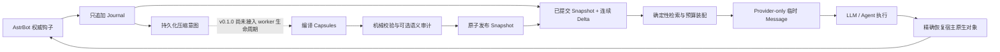

# AstrContinuum

[English](./README.md) | 简体中文

[](./CHANGELOG.md)
[](https://github.com/AstrBotDevs/AstrBot)
[](./LICENSE)
[](https://github.com/2718labs/astrbot_plugin_astrcontinuum/actions/workflows/ci.yml)

**面向 AstrBot 的非阻塞、可持久化长上下文运行时。**

AstrContinuum 将权威会话事件写入只追加的 SQLite Journal，从“已提交 Snapshot +
尚未压缩的 Delta”构造有预算上限的请求视图，并只把 AstrContinuum 自己拥有的临时
上下文投影到 Provider 请求中。在 AstrBot 持久化本轮结果前，插件会按对象身份恢复
宿主原生消息图。

> [!IMPORTANT]
> `v0.1.0` 是仅进入代码仓库的技术预览版，**暂未提交 AstrBot 插件市场**。
> AstrBot 钩子桥、持久 Journal、请求视图不变量、可逆投影、存储契约和压缩核心已经
> 实现并通过测试；但插件生命周期尚未启动后台压缩 worker，因此自动、持续地产生
> Snapshot 的闭环还没有完成。安装前请先阅读[当前状态](#当前状态)。

## 快速导航

- [当前状态](#当前状态)
- [为什么需要 AstrContinuum](#为什么需要-astrcontinuum)
- [架构总览](#架构总览)
- [AstrBot 钩子归属](#astrbot-钩子归属)
- [持久化数据模型](#持久化数据模型)
- [上下文装配与可逆投影](#上下文装配与可逆投影)
- [安装](#安装)
- [配置](#配置)
- [兼容性](#兼容性)
- [运维与隐私](#运维与隐私)
- [开发与验证](#开发与验证)
- [详细架构文档](./docs/ARCHITECTURE.zh-CN.md)

## 当前状态

AstrContinuum 将可独立验证的持久化核心与 AstrBot 组合入口分开。这样可以单独测试
并发、预算、恢复和存储契约，但也必须区分“核心里已经实现”和“安装插件后已经自动
运行”这两件事。

| 能力 | `v0.1.0` 状态 | 说明 |
| --- | --- | --- |
| 官方 AstrBot `PluginManager` 加载 | 已实现、已实测 | 已验证 `4.24.0`、`4.24.2`、`4.26.7` |
| 用户/助手/工具 Journal 幂等采集 | 已实现、已接线 | 只允许四种权威 hook/event 映射 |
| 会话稳定身份 | 已实现、已接线 | 七元 `SessionKey` |
| Snapshot + Delta 请求读取 | 已实现、已接线 | 首个 Snapshot 前使用逻辑 `EMPTY_BASE` |
| 确定性预算装配 | 已实现、已接线 | NORMAL 与 EMERGENCY 两种模式 |
| Provider-only 临时上下文投影 | 已实现、已接线 | `_no_save` + 精确对象身份恢复 |
| 持久化压缩意图 | 已实现、已接线 | 助手完成后写入 durable intent |
| Capsule 编译、校验、审计、发布契约 | 核心已实现 | 单元、SQLite 集成和崩溃原子性测试覆盖 |
| 后台压缩 worker 生命周期 | **尚未接线** | 当前 Star 不会自动 claim 并执行排队 job |
| Provider 驱动的语义审计 | **尚未接线** | 核心中的机械校验始终强制执行 |
| 时间旅行 / 回滚管理界面 | **尚未暴露** | 存储原语存在，但没有发布指令或 WebUI |
| Sylanne 外部记忆适配 | 仅实验性核心 | 外部记忆正文不会写入 Journal |

当前仓库适合架构评审、兼容性测试和受控开发环境，不应被当成已经完成闭环的生产级
长期压缩方案。

## 为什么需要 AstrContinuum

长对话不能只靠“把越来越长的 Prompt 再总结一遍”。可靠的长上下文系统至少要做到：
保留精确事实、区分已提交状态和近期原文、压缩慢或失败时聊天仍可继续、临时 Prompt
材料绝不能污染 AstrBot 自己持久化的原生历史。

因此 AstrContinuum 坚持五条规则：

1. **在线请求路径绝不等待压缩。**
2. **权威原始事件只追加，不原地改写。**
3. **只有通过校验并原子发布的 Snapshot 才可被读取。**
4. **Snapshot 覆盖边界之后的事件必须构成连续 Delta。**
5. **临时投影必须能按精确对象身份恢复。**

## 架构总览



设计上分为三条通道：

- **Live Lane：**采集 → 读取已提交视图 → 选择证据 → 预算装配 → 临时投影 →
  Provider 执行 → 恢复。它必须有界且不等待后台工作。
- **Compaction Lane：**领取持久化意图 → 编译不可变 Capsule → 校验/审计 →
  带 fencing 与 CAS 的原子发布。核心已经存在，插件生命周期自动执行尚待接入。
- **Archive Lane：**保留不可变的用户、助手、工具调用和工具结果事实及其来源。

完整设计见[架构](./docs/ARCHITECTURE.zh-CN.md)、
[数据流](./docs/DATA_FLOW.md)、[数据库模式](./docs/DATABASE_SCHEMA.md)和
[并发状态机](./docs/CONCURRENCY_STATE_MACHINE.md)。

## AstrBot 钩子归属

插件只在 `main.py` 定义一个 `Star` 子类。以下优先级已通过真实 AstrBot handler
registry 在三个版本中核验。

| 钩子 | 优先级 | 唯一权威职责 |
| --- | ---: | --- |
| `on_llm_request` | `2000` | 采集一个用户事件并冻结一个不可变请求视图 |
| `on_agent_begin_guard` | `2000` | 投影前记录原生请求/消息对象身份 |
| `on_agent_begin_project` | `-100` | 只追加 AstrContinuum 自己拥有的临时 Provider 内容 |
| `on_agent_done_restore` | `2000` | 恢复精确原生对象图和 Provider 新增 Delta |
| `on_agent_done_finalize` | `900` | 校验恢复、采集助手输出、持久化压缩意图 |
| `on_using_llm_tool` | `0` | 采集有界、确定性的工具调用元数据 |
| `on_llm_tool_respond` | `0` | 采集有界、确定性的工具结果元数据 |
| `on_llm_response` | `0` | 仅观测，绝不写 Journal |

持久层只接受下面四种组合：

| 事件 | 角色 | 来源钩子 |
| --- | --- | --- |
| `USER_MESSAGE` | `USER` | `ON_LLM_REQUEST` |
| `ASSISTANT_MESSAGE` | `ASSISTANT` | `ON_AGENT_DONE` |
| `TOOL_CALL` | `TOOL` | `ON_USING_LLM_TOOL` |
| `TOOL_RESULT` | `TOOL` | `ON_LLM_TOOL_RESPOND` |

重复回调依靠确定性幂等键和 SQLite 唯一约束收敛。`on_llm_response` 被刻意排除在
Journal 来源枚举之外，避免重复写入助手内容。

## 持久化数据模型

每个会话由七元 `SessionKey` 隔离：

```text
platform_instance_id
+ message_type
+ session_id
+ group_id
+ user_id
+ conversation_id
+ persona_id
```

规范序列化的哈希只用于物理索引；每个 wire envelope 仍保留完整身份对象。

| 表 | 职责 |
| --- | --- |
| `sessions` | 规范会话身份与会话内事件序号分配 |
| `journal_events` | 只追加的用户、助手、工具调用、工具结果事实 |
| `capsules` | 不可变、多分辨率结构化语义信封 |
| `snapshots` | 不可变已提交上下文版本及其覆盖边界 |
| `snapshot_capsules` | Snapshot 到 Capsule 的有序成员关系 |
| `active_snapshots` | 每会话一个受 CAS 保护的 active pointer |
| `compaction_jobs` | 持久意图、租约、fencing epoch、重试和终态 |

SQLite 外键、唯一约束、事务、savepoint、租约 epoch 和 active-pointer CAS 才是正确性
边界；进程内锁和队列只允许作为优化，不能成为持久正确性的前提。

## 上下文装配与可逆投影

每次请求在同一个读事务中确定高水位 `H`，并构造：

```text
请求视图 = active committed Snapshot + Journal (coverage + 1 .. H)
```

首个 Snapshot 出现前，读取器使用覆盖为 `0` 的逻辑 `EMPTY_BASE`，不会伪造数据库行。

预算计算为：

```text
B_input = min(
    target_input_budget,
    hard_input_ceiling,
    model_context_limit - reserved_output_and_tools
)

B_ac = max(
    0,
    B_input
    - opaque_host_history_cost
    - current_input_cost
    - fixed_required_cost
    - safety_margin
)
```

候选块按 slot、是否必需、相关分数、事件顺序和稳定标识确定性排序。如果普通模式无法
容纳必需信息，就进入 `EMERGENCY_ASSEMBLY`，保留关键块与预算内最长的连续近期原文
后缀。这个过程不会删 Journal，也不会改变 Snapshot 覆盖。

> [!NOTE]
> `v0.1.0` 使用保守的 `Utf8ByteTokenCounter`：一个 UTF-8 字节算一个预算单位。
> 配置值因此是安全预算，不是 Provider tokenizer 的精确 Token 数。Provider-aware
> tokenizer 适配属于后续工作。

临时投影只在运行时探测到 AstrBot 内部 `Message` / `TextPart` 能力后使用。新建 part
和 message 都标记 `_no_save`，最终再按身份恢复原生对象。如果能力缺失或身份不变量
失败，插件会跳过增强，让 AstrBot 使用原请求继续执行。

## 安装

插件尚未进入 AstrBot 市场，只建议在受控环境中从仓库安装。

### 手动 clone

```bash
cd AstrBot/data/plugins
git clone https://github.com/2718labs/astrbot_plugin_astrcontinuum
```

随后重启 AstrBot，或在 WebUI 中重载插件。

### WebUI 本地安装

AstrBot `v4.26.3+` 支持从本地目录安装插件。选择已检出的
`astrbot_plugin_astrcontinuum` 目录，然后确认日志出现：

```text
AstrContinuum initialized
```

由 AstrBot 管理员执行 `/context_status`，就绪时返回：

```text
AstrContinuum is ready.
```

## 配置

WebUI 只暴露已经接入 `v0.1.0` Star 生命周期的设置。

| 配置项 | 类型 | 默认值 | 作用 |
| --- | --- | ---: | --- |
| `enabled` | `bool` | `true` | 启用持久采集与临时投影 |
| `model_context_limit` | `int` | `200000` | 总保守上下文预算 |
| `target_input_budget` | `int` | `130000` | 首选输入预算 |
| `hard_input_ceiling` | `int` | `150000` | 输入硬上限 |

预算配置非法时会回退到内置默认值，并只记录不含正文的
`BUDGET_CONFIG_INVALID` 警告码。

输出/工具预留预算 `32000` 和装配安全余量 `2000` 在 `v0.1.0` 中固定，不对外配置。

## 指令

| 指令 | 权限 | 说明 |
| --- | --- | --- |
| `/context_status` | 管理员 | 报告持久化 AstrContinuum bridge 是否就绪 |

`v0.1.0` 不提供压缩、回滚或数据库管理指令。

## 兼容性

兼容测试使用的是官方 AstrBot 包和真实 `PluginManager`，不是本地伪造的框架 stub。

| AstrBot | Python | 结果 | 说明 |
| --- | --- | --- | --- |
| `4.24.0` | `3.12.13` | 通过 | 宿主会产生自身的 `StarMetadata.pages` 回退警告，但完整生命周期通过 |
| `4.24.2` | `3.12.13` | 通过 | 加载、钩子、投影、Journal、卸载全链路 |
| `4.26.7` | `3.12.13` | 通过 | 加载、钩子、投影、Journal、卸载全链路 |

声明范围为 `>=4.24.0,<5.0.0`。上界是防御性兼容约束，不代表未来所有 `4.x` 都已经
测试。

插件不修改任何平台传输语义。在收集实际适配器字段证据前，`metadata.yaml` 不列出
具体 `support_platforms`。

## 运维与隐私

### 数据位置

AstrBot 为插件分配数据目录，主数据库位于：

```text
AstrBot/data/plugin_data/astrbot_plugin_astrcontinuum/astrcontinuum.sqlite3
```

数据库活动期间，SQLite 还可能创建 `-wal` 和 `-shm` 文件。

### 存储内容

- 权威钩子采集的完整用户和助手文本；
- 有界、确定性的工具元数据；
- 规范会话身份；
- 核心产生的 Snapshot、Capsule、成员关系和压缩任务状态。

工具对象会限制深度、条目数和字符串长度；元数据过大时只保留不含正文的截断记录。
外部 Sylanne 记忆正文不能成为 Journal 或 Capsule 来源。

### 备份与恢复

复制数据库文件前应禁用插件或停止 AstrBot，或者使用 SQLite 在线备份机制。WAL 模式
运行时不能只复制主 `.sqlite3` 文件。

启动时数据库迁移是幂等的。过期 worker lease 可以重新排队，而不修改已提交 Snapshot
或 Journal。当前 Star 生命周期尚未启动该 worker，因此在接线完成前，排队 job 可能
一直保持 pending。

### 失败行为

AstrContinuum 的请求路径按 fail-open 设计：

- 缺少宿主身份字段 → 本轮跳过 AstrContinuum；
- 投影 API 不匹配 → 保持原 AstrBot 请求不变；
- 投影/恢复不变量失败 → 记录脱敏错误码并继续；
- 预算配置非法 → 使用安全默认值；
- 候选发布失败 → 旧 active Snapshot 保持不变。

错误日志不会写入消息正文、宿主对象 `repr` 或密钥。

## 开发与验证

仓库要求 Python `>=3.10`，当前开发版本记录在 `.python-version`。

```bash
uv sync --extra dev
uv run ruff check .
uv run ruff format --check .
uv run mypy astrcontinuum main.py
uv run pytest -q
```

当前测试覆盖领域信封、确定性身份、预算装配、检索、SQLite 迁移、幂等性、并发发布、
崩溃原子性、失败恢复、AstrBot 钩子归属和可逆投影。

提交改动前仍需至少完成一次真实 AstrBot 本地加载。静态测试无法证明动态插件 registry、
handler 优先级和 Provider 内部消息类型仍与目标宿主匹配。

## 文档导航

| 文档 | 作用 |
| --- | --- |
| [详细架构](./docs/ARCHITECTURE.zh-CN.md) | 运行边界、不变量、组件图与当前接线状态 |
| [AstrBot 接入](./docs/ASTRBOT_INTEGRATION.zh-CN.md) | Hook 职责、优先级、私有能力边界和生命周期 |
| [数据流](./docs/DATA_FLOW.md) | 请求、完成、工具、压缩与恢复的规范流程 |
| [数据库模式](./docs/DATABASE_SCHEMA.md) | SQLite 表、约束、wire 投影和原子事务 |
| [并发状态机](./docs/CONCURRENCY_STATE_MACHINE.md) | 租约、fencing、CAS、重试和竞争结果 |
| [上下文模型](./docs/CONTEXT_MODEL.md) | Event、Capsule、Snapshot、Delta、精确锚点 |
| [压缩协议](./docs/COMPACTION_PROTOCOL.zh-CN.md) | 非阻塞压缩协议和恢复模型 |
| [测试矩阵](./docs/TEST_MATRIX.md) | 规范不变量及其验证层级 |
| [路线图](./docs/ROADMAP.zh-CN.md) | 仓库稳定化、受控预览和生产门槛 |
| [架构决策](./docs/ADR-001-NONBLOCKING.md) | 系列 ADR 与不可妥协设计选择 |

## 贡献

欢迎 Issue 和 Pull Request。任何架构变更都必须说明受影响不变量、持久化迁移、失败
语义和实际验证证据。提交前请阅读 [CONTRIBUTING.md](./CONTRIBUTING.md)。

安全问题请按 [SECURITY.md](./SECURITY.md) 私下报告。

## 致谢

仓库治理结构参考了
[DBJD-CR/astrbot_plugin_helloworld](https://github.com/DBJD-CR/astrbot_plugin_helloworld)，
该模板又建立在 AstrBot 官方插件模板之上。AstrContinuum 面向
[AstrBot](https://github.com/AstrBotDevs/AstrBot) 构建。

## 许可证

Copyright © 2026 2718labs contributors.

本项目采用 [GNU Affero General Public License v3.0 or later](./LICENSE)。
