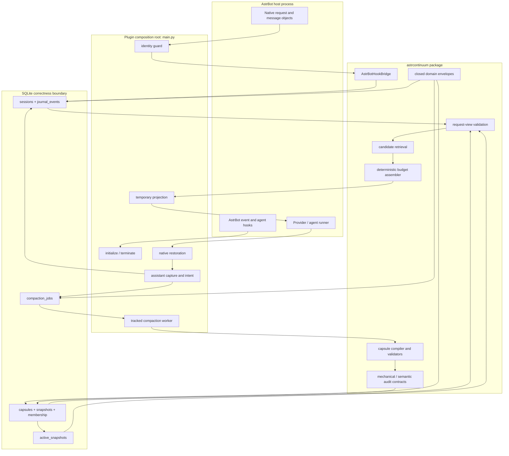
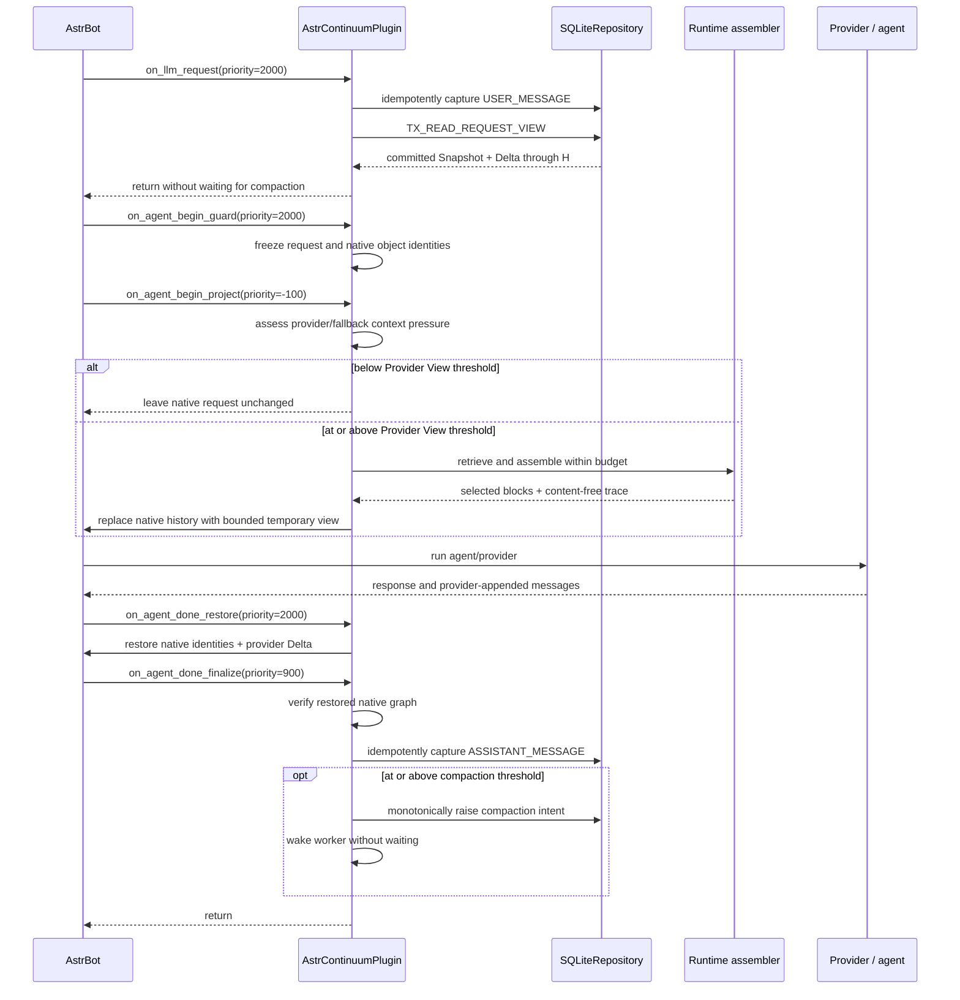

# AstrContinuum architecture

English | [简体中文](./ARCHITECTURE.zh-CN.md)

This document describes the architecture that exists at repository version `v0.2.1`, the
invariants that make it safe, and the difference between implemented core capabilities and
capabilities currently activated by the AstrBot plugin lifecycle.

## 1. Scope and maturity

AstrContinuum is a durable context runtime embedded in AstrBot through one `Star` composition
root. It is designed to:

- capture authoritative conversation facts without duplicate writes;
- read one consistent committed Snapshot plus its contiguous raw Delta;
- select and assemble context under an explicit input budget;
- project only AstrContinuum-owned temporary material into the provider request;
- restore AstrBot's native message graph before host persistence;
- compile and atomically publish structured, audited Snapshots in a background lane.

At `v0.2.1`, all six items are wired into the AstrBot lifecycle. The `Star` starts one durable
worker, binds an AstrBot-backed extractive compiler, renews fenced leases during slow model
calls, and cancels the tracked task during termination. Authenticated at-rest encryption,
offline model-aware text counting, automatic AstrBot context-limit resolution, canonical
token-metric sidecars, and bounded metric backfill are active. A provider-backed
semantic-audit adapter is not part of `v0.2.1`.

## 2. Architectural goals

### 2.1 Non-blocking live requests

The request path may perform bounded local work and SQLite transactions. It must not wait for a
compiler, semantic auditor, background worker, remote extraction model, or whole-database scan.

### 2.2 Durable authority

Correctness comes from:

- append-only authoritative events;
- closed wire envelopes;
- canonical session identity;
- SQLite foreign keys and uniqueness constraints;
- transactional sequence allocation;
- immutable Capsules and Snapshots;
- fenced job transitions;
- active-pointer compare-and-swap.

Process-local locks, queues, and task ownership are optimizations only.

Token accounting has three explicit coordinate systems. Canonical metrics are durable,
profile-keyed sidecars for immutable artifacts; live metrics belong to one immutable
request-local profile; compaction consumes only complete canonical metrics. Compatibility byte
counts remain logically unchanged for wire identities and legacy validation and are never
reinterpreted as current model tokens.

### 2.3 Loss-aware compaction

A Snapshot is not a free-form summary. It is an immutable, structured representation of a
contiguous Journal prefix. The model may select only event ids and exact source spans; code owns
identity, validation, deterministic rendering, coverage, quality metrics, and publication.

### 2.4 Host-history non-interference

AstrContinuum may enhance what the provider sees, but it must not silently replace or persist
over AstrBot's native message history. All injected material is marked temporary and later
removed by exact object identity.

### 2.5 Fail-open enhancement

AstrContinuum is optional to the host request. Compatibility or enhancement failures must not
turn into an AstrBot outage. Durable corruption, false coverage, and partially published
Snapshots are never accepted as the price of availability.

## 3. Non-goals in `v0.2.1`

- no repository-managed AstrBot-market distribution workflow;
- no user-facing rollback or time-travel command;
- no WebUI administration page;
- no provider-backed semantic-audit adapter;
- no claim that one tokenizer profile is accurate for every provider model;
- no platform-adapter-specific behavior or declared adapter support;
- no import of external Sylanne memory payloads into durable AstrContinuum records.

## 4. System topology



## 5. Layer boundaries

| Layer | May depend on | Must not own |
| --- | --- | --- |
| `main.py` composition root | AstrBot public hooks, isolated probed internal projection types, core adapters | Domain rules or SQL |
| `astrcontinuum.adapters` | Domain/runtime/storage ports and narrowly isolated host adaptation | AstrBot lifecycle registration |
| `astrcontinuum.runtime` | Domain envelopes and storage read contracts | AstrBot objects or SQL transactions |
| `astrcontinuum.compaction` | Closed domain contracts and compiler/audit ports | Active pointer mutation |
| `astrcontinuum.domain` | Standard library and schema-level rules | AstrBot, SQLite, provider SDKs |
| `astrcontinuum.storage` | Domain contracts and SQLite | Provider or AstrBot behavior |

The domain layer must remain importable without AstrBot.

## 6. AstrBot composition root

### 6.1 Initialization

`AstrContinuumPlugin.initialize()` is idempotent and protected by an async lock.

1. If disabled, mark the lifecycle initialized without opening storage.
2. Ask `StarTools.get_data_dir("astrbot_plugin_astrcontinuum")` for the durable data root.
3. Create a `SQLiteConnectionFactory`.
4. Run idempotent migrations in a worker thread.
5. Construct one `SQLiteRepository`.
6. Construct `AstrBotHookBridge` with the validated budget configuration.
7. Construct the bounded per-session provider registry and exact-span compiler backend.
8. Construct and start one tracked `CompactionWorker`.
9. Probe the internal provider-message projection capability once.

### 6.2 Termination

`terminate()` first cancels and awaits the tracked worker, then clears the bridge, provider
registry, and projection capability under the same lifecycle lock. It is safe to call
repeatedly.

The method is defined directly on the sole `Star` subclass, as required by AstrBot's plugin
termination behavior.

## 7. Request lifecycle



Tool calls and results are captured through their dedicated authoritative hooks while the same
request-local state is active.

## 8. Hook ownership and ordering

| Hook | Priority | Write authority |
| --- | ---: | --- |
| `on_llm_request` | `2000` | `USER_MESSAGE` only |
| `on_agent_begin_guard` | `2000` | none |
| `on_agent_begin_project` | `-100` | none |
| `on_agent_done_restore` | `2000` | none |
| `on_agent_done_finalize` | `900` | `ASSISTANT_MESSAGE` and compaction intent |
| `on_using_llm_tool` | `0` | `TOOL_CALL` only |
| `on_llm_tool_respond` | `0` | `TOOL_RESULT` only |
| `on_llm_response` | `0` | none |

The guard executes before low-priority projection. Restoration executes before final assistant
capture. `on_llm_response` is deliberately observational so one host completion cannot become
two durable assistant events.

## 9. Session identity

The canonical `SessionKey` contains:

1. `platform_instance_id`
2. `message_type`
3. `session_id`
4. `group_id`
5. `user_id`
6. `conversation_id`
7. `persona_id`

The field order is stable. Canonical JSON is hashed with SHA-256 for the physical
`session_key_hash`, but durable wire envelopes reconstruct and expose the complete `SessionKey`.

Changing any component changes session identity. This prevents accidental merging across bot
instances, private/group contexts, users, conversations, or personas.

Persona identity is metadata. Persona or Sylanne memory content is not part of the key and is not
automatically imported.

## 10. Event authority and idempotency

The Journal admits exactly four event/role/source triples:

```text
USER_MESSAGE      / USER      / ON_LLM_REQUEST
ASSISTANT_MESSAGE / ASSISTANT / ON_AGENT_DONE
TOOL_CALL         / TOOL      / ON_USING_LLM_TOOL
TOOL_RESULT       / TOOL      / ON_LLM_TOOL_RESPOND
```

For each callback, the adapter derives deterministic identifiers from stable host identity,
source hook, ordinal, and bounded canonical tool metadata. It never uses wall-clock UUIDs or
Python's process-local hash.

The capture transaction:

1. validates/upserts the canonical session;
2. checks `(session, source_hook, idempotency_key)`;
3. returns the existing event on duplicate delivery;
4. otherwise allocates the next per-session sequence and inserts atomically.

An idempotency conflict must not consume another sequence.

## 11. Request view

`TX_READ_REQUEST_VIEW` fixes both the active pointer and Journal high-water mark `H` in one read
transaction.

If an active Snapshot covers event `C`, the Delta must be exactly:

```text
C + 1, C + 2, ..., H
```

No gap, duplicate, cross-session event, stale membership, or mixed Snapshot/Delta boundary is
accepted.

Before the first publication:

- no `active_snapshots` row exists;
- the reader uses logical `EMPTY_BASE`;
- logical coverage is `0`;
- Delta is `1..H`;
- no synthetic Snapshot is inserted.

## 12. Retrieval and budget assembly

The runtime converts committed Capsule membership and raw Delta events into immutable
`CandidateBlock` records. The current user event is excluded from candidates because AstrBot
already owns the current input.

Budget arithmetic is:

```text
B_input = min(target, ceiling, model_limit - reserved_output_and_tools)
B_required = current_input + fixed_host_prefix + safety_margin
B_ac = max(0, B_input - opaque_host_history - B_required)
```

Candidate selection is deterministic. Stable sorting uses:

- runtime slot priority;
- raw event sequence;
- score;
- block id;
- block kind and stable source identity.

### 12.1 Pressure policy

Pressure is assessed against usable capacity (`model limit - output/tool reserve`). A positive
provider usage value is preferred; otherwise the complete native input is counted with the
request's frozen profile. `model_context_limit=0` resolves the current Provider through
AstrBot's public `get_using_provider()` API and accepts a matching positive
`max_context_tokens`; missing or mismatched metadata uses the content-free
`AUTO_SAFE_FALLBACK` limit of `128000`. A positive configured value is `MANUAL`. The default
compaction and projection ratios are `0.75` and `0.80`, independent of turn count.

### 12.2 Normal assembly

Candidates are accepted in deterministic order while the resulting projection fits `B_ac`.
Duplicate block identifiers are rejected with a content-free reason.

### 12.3 Emergency assembly

If a required block cannot fit under normal selection:

- optional non-raw material is omitted;
- required blocks are retained when possible;
- raw slots preserve the longest contiguous recent suffix that fits;
- durable rows and coverage remain unchanged.

The assembly trace contains ids, slots, costs, scores, reasons, coverage, and totals, but not
message text.

### 12.4 Token coordinate systems

The request path resolves one immutable `TokenizerProfile` before persistence or assembly.
Known OpenAI model mappings select bundled `cl100k_base` or `o200k_base`; an unknown mapping
uses the conservative `reference-o200k-v1` profile with an integer `11000/10000` multiplier.
The two tokenizer assets are packaged with fixed size and SHA-256 metadata and are loaded
offline without a mutable download cache.

All host text, current input, candidate blocks, and the final Provider projection are counted
under that one request profile. Tool calls and their corresponding results are indivisible
selection units. If tokenizer construction or counting fails, every partial primary result is
discarded and the complete request is replayed from source under `utf8-byte-v1`; BPE and byte
units are never mixed within one request.

The canonical lane uses `canonical-o200k-v1` sidecars for immutable Events, Capsules, and
Snapshots. New artifacts commit their metric atomically with their durable row or publication;
older artifacts are counted in bounded, retryable batches. Compaction defers with a stable code
when a required canonical metric is unavailable instead of borrowing live or compatibility
counts.

## 13. Projection ownership and restoration

Projection is the only intentionally isolated use of an AstrBot internal provider-message API.
The adapter probes for:

- `astrbot.core.agent.message.Message`;
- `TextPart`;
- `TextPart.mark_as_temp`.

If temporary message construction is unavailable below the hard-pressure threshold, the native
request remains unchanged. At or above hard pressure, an empty projection can still remove
native history while retaining system objects and the current input.

When available:

1. build a `TextPart` from AstrContinuum's assembled text;
2. mark it temporary and require `_no_save=True`;
3. wrap it in a user `Message`;
4. mark the message `_no_save=True`;
5. append only that new object to the agent message list.

Before projection, the guard records:

- request identity;
- the leading system object identities;
- the exact current-user object identities;
- all native history object identities.

After the provider run, `restore()` reconstructs the exact native graph and retains only the
provider-appended Delta. `verify_native()` checks identity, not equality or serialized content.

This prevents a temporary context block from becoming a permanent message or replacing a
foreign plugin's objects.

## 14. Durable storage

### 14.1 Tables

| Table | Key invariant |
| --- | --- |
| `sessions` | canonical identity and next sequence agree |
| `journal_events` | append-only, contiguous per session, idempotent source delivery |
| `capsules` | immutable, closed envelope, same-session provenance |
| `snapshots` | committed immutable prefix representation |
| `snapshot_capsules` | authoritative ordered membership |
| `active_snapshots` | at most one active pointer per session |
| `compaction_jobs` | durable intent and fenced state machine |
| `token_metrics` | encrypted immutable count keyed by artifact, id, and profile |
| `token_metric_backfill_intents` | bounded retryable work for missing canonical metrics |

See [DATABASE_SCHEMA.md](./DATABASE_SCHEMA.md) for every column and constraint.

### 14.2 Reader visibility

Readers resolve a Snapshot only through `active_snapshots`. Worker-local candidate envelopes are
not inserted as readable Snapshots. A committed Snapshot, its new Capsules, ordered membership,
active-pointer update, and job completion form one publication outcome.

### 14.3 Publication savepoint

`TX_PUBLISH_SNAPSHOT` opens an inner savepoint:

1. validate fence, identity, coverage, anchors, membership, and audit outcome;
2. insert new immutable Capsules;
3. insert the committed-form Snapshot;
4. insert ordered membership;
5. perform bootstrap-create or existing-pointer CAS;
6. mark the job committed.

If Snapshot prefix uniqueness or pointer CAS loses a race, the inner savepoint is rolled back so
no candidate Capsule, membership, or Snapshot remains. The fenced outer transaction records
`SUPERSEDED` and preserves any higher durable intent as follow-up work.

## 15. Compaction lane

The durable job states are:

```text
PENDING
  -> LEASED
  -> COMPILING
  -> AUDITING (optional semantic branch)
  -> READY_TO_COMMIT
  -> COMMITTED
```

Alternative terminal/retry states:

```text
RETRY_WAIT
FAILED
SUPERSEDED
CANCELLED
```

Mechanical validation is permanent and cannot be disabled. `strict_audit=false` may skip only a
future provider-backed semantic audit; it cannot bypass identity, source, coverage, anchor,
membership, non-empty-output, or audit-envelope checks.

### 15.1 Implemented runtime

- durable monotonic intent coalescing;
- eligible job claim and lease epoch fencing;
- compiler and structured Capsule types;
- mechanical candidate validation;
- optional semantic-auditor protocol and evidence;
- atomic Snapshot/Capsule/membership publication;
- retry/failure transitions;
- expired-lease recovery;
- periodic durable claim loop and non-blocking wake-up;
- lease renewal while a model call is in flight;
- exact frozen-base/target reads for every claimed job;
- bounded redacted retry and failure isolation;
- tracked startup and cancellation during plugin termination.

### 15.2 Compiler trust boundary

The configured compaction provider overrides the current conversation provider only when the
operator selects it explicitly. Otherwise provider affinity is remembered per session. After a
restart, a pending job waits until that session is observed again instead of silently choosing
a different data recipient.

The provider receives deterministic event segments with role labels and a closed JSON shape. It
may acknowledge event ids and select exact spans only. Unknown ids, missing acknowledgements,
extra fields, or text not found in its declared source event reject the segment. Capsule ids,
claim ids, fallback anchors, rendering, mechanical validation, and publication are owned by
code. The remaining optional semantic-audit protocol is not bound to a provider in this preview.

## 16. Concurrency model

### 16.1 Event concurrency

Per-session sequence allocation and insert happen in one write transaction. Unique constraints
prevent both duplicate callback writes and sequence collisions.

### 16.2 Job fencing

Every successful claim increments `lease_epoch`. All worker mutations require matching:

- `lease_owner`;
- `lease_epoch`;
- valid state;
- unexpired lease where required.

An expired worker may continue computing in memory, but its next database mutation must affect
zero rows.

### 16.3 Concurrent publication

Two workers compiling the same base can race. Exactly one may advance the active pointer. The
loser becomes `SUPERSEDED`, leaves no orphan candidate content, and must schedule follow-up work
if durable intent is still beyond the winner's coverage.

## 17. Failure and degradation semantics

| Failure | Behavior |
| --- | --- |
| Missing event-extra API | Skip AstrContinuum state for the request |
| Initialization/storage error | Record redacted `INITIALIZE_FAILED`; host request proceeds |
| Invalid or unavailable AstrBot context limit | Use `AUTO_SAFE_FALLBACK` at `128000` |
| Tokenizer construction/count failure | Discard partial counts and recount the complete request in BYTE mode |
| Canonical metric unavailable | Defer compaction and preserve retryable backfill work |
| Missing projection capability below hard pressure | Do not alter the provider message list |
| Assembly/projection unavailable at hard pressure | Remove native history with an empty Provider View |
| Invalid projection boundary | Record a content-free adapter fault; skip projection |
| Required input exceeds budget | Retain a bounded recent suffix; durable rows remain unchanged |
| Restore/verify failure | Record a redacted invariant code; do not claim native verification |
| Compiler/auditor worker failure | Persist stage/code/redacted message and retry or fail that job |
| Publication race | Roll back candidate savepoint and persist `SUPERSEDED` |
| Storage write failure | Never fabricate Journal success or Snapshot coverage |

Degradation is observable through stable codes and durable state, not through message content in
logs.

## 18. Privacy and trust boundaries

AstrContinuum stores complete user and assistant content because those records are the
authoritative local Journal. Conversation-derived SQLite values and canonical token counts are
stored in authenticated AES-256-GCM envelopes. Operators must still protect the plugin data
directory, backups, and external/environment key material.

Tool metadata is canonicalized with bounded:

- object depth;
- collection length;
- string length;
- total UTF-8 byte size.

Arbitrary object `repr` is never persisted. Oversized values become typed or truncated metadata.
Tokenizer operation is offline. Diagnostics omit model identities, tokenizer asset paths,
message text, and dynamic exception details.

External Sylanne memory may eventually provide ephemeral retrieval signals, but its payload is
not an admissible Journal event, Capsule source, or stable hash input.

## 19. Compatibility boundary

Most of the integration uses `astrbot.api.*`. The one internal exception is provider-message
projection, which is isolated behind a capability probe and fail-open behavior.

The exact release archive is probed through real public AstrBot Provider and ProviderRequest
objects on:

- AstrBot `4.24.0`;
- AstrBot `4.26.7`;
- Python `3.12.13`.

The probe verifies module loading through
`data.plugins.astrbot_plugin_astrcontinuum.main`, all eight registered handlers, public
`get_using_provider()` metadata resolution, offline bundled counting, and zero LLM requests.

AstrBot `4.24.0` emits an upstream `StarMetadata.pages` fallback warning. The plugin lifecycle
and behavior still pass.

## 20. Evolution constraints

Any architecture-changing pull request must answer:

1. Which durable invariant changes?
2. Does a closed wire schema change?
3. Is an automatic SQLite migration required?
4. Can old Journal/Snapshot rows still round-trip?
5. Does the live path remain bounded and non-blocking?
6. Can temporary provider content still be removed by identity?
7. What happens after process loss at each write boundary?
8. Which real AstrBot versions were loaded after the change?

Changes that weaken append-only authority, continuous Delta coverage, mechanical validation,
publication atomicity, fencing, or exact restoration require an explicit ADR.

## 21. Related documents

- [DATA_FLOW.md](./DATA_FLOW.md)
- [DATABASE_SCHEMA.md](./DATABASE_SCHEMA.md)
- [CONCURRENCY_STATE_MACHINE.md](./CONCURRENCY_STATE_MACHINE.md)
- [CONTEXT_MODEL.md](./CONTEXT_MODEL.md)
- [COMPACTION_PROTOCOL.md](./COMPACTION_PROTOCOL.md)
- [TEST_MATRIX.md](./TEST_MATRIX.md)
- [ADR-001-NONBLOCKING.md](./ADR-001-NONBLOCKING.md)
- [ADR-006-ASTRBOT-HOOK-OWNERSHIP.md](./ADR-006-ASTRBOT-HOOK-OWNERSHIP.md)
- [ADR-007-V1-CAPSULE-PERSISTENCE.md](./ADR-007-V1-CAPSULE-PERSISTENCE.md)
