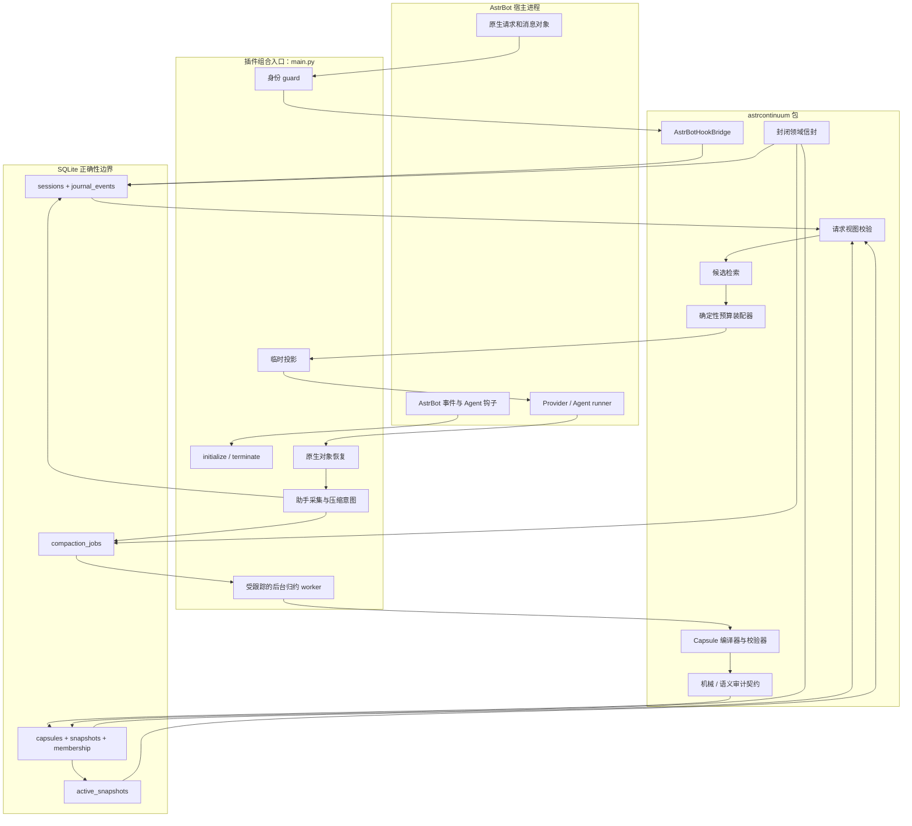
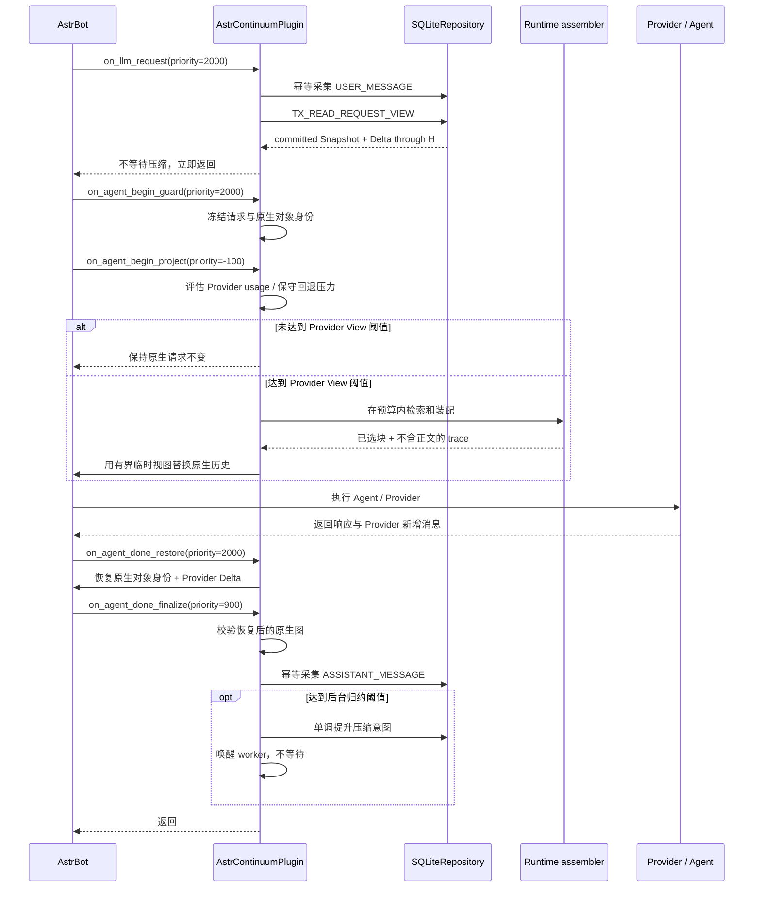

# AstrContinuum 架构

[English](./ARCHITECTURE.md) | 简体中文

本文描述仓库版本 `v0.1.0` 的真实架构、保证安全性的核心不变量，以及“核心已经实现”
与“AstrBot 插件生命周期已经自动启用”之间的边界。

## 1. 范围与成熟度

AstrContinuum 是通过一个 `Star` 组合入口嵌入 AstrBot 的持久化上下文运行时。它的
目标包括：

- 幂等采集权威会话事实；
- 读取一个一致的已提交 Snapshot 及其连续原始 Delta；
- 在显式输入预算下选择并装配上下文；
- 只把 AstrContinuum 自己拥有的临时内容投影到 Provider 请求；
- 在宿主持久化前恢复 AstrBot 原生消息对象图；
- 在后台通道编译并原子发布结构化、经过审计的 Snapshot。

在 `v0.1.0` 中，以上六项都已接入 AstrBot 生命周期。`Star` 会启动唯一持久 worker，
绑定 AstrBot 提供的精确引文式编译后端，在慢模型调用期间续租，并在终止时取消和等待
受跟踪任务。数据库静态加密与 Provider 语义审计适配器仍不属于本预览版。

因此本仓库仍是技术预览版，暂未提交 AstrBot 插件市场。

## 2. 架构目标

### 2.1 在线请求不等待后台压缩

请求路径可以执行有界的本地计算和 SQLite 事务，但不得等待编译器、语义审计器、
后台 worker、远程提取模型或全库扫描。

### 2.2 持久化事实拥有最终权威

正确性来自：

- 只追加的权威事件；
- 封闭的 wire envelope；
- 规范化会话身份；
- SQLite 外键和唯一约束；
- 事务内序号分配；
- 不可变 Capsule 与 Snapshot；
- 带 fencing 的任务状态迁移；
- active pointer compare-and-swap。

进程内锁、队列和任务归属只能作为优化。

### 2.3 压缩必须可审计、可追溯

Snapshot 不是一段自由文本摘要。它是某个连续 Journal 前缀的不可变结构化表示。
模型只能选择事件编号和逐字来源片段；身份、校验、确定性渲染、覆盖、质量指标和发布
全部由程序拥有。

### 2.4 不干扰宿主原生历史

AstrContinuum 可以增强 Provider 本轮看到的上下文，但不能暗中替换或持久化覆盖
AstrBot 原生消息历史。所有注入内容必须标记为临时，并在之后按对象身份移除。

### 2.5 增强失败时让宿主继续

对宿主请求而言，AstrContinuum 是可选增强。兼容性或投影失败不能演变成 AstrBot
停服；但系统也绝不会为了可用性接受持久化损坏、虚假覆盖或部分发布的 Snapshot。

## 3. `v0.1.0` 明确不包含的能力

- 不在 AstrBot 插件市场发布；
- 不提供用户可见的回滚或时间旅行指令；
- 不提供 WebUI 管理页面；
- 不提供 Provider 驱动的语义审计适配器；
- Journal 与 Snapshot 尚未实现静态加密；
- 不宣称 UTF-8 字节计数等价于 Provider tokenizer；
- 不实现平台适配器特定行为，也不声明具体适配器支持；
- 不把外部 Sylanne 记忆正文导入 AstrContinuum 持久记录。

## 4. 系统拓扑



## 5. 分层边界

| 层 | 可以依赖 | 不得拥有 |
| --- | --- | --- |
| `main.py` 组合入口 | AstrBot 公开钩子、隔离探测的内部投影类型、核心适配器 | 领域规则或 SQL |
| `astrcontinuum.adapters` | 领域/运行时/存储端口和窄化的宿主适配 | AstrBot 生命周期注册 |
| `astrcontinuum.runtime` | 领域信封和存储读取契约 | AstrBot 对象或 SQL 事务 |
| `astrcontinuum.compaction` | 封闭领域契约、编译/审计端口 | active pointer 修改权 |
| `astrcontinuum.domain` | 标准库与 Schema 级规则 | AstrBot、SQLite、Provider SDK |
| `astrcontinuum.storage` | 领域契约与 SQLite | Provider 或 AstrBot 行为 |

领域层必须在没有 AstrBot 的环境中独立 import。

## 6. AstrBot 组合入口

### 6.1 初始化

`AstrContinuumPlugin.initialize()` 是幂等的，并由异步锁保护：

1. 如果插件被禁用，只记录生命周期已初始化，不打开存储；
2. 通过 `StarTools.get_data_dir("astrbot_plugin_astrcontinuum")` 获取持久目录；
3. 创建 `SQLiteConnectionFactory`；
4. 在线程中运行幂等迁移；
5. 创建唯一 `SQLiteRepository`；
6. 使用通过校验的预算配置创建 `AstrBotHookBridge`；
7. 创建有界的会话 Provider 注册表和精确引文式编译后端；
8. 创建并启动唯一 `CompactionWorker`；
9. 对 Provider 消息投影能力执行一次探测。

### 6.2 终止

`terminate()` 先取消并等待后台 worker，再在同一生命周期锁下清空 bridge、Provider
注册表和投影能力，并把实例恢复为未初始化。重复调用是安全的。

该方法直接定义在唯一 `Star` 子类中，符合 AstrBot 对插件终止方法的查找行为。

## 7. 请求生命周期



同一请求局部状态存活期间，工具调用与工具结果通过各自的权威钩子采集。

## 8. 钩子归属与顺序

| 钩子 | 优先级 | 写入权威 |
| --- | ---: | --- |
| `on_llm_request` | `2000` | 仅 `USER_MESSAGE` |
| `on_agent_begin_guard` | `2000` | 无 |
| `on_agent_begin_project` | `-100` | 无 |
| `on_agent_done_restore` | `2000` | 无 |
| `on_agent_done_finalize` | `900` | `ASSISTANT_MESSAGE` 与压缩意图 |
| `on_using_llm_tool` | `0` | 仅 `TOOL_CALL` |
| `on_llm_tool_respond` | `0` | 仅 `TOOL_RESULT` |
| `on_llm_response` | `0` | 无 |

guard 在低优先级投影前执行；恢复在最终助手采集前执行。`on_llm_response` 被刻意设计
为只观测，避免一次宿主 completion 变成两个持久助手事件。

## 9. 会话身份

规范 `SessionKey` 包含：

1. `platform_instance_id`
2. `message_type`
3. `session_id`
4. `group_id`
5. `user_id`
6. `conversation_id`
7. `persona_id`

字段顺序固定。规范 JSON 经过 SHA-256 得到物理索引 `session_key_hash`，但持久 wire
envelope 会重建并公开完整 `SessionKey`。

任何一个分量改变都会改变会话身份，防止不同 bot instance、私聊/群聊、用户、
conversation 或 persona 被错误合并。

persona 身份只是元数据；persona 或 Sylanne 的记忆正文不会成为 key，也不会被自动
导入。

## 10. 事件权威与幂等

Journal 只接受四种 event/role/source 组合：

```text
USER_MESSAGE      / USER      / ON_LLM_REQUEST
ASSISTANT_MESSAGE / ASSISTANT / ON_AGENT_DONE
TOOL_CALL         / TOOL      / ON_USING_LLM_TOOL
TOOL_RESULT       / TOOL      / ON_LLM_TOOL_RESPOND
```

对每个回调，适配器使用稳定宿主身份、来源钩子、ordinal 和有界规范工具元数据推导
确定性标识，不使用基于当前时间的 UUID，也不使用 Python 进程局部 hash。

采集事务依次：

1. 校验或 upsert 规范 session；
2. 查询 `(session, source_hook, idempotency_key)`；
3. 重复投递时返回原事件；
4. 否则原子分配下一个会话内 sequence 并插入。

幂等冲突不能额外消耗一个序号。

## 11. 请求视图

`TX_READ_REQUEST_VIEW` 在一个读事务中同时固定 active pointer 和 Journal 高水位 `H`。

如果 active Snapshot 覆盖到事件 `C`，Delta 必须精确为：

```text
C + 1, C + 2, ..., H
```

任何缺口、重复、跨 session 事件、失效成员关系或混合的 Snapshot/Delta 边界都会被
拒绝。

第一次发布前：

- 不存在 `active_snapshots` 行；
- 读取器使用逻辑 `EMPTY_BASE`；
- 逻辑覆盖为 `0`；
- Delta 为 `1..H`；
- 不插入伪造 Snapshot。

## 12. 检索与预算装配

运行时把已提交 Capsule 成员和原始 Delta 事件转换为不可变 `CandidateBlock`。当前
用户事件不会进入候选，因为 AstrBot 已经拥有本轮输入。

预算公式：

```text
B_input = min(target, ceiling, model_limit - reserved_output_and_tools)
B_required = current_input + fixed_host_prefix + safety_margin
B_ac = max(0, B_input - opaque_host_history - B_required)
```

候选选择是确定性的，稳定排序依据：

- runtime slot 优先级；
- 原始事件序号；
- 分数；
- block id；
- block kind 与稳定来源身份。

### 12.1 压力策略

压力以可用容量（模型窗口减去输出/工具预留）计算。优先使用正数的 Provider usage；
拿不到时才保守估算完整原生输入。后台归约和 Provider View 的默认阈值分别为 `0.75`
与 `0.80`，与对话轮数无关。

### 12.2 普通装配

按确定性顺序加入候选，直到投影即将超过 `B_ac`。重复 block id 使用不含正文的原因码
拒绝。

### 12.3 紧急装配

如果普通选择无法放入某个必需块：

- 省略非必需的非原文材料；
- 尽可能保留必需块；
- 原文 slot 保留预算内最长连续近期后缀；
- 持久数据行和覆盖边界保持不变。

装配 trace 记录 id、slot、cost、score、reason、coverage 与总量，但不记录消息正文。

### 12.4 计数限制

插件当前使用 `Utf8ByteTokenCounter`，每个 UTF-8 字节计一个单位。它确定、保守，但
不等于 Provider tokenizer 的精确 Token 数。

## 13. 投影所有权与恢复

投影是系统唯一使用 AstrBot 内部 Provider 消息 API 的地方，并被隔离在能力探测后。
适配器探测：

- `astrbot.core.agent.message.Message`；
- `TextPart`；
- `TextPart.mark_as_temp`。

在硬压力阈值以下，临时消息能力缺失时保持原生请求不变；达到硬压力后，即使不能创建
临时消息，也可以用空投影移除原生历史，同时保留 system 对象和当前输入。

能力可用时：

1. 用 AstrContinuum 装配文本创建 `TextPart`；
2. 标记临时并要求 `_no_save=True`；
3. 包装为 user `Message`；
4. 给 message 标记 `_no_save=True`；
5. 只把这个新对象追加到 Agent 消息列表。

投影前，guard 记录：

- request identity；
- 开头 system 对象身份；
- 精确 current-user 对象身份；
- 全部原生 history 对象身份。

Provider 执行后，`restore()` 重建精确原生图，只保留 Provider 新增 Delta。
`verify_native()` 校验的是对象身份，而不是值相等或序列化内容。

因此临时上下文不会成为永久消息，也不会替换其他插件拥有的对象。

## 14. 持久化存储

### 14.1 表

| 表 | 核心不变量 |
| --- | --- |
| `sessions` | 规范身份与 next sequence 一致 |
| `journal_events` | 只追加、会话内连续、来源投递幂等 |
| `capsules` | 不可变、封闭信封、同 session 来源 |
| `snapshots` | 某个已提交前缀的不可变表示 |
| `snapshot_capsules` | 权威有序成员关系 |
| `active_snapshots` | 每 session 至多一个 active pointer |
| `compaction_jobs` | 持久意图与带 fencing 的状态机 |

每个字段和约束见 [DATABASE_SCHEMA.md](./DATABASE_SCHEMA.md)。

### 14.2 读取可见性

读取器只通过 `active_snapshots` 解析 Snapshot。worker 局部候选信封不是可读 Snapshot。
已提交 Snapshot、新 Capsule、有序 membership、active pointer 更新和 job 完成构成
同一个发布结果。

### 14.3 发布 savepoint

`TX_PUBLISH_SNAPSHOT` 打开内层 savepoint：

1. 校验 fence、身份、覆盖、锚点、成员关系和审计结果；
2. 插入新不可变 Capsule；
3. 插入 committed-form Snapshot；
4. 插入有序 membership；
5. 执行 bootstrap-create 或 existing-pointer CAS；
6. 标记 job committed。

如果 Snapshot 前缀唯一约束或 pointer CAS 输掉竞争，内层 savepoint 回滚，不能留下
任何候选 Capsule、membership 或 Snapshot。带 fence 的外层事务记录 `SUPERSEDED`，
并把更高的持久意图保留为后续任务。

## 15. 压缩通道

持久任务状态：

```text
PENDING
  -> LEASED
  -> COMPILING
  -> AUDITING（可选语义分支）
  -> READY_TO_COMMIT
  -> COMMITTED
```

其他终态/重试态：

```text
RETRY_WAIT
FAILED
SUPERSEDED
CANCELLED
```

机械校验永久强制，不能关闭。`strict_audit=false` 最多只能跳过未来的 Provider 语义
审计，不能绕过身份、来源、覆盖、精确锚点、成员关系、非空输出或审计信封校验。

### 15.1 已实现运行时

- 持久化、单调合并的压缩意图；
- 可领取任务与 lease-epoch fencing；
- 编译器与结构化 Capsule 类型；
- 机械候选校验；
- 可选语义审计协议与证据；
- Snapshot/Capsule/membership 原子发布；
- 重试/失败状态迁移；
- 过期 lease 恢复；
- 周期持久 claim loop 与非阻塞唤醒；
- 模型调用期间续租；
- 每个 job 按冻结 base/target 精确读取；
- 有界脱敏重试与失败隔离；
- 插件启动时跟踪、终止时取消并等待 worker。

### 15.2 编译器信任边界

只有运维者显式选择时，配置的归约 Provider 才会覆盖当前对话 Provider；否则按会话
记住当前 Provider。进程重启后，pending job 会等该会话再次出现，而不是悄悄选择另一
个数据接收方。

Provider 接收带角色标签的确定性事件分段和封闭 JSON 结构，只能确认事件编号并选择
逐字片段。未知编号、缺失确认、额外字段或不在声明来源事件中的文本都会拒绝该分段。
Capsule/claim 标识、回退锚点、渲染、机械校验和发布均由程序负责。本预览版仍未给可选
语义审计协议绑定 Provider。

## 16. 并发模型

### 16.1 事件并发

会话内 sequence 分配与插入在一个写事务中完成。唯一约束同时防止重复回调写入和
sequence 冲突。

### 16.2 任务 fencing

每次成功 claim 都会增加 `lease_epoch`。所有 worker 修改必须匹配：

- `lease_owner`；
- `lease_epoch`；
- 当前合法状态；
- 必要时尚未过期的 lease。

过期 worker 可以继续在内存里计算，但下一次数据库修改必须影响零行。

### 16.3 并发发布

两个 worker 可能基于同一 base 竞争。只有一个能推进 active pointer。失败者进入
`SUPERSEDED`，不能留下孤儿候选内容；如果持久意图仍高于胜者覆盖，还必须创建后续
任务。

## 17. 失败与降级语义

| 失败 | 行为 |
| --- | --- |
| event extra API 缺失 | 本轮跳过 AstrContinuum 状态 |
| 初始化/存储失败 | 记录脱敏 `INITIALIZE_FAILED`，宿主请求继续 |
| 硬压力以下投影能力缺失 | 不修改 Provider 消息列表 |
| 硬压力下装配/投影不可用 | 用空 Provider View 移除原生历史 |
| 投影边界非法 | 记录不含正文的适配错误，跳过投影 |
| 必需输入超过预算 | 保留有界近期后缀，持久数据不变 |
| 恢复/校验失败 | 记录脱敏不变量码，不宣称原生恢复通过 |
| compiler/auditor worker 失败 | 持久化 stage/code/脱敏 message，重试或终止该 job |
| 发布竞争 | 回滚候选 savepoint，持久化 `SUPERSEDED` |
| 存储写失败 | 不伪造 Journal 成功或 Snapshot 覆盖 |

降级通过稳定错误码和持久状态可观测，而不是把消息正文写进日志。

## 18. 隐私与信任边界

AstrContinuum 会存储完整用户与助手内容，因为这些记录构成本地权威 Journal。运维者
必须相应保护插件数据目录。
`v0.1.0` 的 SQLite 数据库没有静态加密；这是明确的预览限制，不是安全承诺。

工具元数据会限制：

- 对象深度；
- 集合长度；
- 字符串长度；
- 总 UTF-8 字节数。

系统不会持久化任意对象 `repr`。过大值会变为类型化或截断元数据。

外部 Sylanne 记忆未来可以提供临时检索信号，但其正文不能成为 Journal event、
Capsule 来源或稳定哈希输入。

## 19. 兼容边界

绝大多数接入只使用 `astrbot.api.*`。唯一内部例外是 Provider 消息投影，它被封装在
能力探测和 fail-open 行为之后。

同一个已提交归档已通过以下真实 `PluginManager` 生命周期探针：

- AstrBot `4.24.0`；
- AstrBot `4.24.2`；
- AstrBot `4.26.7`；
- Python `3.12.13`。

探针验证
`data.plugins.astrbot_plugin_astrcontinuum.main` 模块加载、handler 优先级、初始化、
两轮对话、工具调用/结果、Provider-only 投影、精确原生身份恢复、Journal 顺序与
终止。

AstrBot `4.24.0` 会产生上游 `StarMetadata.pages` 回退警告，但插件生命周期和行为
仍通过。

## 20. 演进约束

任何改变架构的 PR 都必须回答：

1. 哪个持久不变量发生变化？
2. 是否改变封闭 wire schema？
3. 是否需要自动 SQLite migration？
4. 旧 Journal/Snapshot 是否仍能 round-trip？
5. 在线路径是否仍有界、非阻塞？
6. 临时 Provider 内容是否仍能按身份移除？
7. 每个写边界发生进程崩溃后会怎样？
8. 改动后真实加载了哪些 AstrBot 版本？

任何削弱只追加权威、连续 Delta、机械校验、发布原子性、fencing 或精确恢复的修改，
都必须新增显式 ADR。

## 21. 相关文档

- [DATA_FLOW.md](./DATA_FLOW.md)
- [DATABASE_SCHEMA.md](./DATABASE_SCHEMA.md)
- [CONCURRENCY_STATE_MACHINE.md](./CONCURRENCY_STATE_MACHINE.md)
- [CONTEXT_MODEL.md](./CONTEXT_MODEL.md)
- [COMPACTION_PROTOCOL.md](./COMPACTION_PROTOCOL.md)
- [TEST_MATRIX.md](./TEST_MATRIX.md)
- [ADR-001-NONBLOCKING.md](./ADR-001-NONBLOCKING.md)
- [ADR-006-ASTRBOT-HOOK-OWNERSHIP.md](./ADR-006-ASTRBOT-HOOK-OWNERSHIP.md)
- [ADR-007-V1-CAPSULE-PERSISTENCE.md](./ADR-007-V1-CAPSULE-PERSISTENCE.md)
