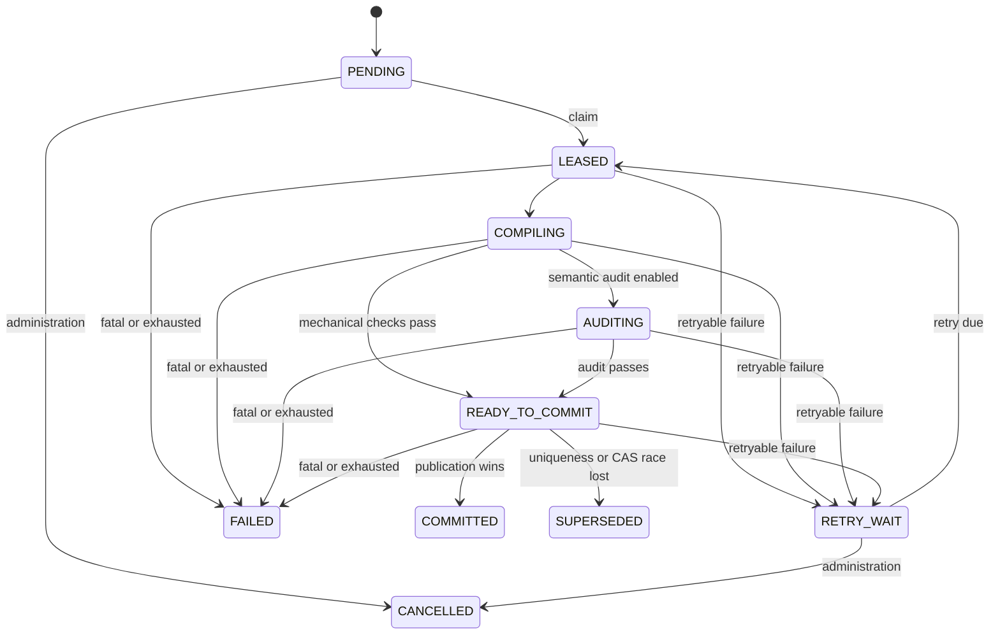

# Non-blocking compaction protocol

English | [简体中文](./COMPACTION_PROTOCOL.zh-CN.md)

This protocol describes the implemented compaction core at `v0.1.0`. The AstrBot `Star`
lifecycle persists compaction intent but does not yet start the background worker. The protocol
is therefore durable and testable without being automatically active in an installed plugin.

## 1. Safety objective

Compaction may fail, retry, lose a race, or stop with the process without blocking a live
request and without exposing candidate content. The active committed Snapshot remains valid
until a newer candidate passes permanent validation and wins atomic publication. Compaction
never deletes raw Journal events.

## 2. Durable state machine



Expired working states recover to `PENDING`. Recovery clears the lease but does not decrease
its fencing epoch, mutate Journal rows, or change the active pointer. An expired
`READY_TO_COMMIT` job also drops its candidate identifier so the next worker recompiles.

## 3. Intent, claims, and fencing

Each session has at most one actionable job. Raising intent never lowers its requested
high-water mark and coalesces duplicate/lower notifications. A worker claim freezes:

- the committed base Snapshot and pointer version;
- target high-water mark;
- lease owner and expiry;
- monotonically increasing fencing epoch;
- incremented attempt.

Every working-state update includes owner and epoch in its predicate. A stale or expired worker
changes zero durable rows. An in-process lock is only an optimization; the database fence is
authoritative.

The frozen compile interval is:

```text
active/logical coverage + 1 .. target high-water
```

Gaps, overlaps, stale bases, and coverage beyond the frozen target are rejected. If newer intent
remains after `COMMITTED` or `SUPERSEDED`, follow-up `PENDING` work starts from the winning
active pointer.

## 4. Candidate pipeline

The worker reads one committed base plus contiguous Delta and:

1. segments bounded evidence;
2. compiles immutable structured Capsules;
3. verifies identity, coverage, provenance, dependencies, exact anchors, and closed envelopes;
4. optionally runs semantic loss audit;
5. creates a candidate Snapshot covering exactly the frozen target;
6. enters `READY_TO_COMMIT` only after mandatory checks pass.

Disabling optional semantic audit never disables structural, identity, coverage, exact-anchor,
non-empty, or permanent publication validation.

## 5. Atomic publication

Candidate content is published under a savepoint inside the fenced outer transaction:

1. re-read the active pointer and base version;
2. insert new immutable Capsules;
3. insert the committed-form Snapshot;
4. insert ordered Snapshot/Capsule membership;
5. compare-and-swap the active pointer;
6. mark the job `COMMITTED`, clear the lease, and commit.

If Snapshot uniqueness or pointer CAS loses a race, the savepoint rolls back every candidate
Capsule, membership row, and Snapshot. The outer transaction may persist `SUPERSEDED`, retain
the candidate id for diagnosis, clear the lease, and schedule newer intent from the winning
pointer.

Readers therefore observe either the complete old committed view or the complete new committed
view, never partial candidate state.

## 6. Failure classes

- **Retryable:** transient SQLite contention or bounded compiler/auditor/callback failure.
  Persist a redacted error tuple and backoff in `RETRY_WAIT`.
- **Fatal:** invalid closed envelope, impossible identity/coverage, policy rejection, or
  exhausted attempts. Persist `FAILED`.
- **Superseded:** another valid publisher wins uniqueness or active-pointer CAS. This is a race
  outcome, not data corruption.
- **Crash/lease expiry:** startup recovery returns work to `PENDING`; committed data is
  unchanged.

Diagnostics contain a stage, code, and redacted message. Conversation content and arbitrary
provider object representations are forbidden.

## 7. Separation from live requests

`on_llm_request` reads only committed state and captured high-water `H`; it never waits for a
job. New events continue into the Delta during compilation. Emergency assembly may shrink the
request view but cannot mutate Journal, Snapshot, coverage, or job state.

## 8. Current activation boundary

The repository contains the state machine, scheduler primitives, compiler/validator/auditor
pipeline, SQLite repository, publication savepoint, and recovery tests. It does not yet contain
a `Star`-owned task loop that claims jobs and supplies a production compiler/auditor.

Startup, bounded cancellation, provider selection, backpressure, and operational telemetry must
be wired and verified before automatic compaction can be claimed.

See [Concurrency state machine](./CONCURRENCY_STATE_MACHINE.md),
[Database schema](./DATABASE_SCHEMA.md), and [Test matrix](./TEST_MATRIX.md).
