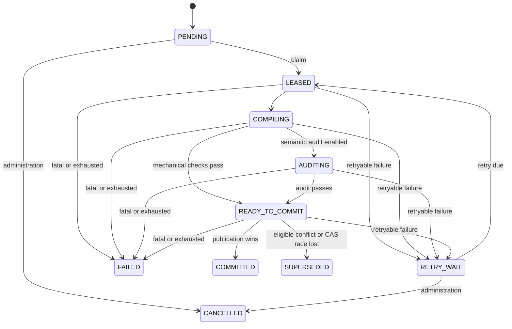

# Non-blocking compaction protocol

English | [简体中文](./COMPACTION_PROTOCOL.zh-CN.md)

This document describes the `v0.3.0` Technical Preview. It retains the active `v0.2.1`
compaction lane and adds a durable, opt-in reorganization ledger at the repository publication
boundary. The ordinary Provider-bound/default AstrBot path leaves
`reorganization_token_budget` unset and publishes an empty ledger. A separately opt-in injected
compiler backend may set an explicit budget, reorganize a candidate, and persist records in the
fenced synthetic Gate A validation path; it is not a Provider or production integration claim.

## 1. Safety objective

Compaction may fail, retry, lose a race, or stop with the process without blocking a live request
or exposing candidate content. The active committed Snapshot remains valid until a newer candidate
passes permanent validation and wins atomic publication. Compaction never deletes raw Journal
events.

## 2. Durable state machine



Expired working states recover to `PENDING`. Recovery clears the lease but does not decrease its
fencing epoch, mutate Journal rows, or change the active pointer. An expired `READY_TO_COMMIT` job
also drops its candidate identifier so the next worker recompiles.

## 3. Intent, claims, and fencing

Each session has at most one actionable job. Raising intent never lowers its requested high-water
mark and coalesces duplicate or lower notifications. A worker claim freezes:

- the committed base Snapshot and pointer version;
- target high-water mark;
- lease owner and expiry;
- monotonically increasing fencing epoch; and
- incremented attempt.

Every working-state update includes owner and epoch in its predicate. A stale or expired worker
changes zero durable rows. An in-process lock is only an optimization; the database fence is
authoritative.

The frozen compile interval is:

```text
active/logical coverage + 1 .. target high-water
```

Gaps, overlaps, stale bases, and coverage beyond the frozen target are rejected. If newer intent
remains after `COMMITTED` or `SUPERSEDED`, follow-up `PENDING` work starts from the winning active
pointer.

## 4. Candidate pipeline

The worker reads one committed base plus contiguous Delta and:

1. processes at most one bounded, stable-order batch of missing `canonical-o200k-v1` metrics;
2. reads the expected active Snapshot, contiguous Delta ending at the frozen target, and the
   required canonical Event metrics;
3. segments bounded role-labelled evidence;
4. asks the selected provider for event ids and exact source spans only;
5. rejects missing acknowledgements, extra fields, unknown ids, and non-verbatim text;
6. compiles immutable structured Capsules and renders them deterministically;
7. verifies identity, coverage, provenance, dependencies, exact anchors, closed envelopes, and
   canonical metric completeness;
8. optionally runs semantic loss audit;
9. creates a candidate Snapshot covering exactly the frozen target; and
10. enters `READY_TO_COMMIT` only after mandatory checks pass.

Missing or unavailable canonical metrics defer the job without consuming an ordinary failure
attempt. Disabling optional semantic audit never disables structural, identity, coverage,
exact-anchor, non-empty, canonical-metric, or permanent publication validation.

The `v0.3.0` repository API can additionally accept ordered reorganization records from an
explicit publisher. It canonicalizes them before publication; a non-`narrative_summary`
`released` record adds `QUALITY_COVERAGE_GAP` and blocks publication even when
`strict_audit=false`. The ordinary Provider-bound/default AstrBot path does not set the
reorganization budget and therefore does not invoke this path. An injected compiler backend may
set it in fenced synthetic Gate A validation; that narrow path does not claim reorganization
coverage for ordinary background work.

## 5. Atomic publication

Candidate content is published under a savepoint inside the fenced outer transaction:

1. re-read the active pointer and base version;
2. insert new immutable Capsules;
3. insert the committed-form Snapshot;
4. insert ordered Snapshot/Capsule membership;
5. insert ordered reorganization-ledger records only when an explicit publisher supplied them;
6. write the canonical metrics for every new Capsule and the Snapshot, deleting matching
   backfill intents; and
7. compare-and-swap the active pointer, mark the job `COMMITTED`, clear the lease, and commit.

Readers therefore observe either the complete old committed view or the complete new committed
view, never partial candidate state. The ledger reader accepts only committed Snapshots; candidate
or rolled-back rows are not visible.

The existing `SUPERSEDED` classifier is deliberately narrow: eligible Capsule, Snapshot, or
membership insert conflicts and active-pointer CAS loss roll the savepoint back. Ledger-write
integrity failures are not relabelled as `SUPERSEDED`; they propagate and roll back the outer
transaction. Canonical-metric failures likewise cannot publish a partial candidate. No failure
moves the active pointer.

## 6. Failure classes

- **Retryable:** transient SQLite contention or bounded compiler, auditor, or callback failure.
  Persist a redacted error tuple and back off in `RETRY_WAIT`.
- **Metric deferral:** missing or unavailable canonical metrics leave or preserve content-free
  backfill work and defer compilation without substituting an incompatible unit system.
- **Fatal:** invalid closed envelope, impossible identity or coverage, policy rejection, or
  exhausted attempts. Persist `FAILED`.
- **Superseded:** another valid publisher wins an eligible uniqueness conflict or active-pointer
  CAS. This is a race outcome, not data corruption.
- **Crash or lease expiry:** startup recovery returns work to `PENDING`; committed data is
  unchanged.

Diagnostics contain a stage, code, and redacted message. Conversation content and arbitrary
provider object representations are forbidden.

## 7. Separation from live requests

`on_llm_request` reads only committed state and captured high-water `H`; it never waits for a
job. New events continue into the Delta during compilation. Emergency assembly may shrink the
request view but cannot mutate Journal, Snapshot, coverage, job state, canonical metrics, or the
reorganization ledger.

## 8. Current activation boundary

The installed preview includes the `Star`-owned claim loop, frozen compaction reads, lease
renewal, bounded cancellation, provider selection, offline tokenizer profiles with request-level
BYTE fallback, encrypted canonical-token sidecars and bounded backfill, redacted retry, atomic
publication, and content-free status/inspection telemetry.

The provider-backed semantic-audit adapter remains unbound. The ordinary Provider-bound/default
AstrBot path continues to publish empty ledger tuples. A separate injected compiler backend can
use `reorganize_capsules()` with an explicit budget in fenced synthetic Gate A validation before
the same durable publication boundary. This Technical Preview is not a public `v1.0`
compatibility, Provider-coverage, semantic-quality, performance, or end-user-release claim.

See [Data flow](./DATA_FLOW.md), [Concurrency state machine](./CONCURRENCY_STATE_MACHINE.md),
[Database schema](./DATABASE_SCHEMA.md), [reorganization-ledger ADR](./ADR-008-REORGANIZATION-LEDGER.md),
and [test matrix](./TEST_MATRIX.md).
