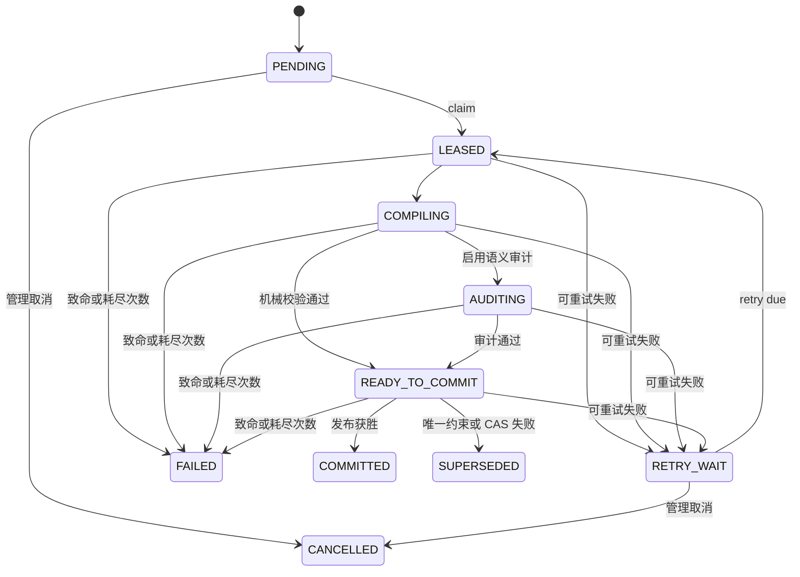

# 非阻塞压缩协议

[English](./COMPACTION_PROTOCOL.md) | 简体中文

本文描述 `v0.1.0` 已实现的压缩核心。AstrBot `Star` 生命周期会保存压缩意图，但尚未启动
后台 worker，因此协议已具备持久化实现和测试，却不会在安装插件后自动执行。

## 1. 安全目标

压缩可以失败、重试、竞争落败或随进程退出，但不能阻塞在线请求，也不能让候选内容提前可见。
只有新候选通过永久校验并赢得原子发布后，活动 Snapshot 才能变化；Journal 原始事件永不因
压缩而删除。

## 2. 持久状态机



过期工作态恢复到 `PENDING`。恢复会清除租约，但不能降低 fencing epoch、修改 Journal 或
活动指针；过期 `READY_TO_COMMIT` 还要清除 candidate id，让下一 worker 重新编译。

## 3. 意图、领取与 fencing

每个会话最多保留一个可执行任务。提高意图不能降低目标高水位，重复或更低通知会合并。领取
任务时冻结：

- 已提交 base Snapshot 与指针版本；
- 目标高水位；
- 租约 owner 与 expiry；
- 单调增长的 fencing epoch；
- 自增 attempt。

之后每次工作态更新都用 owner+epoch 作条件；过期 worker 必须更新零行。进程锁只是优化，
数据库 fence 才是权威。

冻结编译区间是：

```text
活动/逻辑覆盖 + 1 .. 目标高水位
```

缺口、重叠、过期 base 或超目标覆盖都必须拒绝。如果 `COMMITTED` 或 `SUPERSEDED` 后仍有
更新意图，后续 `PENDING` 从获胜活动指针继续。

## 4. 候选流水线

worker 读取一个已提交 base 加连续 Delta，然后：

1. 切分有界证据；
2. 编译不可变结构化 Capsule；
3. 校验身份、覆盖、来源、依赖、精确锚点与闭合 envelope；
4. 可选执行语义损失审计；
5. 构造恰好覆盖冻结 target 的候选 Snapshot；
6. 所有强制校验通过后才能进入 `READY_TO_COMMIT`。

关闭可选语义审计，也不能跳过结构、身份、覆盖、精确锚点、非空或永久发布校验。

## 5. 原子发布

候选内容在带 fence 的外层事务内通过 savepoint 发布：

1. 重读活动指针/base version；
2. 写入新 Capsule；
3. 写入 committed 形态 Snapshot；
4. 写入有序 membership；
5. CAS 更新活动指针；
6. 将 job 标记 `COMMITTED`、清除租约并提交。

若 Snapshot 唯一约束或指针 CAS 竞争失败，savepoint 会回滚所有候选 Capsule、membership
与 Snapshot。外层事务可以持久化 `SUPERSEDED`、保留 candidate id、清除租约，并从获胜
指针调度更新意图。

读者只能看到完整旧视图或完整新视图，不能看到半成品候选。

## 6. 失败分类

- **可重试：** SQLite 暂时争用，或有界编译/审计/回调异常；写脱敏错误并进入
  `RETRY_WAIT`。
- **致命：** 闭合 envelope、身份/覆盖、策略校验失败或重试耗尽；进入 `FAILED`。
- **竞争落败：** 另一发布者赢得唯一约束或 CAS；进入 `SUPERSEDED`，这不是数据损坏。
- **崩溃/租约过期：** 启动恢复回到 `PENDING`，已提交数据不变。

诊断只允许阶段、代码和脱敏消息，不能保存会话内容或任意 Provider 对象表示。

## 7. 与在线请求隔离

`on_llm_request` 只读取已提交状态和冻结高水位 `H`，永不等待 job。worker 编译时，新事件
继续进入 Delta。紧急装配可以缩短请求视图，但不能修改 Journal、Snapshot、覆盖或 job。

## 8. 当前启用边界

仓库已经包含状态机、调度原语、编译/校验/审计流水线、SQLite Repository、发布 savepoint
和恢复测试，但尚无由 `Star` 管理、能领取 job 并提供生产编译器/审计器的任务循环。

必须补齐并验证启动、有界取消、Provider 选择、背压和运维遥测，之后才能宣称自动压缩已启用。

参见[并发状态机](./CONCURRENCY_STATE_MACHINE.md)、[数据库 Schema](./DATABASE_SCHEMA.md)
和[测试矩阵](./TEST_MATRIX.md)。
