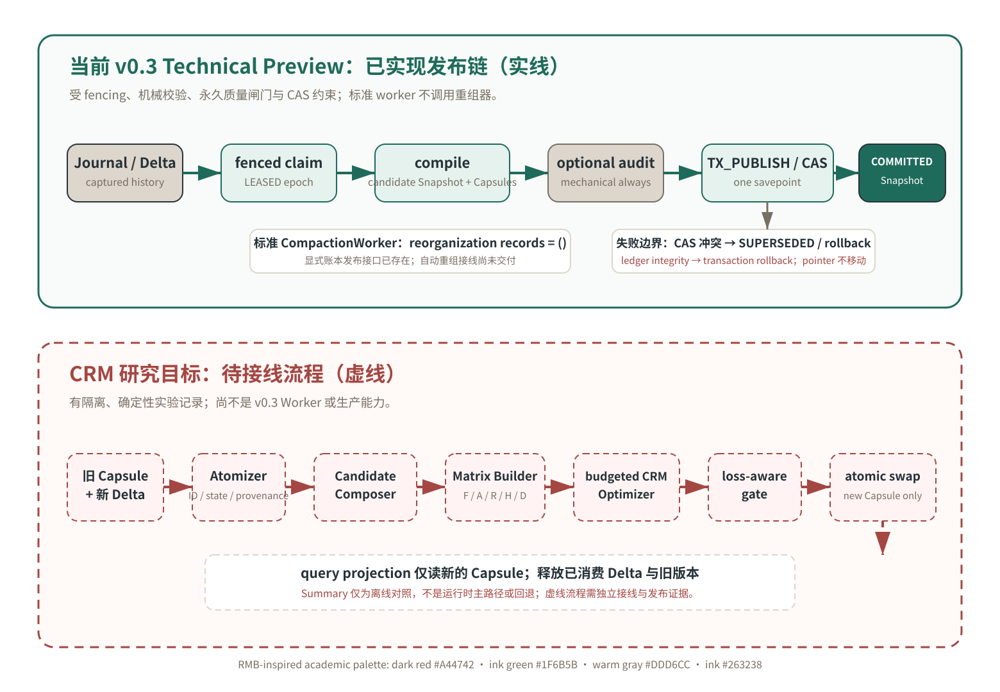

# v0.3 工作流与研究路径

[English](WORKFLOW.md) | 简体中文

## 图例

- **实线墨绿：** 由当前 v0.3.0 契约实现并约束的常规 Provider 绑定／默认 AstrBot 发布链。
- **暖灰说明框：** 窄范围、可选的注入式／围栏 Gate A 验证通道。它只有在显式预算下才可重组候选；
  这是合成证据，不是 Provider 或生产能力。
- **虚线暗红：** 更广的 CRM 研究目标链。Gate A 并未把其完整路径接入常规运行时，也不能证明
  端到端质量。
- **暖灰：** 账本、质量与失败边界。它们约束状态迁移，不能被可选语义审计设置绕过。

图采用暗红 #A44742、墨绿 #1F6B5B、暖灰 #DDD6CC 与墨色 #263238 的学术配色；
不包含货币符号、面额或价格意象。

## 当前 v0.3.0：已交付发布链

1. 已捕获的 Journal / Delta 工作先获取带 fencing 的 job claim；请求路径不会等待
   编译、审计或远端模型。
2. 编译器从 frozen high-water mark 出发，生成候选 Capsule 与 Snapshot。
3. 可选语义审计只决定候选是否经过 AUDITING；机械校验、fence 和永久质量闸门
   始终执行。
4. TX_PUBLISH_SNAPSHOT 在同一 savepoint 内写入 Capsule、Snapshot、membership、
   显式提供的账本记录，并执行 active-pointer CAS。
5. 候选 Snapshot 会在 CAS 之前以 COMMITTED 插入；只有 CAS 成功且外层事务提交
   后才变为 active/read-visible。CAS 冲突会回滚候选行并返回 SUPERSEDED；账本
   完整性错误会传播并回滚事务，且不会移动 active pointer。

常规 Provider 绑定／默认 AstrBot 路径不设置 `reorganization_token_budget`，并传入空的重组
记录元组。图中的 ledger 对该常规路径仍是已实现的**显式发布接口**。

可选的注入式／围栏 Gate A 路径可设置显式预算、调用 `reorganize_capsules()`、重建候选，
并通过同一永久校验与 CAS 边界持久化规范账本记录。它的合成回执只说明接线，不是 Provider 接入、
语义质量结果、对比 Summary 的结论或生产声明。

## CRM：虚线研究目标链

研究路径从旧 Capsule 和新 Delta 开始：

Atomizer → Candidate Composer → Matrix Builder (F/A/R/H/D) → budgeted CRM
Optimizer → loss-aware gate → atomic swap → query projection。

每一阶段都必须保留 ID、状态、时间、极性和来源。受控释放必须通过 loss-aware gate。
目标 swap 只让 query projection 读取新 Capsule，并释放已消费的 Delta / 旧材料。
Summary 只能用于离线比较，不能作为运行时主路径或降级回退。

这条虚线路径仍需要其更广的方法契约、常规 Provider 运行时接入、获准的端到端评测和发布证据，
才能成为生产能力。

## 相关页面

- [证据与溯源](EVIDENCE.zh-CN.md)
- [评测场景、指标与阈值](EVALUATION.zh-CN.md)
- [规范性数据流细节](DATA_FLOW.zh-CN.md)
- [账本发布契约](ADR-008-REORGANIZATION-LEDGER.zh-CN.md)
