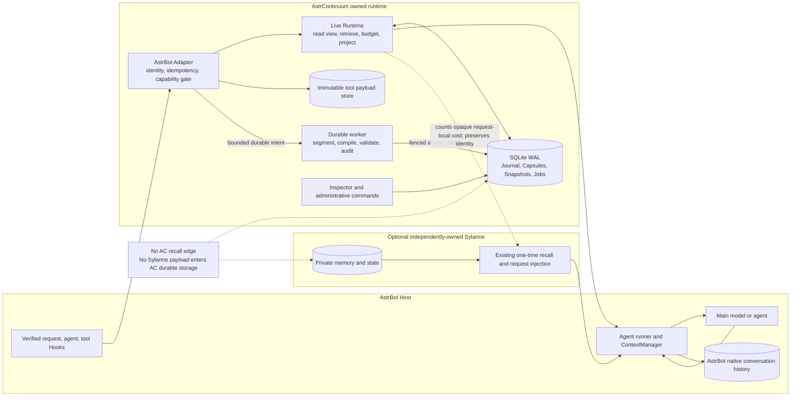
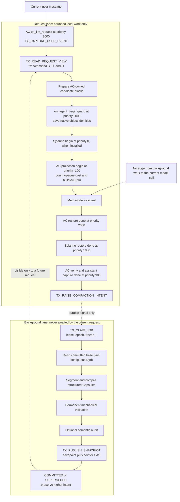

# AstrContinuum v1.0.0 Design

Status: approved implementation direction

Date: 2026-07-26

Target: `astrbot_plugin_astrcontinuum` public release `v1.0.0`

## 1. Product Definition

AstrContinuum is a Context Runtime and Context Compiler for AstrBot. It compiles an
unbounded, immutable conversation event stream into the smallest sufficient context for
one model call while preserving recovery, provenance, and continuity.

It is not a chat summarizer. A narrative summary is only one navigation field inside a
structured Capsule. The durable product is:

```text
immutable Journal
+ structured multi-resolution Capsules
+ versioned committed Snapshots
+ uncompacted raw Delta
+ query-aware reconstruction
+ exact anchors and source links
+ a reversible provider projection
```

The public release is `v1.0.0`. The implementation waves in this document are internal
delivery gates, not public `0.x` versions.

### 1.1 Operating modes

| Mode | Contract |
| --- | --- |
| Standalone | AstrContinuum owns its Journal, compiler, retrieval, budget, projection, and recovery. No Sylanne symbol or data is required. |
| Sylanne-enhanced | Sylanne performs its existing memory recall and injection exactly once. AstrContinuum runs afterward, treats the injected material as opaque request-local budget occupancy, and adds working-context continuity without recalling or storing Sylanne memory. |

The enhanced mode is composition, not dependency. Disabling or uninstalling Sylanne
must reduce the system to the standalone result without migration or data repair.

### 1.2 Sylanne boundary

AstrContinuum must not:

- call a Sylanne recall or retrieve method;
- import or query Sylanne private memory storage;
- copy Sylanne-injected text into Journal events, Capsules, Snapshots, logs, traces, crash
  evidence, or stable content hashes;
- modify Sylanne lifecycle, ranking, privacy, or persistence;
- rely on a private Sylanne symbol to load.

AstrContinuum may observe the final provider message layout after all request hooks have
run, count the token cost of non-owned message objects ephemerally, preserve those
objects by identity, and fit its own projection into the remaining budget. It does not
interpret or retain their semantics.

## 2. Evidence and Authority

Requirements are resolved in this order:

1. the Master Prompt and the user's explicit follow-up decisions;
2. verified AstrBot source for the supported versions;
3. startup-package Schemas and tests;
4. 2718lab DevKit rules;
5. other repository prose.

The input repository index is snapshot
`sha256:5a396918e1c172236227c03b89ac331b31b9fd2445a793f0abec390e2d4f23c9`.
The lease-scoped input query receipt is
`sha256:3460a4821531cd80812d9b49dd393b29c438285455b6e081bfbe80e6d9e29e3c`.
The pre-write checkpoint is
`sha256:1b706afe26663fd112f272192568eff8210bfb656b6b3b38af3a66c9639833dc`.

Verified AstrBot observations cover `v4.24.2`, `v4.24.5`, and `v4.26.7`. Compatibility
outside this matrix is not implied.

## 3. Repository Reconnaissance and Gap Analysis

The starter has useful concepts and eight passing unit tests, but it is an in-memory
scaffold. It is not yet an installable, crash-recoverable Context Runtime.

| Area | Starter state | v1 required state |
| --- | --- | --- |
| Journal | In-memory event store and process-local sequence | SQLite append-only events, transactional sequence allocation, idempotency uniqueness |
| Snapshot | In-memory pointer | Immutable committed rows, active-pointer CAS, rollback-safe publication |
| Capsule | Schema uses old `session_id`; no durable table | Full `session_key`, closed structured envelope, immutable `capsules`, ordered `snapshot_capsules` |
| Scheduler | Process queue can lose notifications | Durable intent, leases, fencing epochs, retry, recovery |
| Compiler | Stub drops the base Snapshot | Complete base plus contiguous Delta, structured output, permanent validation |
| Assembler | `len(text) // 4` estimate; no hard proof | Replaceable TokenCounter, hard budget, emergency mode, slot trace |
| AstrBot | Request Hook is an empty scaffold; commands return dictionaries | Verified Hooks, reversible provider projection, yielded commands, idempotent lifecycle |
| Sylanne | Adapter suggests a second retrieve call | No recall edge; opaque post-injection budgeting and nested reversible restoration |
| Tool results | No durable large-payload contract | Immutable payload reference, digest, preview, recoverable missing-payload behavior |
| Verification | Unit-only scaffold tests | SQLite concurrency, crash recovery, real AstrBot compatibility, standalone and enhanced E2E |

The current `capsule.schema.json`, `DATABASE_SCHEMA.md`, and Master Prompt conflict. The
Master Prompt requires explicit goals, constraints, progress, open loops, preferences,
entities, emotional context, decisions, dependencies, exact anchors, time, quality, and
version information. The old Schema collapses most of these into `claims`, remains open
to unknown fields, uses only `session_id`, and has no persistence tables. Wave 1 resolves
that conflict before runtime code is written.

## 4. System Architecture



The Journal is the durable substrate for both execution lanes. It is not a third worker
lane and never gets rewritten by compaction.

## 5. Request and Background Lanes



`on_llm_request` may perform short local SQLite transactions and bounded local CPU work.
It may not wait for compiler, auditor, scheduler completion, a remote model, or an
unbounded scan.

## 6. Reversible AstrBot Projection

Directly replacing `ProviderRequest.contexts` is forbidden. AstrBot converts it into
`run_context.messages` and later saves that list back to the conversation database. A
compacted request would therefore overwrite native history.

The provider-only projection is nested around Sylanne's existing projection:

```mermaid
sequenceDiagram
  autonumber
  participant H as AstrBot
  participant A as AstrContinuum
  participant S as Sylanne optional
  participant R as Agent run_context
  participant M as Main model
  participant D as AC SQLite

  H->>A: on_llm_request priority 2000
  A->>D: idempotent user capture and committed read view
  D-->>A: Snapshot S plus raw Dread
  A-->>H: prepared AC-owned candidate blocks; no history mutation

  H->>S: Sylanne request injection priority 0
  Note over S: Existing recall occurs once and remains Sylanne-owned

  H->>A: on_agent_begin guard priority 2000
  A->>A: record native list, request, system, and current-turn identities
  H->>S: on_agent_begin priority 0
  S->>R: N becomes S(N)
  H->>A: projection begin priority -100
  A->>R: S(N) becomes A(S(N)); preserve opaque Sylanne/system/current objects

  H->>M: invoke with A(S(N))
  M-->>R: append current-turn result Delta

  H->>A: restore done priority 2000
  A->>R: restore S(N) plus Delta
  H->>S: restore done priority 1000
  S->>R: restore N plus Delta
  H->>A: verify and capture done priority 900
  A->>D: idempotent assistant capture
  H->>H: save native N plus Delta
```

The restoration equation is:

```text
N -> S(N) -> A(S(N)) -> A(S(N)) + Delta
  -> S(N) + Delta -> N + Delta -> host save
```

Let `P_A` be AstrContinuum's provider projection and `R_A` its restoration. For the
original native prefix `N` and a new suffix `Delta`:

```text
R_A(P_A(X) + Delta) = X + Delta
```

The identity guard makes this conditional. Restoration is permitted only when:

```text
same_request
and same_message_list
and same_preserved_system_objects
and same_preserved_current_turn_objects
and projected_prefix_matches_transaction
```

If any predicate fails, AstrContinuum must not guess. It records a redacted compatibility
fault, disables enhanced projection for that request, and allows the verified native path
to continue. AstrContinuum uses its own namespaced event-extra transaction and never
reads or writes Sylanne's transaction key.

## 7. Durable Identity and Event Method

### 7.1 Session identity

The ordered identity tuple is:

```text
K = (
  platform_instance_id,
  message_type,
  session_id,
  group_id,
  user_id,
  conversation_id,
  persona_id
)
```

The lookup key is:

```text
canonical = canonical_json(K)
session_key_hash = SHA256(UTF8(canonical))
```

Canonical JSON uses the exact field order above, UTF-8, no insignificant whitespace,
and explicit null for nullable fields. Null and an empty string are different. A non-null
component must be non-empty.

### 7.2 Idempotent event capture

The authoritative idempotency tuple is:

```text
Ue = (session_key_hash, source_hook, idempotency_key)
```

`TX_CAPTURE_*` first resolves `Ue`. An exact duplicate returns the existing event without
allocating a sequence. Reusing `Ue` with a different payload or event mapping is an
idempotency conflict, not success.

Per-session sequence allocation is inside the same write transaction:

```text
sequence = sessions.next_event_sequence
sessions.next_event_sequence = sequence + 1
insert journal_event(sequence)
```

Rollback must restore both counter and event insertion, so a crash cannot burn a sequence
or create a coverage gap.

Only four mappings are valid:

| Event | Role | Sole source Hook |
| --- | --- | --- |
| `USER_MESSAGE` | `USER` | `ON_LLM_REQUEST` |
| `ASSISTANT_MESSAGE` | `ASSISTANT` | `ON_AGENT_DONE` |
| `TOOL_CALL` | `TOOL` | `ON_USING_LLM_TOOL` |
| `TOOL_RESULT` | `TOOL` | `ON_LLM_TOOL_RESPOND` |

`ON_LLM_RESPONSE` is observational and never writes the Journal.

## 8. Request View and Coverage Method

For one session, define:

- `S`: active committed Snapshot, or logical `EMPTY_BASE`;
- `C`: `S.covered_event_end`, or `0` for `EMPTY_BASE`;
- `H`: maximum committed Journal sequence fixed inside the read transaction;
- `Dread`: the ordered uncovered request Delta.

```text
Dread = ordered { e | C < sequence(e) <= H }
View = S + Dread
```

The no-gap invariant is:

```text
[1, C] union { sequence(e) | e in Dread } = [1, H]
```

`TX_READ_REQUEST_VIEW` reads the active pointer, pointed committed Snapshot, `H`, and
`Dread` in one SQLite read transaction. It cannot expose a candidate, fabricate a
Snapshot for bootstrap, include an event above `H`, or repeat an event at or below `C`.

Emergency prompt trimming never changes Journal rows or `C`.

## 9. Capsule and Snapshot Method

### 9.1 Multi-resolution Capsule

Capsules are immutable structured records. Each uses the full `session_key`, not a lone
`session_id`, and contains:

- identity: `capsule_id`, `session_key`, `level`, version, creation time;
- coverage: inclusive event start/end and source event ids;
- typed semantics: goals, constraints, progress, open loops, preferences, emotional
  context, decisions, and entities;
- exact anchors with exact text and source ids;
- dependencies and supersession relationships;
- navigation-only `narrative_summary`;
- token cost and mechanical quality metrics.

The levels are `micro`, `episode`, `task`, and `global`. A Snapshot contains an ordered
membership relation to Capsules; it is not a single rendered summary.

The minimum persistence model is:

```text
capsules(capsule_id, session_key_hash, level, covered_start, covered_end,
         canonical_capsule_json, token_cost, source_coverage, created_at)

snapshot_capsules(snapshot_id, ordinal, capsule_id, slot)
```

`snapshot_capsules` has primary key `(snapshot_id, ordinal)` and uniqueness on
`(snapshot_id, capsule_id)`. Publication verifies same-session membership, valid
coverage, existing source events, and anchor consistency.

### 9.2 Candidate input and coverage

For a claimed target `T`, compaction input is:

```text
Djob = ordered { e | C < sequence(e) <= T }
```

It must satisfy:

```text
T > C
T <= observed_job_high_water
len(Djob) = T - C
first(Djob) = C + 1
last(Djob) = T
sequence[i + 1] = sequence[i] + 1
```

The compiler consumes the complete base Snapshot and every event in `Djob`. A candidate
is publishable only when:

```text
candidate.covered_event_end
= candidate.source_high_water_mark
= job.target_high_water_mark
= T
```

Dropping prior active semantics, required anchors, or any middle event is a permanent
mechanical failure.

## 10. Query-Aware Reconstruction Method

The retriever works over AC-owned Capsule fields, source links, exact anchors, and raw
Delta. It never queries Sylanne.

For candidate block `b` and current query `q`:

```text
score(b, q) =
    w_sem  * semantic_relevance
  + w_lex  * normalized_lexical_or_BM25
  + w_dep  * active_dependency_match
  + w_ent  * entity_match
  + w_time * temporal_reference_match
  + w_loop * unresolved_loop_match
  + w_ref  * explicit_reference_signal
  + w_imp  * importance
  + w_rec  * exp(-age / half_life)
  - w_red  * redundancy
```

Weights are configuration, not hidden truth, and require golden tests. FTS5/BM25 is the
first local lexical implementation. If FTS5 or semantic retrieval is unavailable, the
fallback is bounded exact-anchor, entity, active-dependency, and lexical matching. The
fallback must not collapse to `narrative_summary` alone.

When a decision is selected, reconstruction also selects its definition, rationale,
dependencies, superseded alternatives, and rejection reason. This is required for
references such as "the second option", "the rejected one", and "continue the unfinished
work".

## 11. Token Budget Method

The request input ceiling is:

```text
B_input = min(
  target_input_budget,
  hard_input_ceiling,
  model_context_limit - reserved_output_and_tools
)
```

After Sylanne has performed its existing injection, AstrContinuum counts preserved
non-owned message objects ephemerally as `B_opaque`. It does not store their text or
semantic features. Let `B_required` include current input, fixed host/system material,
and safety margin:

```text
B_AC = max(0, B_input - B_opaque - B_required)
```

AstrContinuum fills `B_AC` in this order:

1. active goals and hard constraints;
2. raw uncompacted Delta;
3. exact anchors;
4. recent raw turns;
5. active task Capsules;
6. query-relevant evidence;
7. episode and global background.

The assembler is a deterministic pure function over immutable input blocks and a
`TokenCounter` port. It emits both projected content and an `AssemblyTrace` containing
slot costs, selected source ids, rejection reasons, budget mode, and total cost.

If required material exceeds `B_input`, emergency assembly keeps fixed rules, current
input, active state, critical constraints, exact anchors, and the most recent raw suffix.
It changes only the provider projection. It never advances Snapshot coverage.

Until a verified host/model tokenizer is available, estimates are conservative and use a
replaceable counter with safety margin. `len(text) // 4` is prohibited as a hard ceiling,
especially for Chinese.

## 12. Durable Job Runtime Method

### 12.1 Trigger coalescing

Let `I` be durable intent and `H_trigger` the triggering Journal high-water:

```text
I_next = max(I_current, H_trigger)
```

A trigger never changes the active attempt's frozen `T`. It only records later work.

### 12.2 Lease fencing

Every successful claim performs:

```text
lease_epoch_next = lease_epoch_current + 1
attempt_count_next = attempt_count_current + 1
T = I_current
```

A worker mutation is valid only under fence:

```text
F = matching job_id
and matching lease_owner
and matching lease_epoch
and allowed current state
and unexpired lease when required
```

Zero affected rows means stale ownership. The stale worker cannot publish, fail, renew,
or clear newer state.

### 12.3 State machine

```mermaid
stateDiagram-v2
  [*] --> PENDING
  PENDING --> LEASED: eligible claim / epoch++, attempt++, freeze T
  RETRY_WAIT --> LEASED: retry due / new epoch
  LEASED --> COMPILING: fenced start
  COMPILING --> AUDITING: mechanical pass and semantic audit enabled
  COMPILING --> READY_TO_COMMIT: mechanical pass and audit disabled
  AUDITING --> READY_TO_COMMIT: semantic pass

  state publish <<choice>>
  READY_TO_COMMIT --> publish: fenced atomic publish
  publish --> COMMITTED: insert and pointer CAS win
  publish --> SUPERSEDED: same-prefix uniqueness or pointer CAS loses

  LEASED --> RETRY_WAIT: retryable failure
  COMPILING --> RETRY_WAIT: retryable failure
  AUDITING --> RETRY_WAIT: retryable failure
  READY_TO_COMMIT --> RETRY_WAIT: retryable pre-publish failure

  LEASED --> FAILED: fatal or exhausted
  COMPILING --> FAILED: fatal or exhausted
  AUDITING --> FAILED: fatal or exhausted
  READY_TO_COMMIT --> FAILED: fatal or exhausted

  LEASED --> PENDING: expired lease recovery
  COMPILING --> PENDING: expired lease recovery
  AUDITING --> PENDING: expired lease recovery
  READY_TO_COMMIT --> PENDING: expired; clear candidate id

  PENDING --> CANCELLED: explicit administration
  RETRY_WAIT --> CANCELLED: explicit administration

  COMMITTED --> [*]
  SUPERSEDED --> [*]
  FAILED --> [*]
  CANCELLED --> [*]
```



Retry delay is deterministic under injected clock and RNG:

```text
delay_n = min(cap, base * 2^(attempt - 1)) + jitter
```

One job exception is caught at the scheduler iteration boundary, persisted, and cannot
terminate the loop for other sessions.

## 13. Mechanical Validator and Loss Auditor

Permanent mechanical checks are never configurable off:

- closed Schema and identity consistency;
- contiguous coverage and exact target equality;
- non-empty compiler output;
- valid source event ids for active claims;
- preservation of required exact anchors;
- prior active semantics and valid supersession;
- token ceiling;
- lease fence and pointer CAS preconditions.

Metrics are:

```text
source_coverage = valid_sourced_active_claims / active_claims
anchor_recall = preserved_required_anchors / required_anchors
coverage_gap = count(missing sequence positions in [C + 1, T])
```

Publication requires:

```text
source_coverage = 1
anchor_recall = 1
coverage_gap = 0
unsupported_critical_claims = 0
```

Optional model-based semantic audit may detect contradictions or unsupported additions.
`strict_audit=false` skips only that remote/model stage. It never skips mechanical rules.

## 14. Atomic Publication Method

`TX_PUBLISH_SNAPSHOT` uses an outer transaction and inner savepoint:

1. validate fence and permanent candidate rules;
2. create savepoint;
3. insert new immutable Capsules and Snapshot membership;
4. insert the committed Snapshot;
5. execute bootstrap or existing-pointer CAS;
6. on success, mark job `COMMITTED`, clear lease, release savepoint, process higher
   intent, and commit;
7. on same-prefix uniqueness or pointer conflict, roll back to savepoint so candidate
   Capsules, membership, and Snapshot disappear, mark job `SUPERSEDED`, retain candidate
   id as evidence, clear lease, process higher intent against the winner, and commit.

Bootstrap CAS is:

```text
base_snapshot_id is null
and base_pointer_version = 0
and active pointer absent
=> insert pointer(candidate_snapshot_id, version = 1)
```

Existing CAS is:

```text
active.snapshot_id = base_snapshot_id
and active.pointer_version = base_pointer_version
and T > active.covered_event_end
=> pointer = (candidate_snapshot_id, base_pointer_version + 1)
```

After either terminal branch, let `W` be the winning active Snapshot:

```text
if intent_target_high_water_mark > W.covered_event_end:
    create_or_fold_pending_work(base = W, target = intent)
```

Successful pointer coverage is strictly monotonic:

```text
C_(n + 1) > C_n
```

## 15. Stable Transaction Inventory

| Transaction | Method and atomic responsibility |
| --- | --- |
| `TX_CAPTURE_USER_EVENT` | Validate/upsert session, idempotency check, sequence allocation, mapped user append |
| `TX_CAPTURE_ASSISTANT_EVENT` | Same primitive for authoritative assistant completion |
| `TX_CAPTURE_TOOL_EVENT` | Same primitive for tool call/result with immutable payload reference when large |
| `TX_READ_REQUEST_VIEW` | One consistent active Snapshot, Journal high-water, and ordered raw Delta |
| `TX_RAISE_COMPACTION_INTENT` | Monotonic max-fold of desired target without changing an active attempt |
| `TX_CLAIM_JOB` | Eligible selection, fencing increment, attempt increment, frozen target, lease |
| `TX_FAIL_JOB` | Fenced redacted error, retry or terminal transition, lease clear |
| `TX_PUBLISH_SNAPSHOT` | Fenced Capsule/Snapshot insert, pointer CAS, terminal job state, higher-intent follow-up |
| `TX_RECOVER_EXPIRED_LEASES` | Requeue expired work, preserve epoch, clear invalid worker-local candidate identity |

Lease renewal and ordinary fenced state transitions are repository-private atomic
statements under the same fence `F`; they do not add ambiguous public transaction names.

## 16. Module Contracts

| Module | Primary method | Input -> output | Formula or invariant | Failure behavior |
| --- | --- | --- | --- | --- |
| `domain/identity.py` | `SessionKey.canonical_json()` | seven host identity fields -> canonical identity/hash | `SHA256(UTF8(canonical_json(K)))` | Reject missing/empty required components; never merge sessions |
| `domain/events.py` | `EventEnvelope.create()` | authoritative Hook payload -> closed Event | four valid event/role/Hook mappings | Fail capture explicitly; optional projection still fails open for host |
| `storage/sqlite.py` | connection/transaction factory | data directory -> WAL connections | FK on; bounded busy timeout; short request writes | Host request continues without AC enhancement; no fabricated write |
| `storage/repository.py` | nine named transactions | envelopes/jobs -> durable rows/views | idempotency, contiguous sequence, fencing, CAS | Roll back atomically; persist safe job error where fence permits |
| `runtime/read_view.py` | `read_request_view()` | session -> committed S, C, H, Dread | `[1,C] union Dread = [1,H]` | Use native host request if durable view unavailable |
| `runtime/retrieval.py` | `select_candidates()` | query plus AC-owned graph -> ranked blocks | hybrid configurable score | Bounded exact/lexical/dependency fallback |
| `runtime/budget.py` | `assemble()` | blocks plus opaque cost -> projection/trace | `B_AC=max(0,B_input-B_opaque-B_required)` | Emergency assembly; never change coverage |
| `runtime/projection.py` | `project()` / `restore()` | run context plus prepared view -> reversible provider view | `R_A(P_A(X)+Delta)=X+Delta` | Identity mismatch disables projection; never write projected history |
| `compaction/segmenter.py` | `segment()` | contiguous events -> semantic episode boundaries | boundaries preserve event order and coverage | Fall back to bounded deterministic chunking |
| `compaction/compiler.py` | `compile()` | base Snapshot plus full Djob -> Capsules/Snapshot candidate | `covered=source_H=T`; base semantics retained | Retry/fail job; old committed view remains active |
| `compaction/validator.py` | `validate_permanent()` | candidate plus source -> report | source/anchor/coverage all exact | Reject candidate unconditionally |
| `compaction/auditor.py` | `audit_semantic()` | mechanically valid candidate -> optional report | no unsupported critical claims | Retry or reject according to configured policy |
| `compaction/worker.py` | `run_iteration()` | ready durable job -> terminal/retry state | every mutation fenced by owner/epoch | Catch per-job exception; scheduler remains alive |
| `storage/tool_payloads.py` | `put_immutable()` | large tool output -> digest/reference/preview | content-addressed immutable bytes | Record missing payload state; never call a preview complete data |
| `observability/inspector.py` | status/trace/snapshot methods | session/query -> redacted inspection DTO | `queue_lag=max(0,intent-active_coverage)` | Commands remain available in degraded read-only mode |
| `main.py` | lifecycle and Hook wiring | AstrBot Context/config -> composed services | one Star class; idempotent initialize/terminate | Cancel and await all tasks; close handles; no `__del__` |

## 17. Tool Payload Method

Large tool results are written once to the plugin data directory using content addressing:

```text
payload_digest = SHA256(payload_bytes)
payload_id = opaque_id(session_key_hash, source_event_identity, payload_digest)
```

The Journal stores a closed reference with payload id, digest, byte length, media type,
bounded preview, and availability state. Exact path/URL/code arguments that affect later
reasoning remain anchors. Missing bytes during reconstruction produce an explicit
`PAYLOAD_UNAVAILABLE` evidence block, not a false complete preview.

## 18. Observability and Administration

The v1 command surface is:

```text
/context status
/context trace
/context snapshots
/context anchors
/context audit
/context rebuild
/context pause
/context resume
/context pin
/context unpin
```

Commands use AstrBot `yield event.plain_result(...)`. Dangerous rebuild/rollback actions
require administrator permission and explicit confirmation. Status includes active
Snapshot, coverage, Delta count/tokens, raw and assembled tokens, compression ratio,
queue lag, worker state, audit result, projection mode, and slot budget. Traces redact
message content by default and expose source ids rather than Sylanne payloads.

## 19. Standalone and Sylanne-Enhanced Acceptance

Standalone acceptance:

```text
Sylanne imports required = 0
Sylanne calls made = 0
all core E2E scenarios pass with Sylanne absent
```

Enhanced acceptance defines AC-owned context `A` and Sylanne's already-injected,
privacy-cleared request context `P`:

```text
AC_initiated_Sylanne_recall = 0
exact_duplicate_injected = 0
AC_owned_durable_rows_containing_P = 0
privacy_violations = 0
ComplementarityGain = U(A union P) - max(U(A), U(P)) > 0
```

`U` is measured by a fixed evaluation suite covering current-task continuation, old
decision recovery, persona/life-memory relevance, exact anchors, and contradiction rate.
The gain is not a marketing assertion; it must be demonstrated against AC-only and
Sylanne-only baselines.

## 20. Failure and Recovery Matrix

| Failure | Request behavior | Durable behavior | Recovery |
| --- | --- | --- | --- |
| Compiler/provider timeout | Continue with committed S plus raw Delta | Job to `RETRY_WAIT` under fence | Exponential backoff with injected clock/RNG |
| Worker process loss | Current requests unaffected | Lease expires; no candidate becomes active | `TX_RECOVER_EXPIRED_LEASES` requeues |
| DB busy on optional read/projection | Continue native host request | No coverage or fabricated capture | Redacted fault; later request retries |
| Capture transaction failure | Continue host request without AC guarantee | Counter/event both roll back | Operator-visible degraded state |
| FTS/semantic index failure | Exact-anchor and lexical fallback | Committed content unchanged | Rebuild index from Journal/Capsules |
| Mechanical audit failure | Old Snapshot plus raw Delta | Candidate never publishes | Persist job error; retry only if retryable |
| Pointer race | Winner remains active | Loser `SUPERSEDED`; candidate rows rolled back | Higher intent scheduled against winner |
| Projection identity mismatch | Disable AC projection for request | Native history remains authoritative | Capability/version fault visible |
| Sylanne absent/fails | Standalone AC projection | No Sylanne state touched | Automatic next-request retry by Sylanne itself |
| Snapshot corruption | Skip enhanced view | Never advance coverage from corrupt data | Rebuild from immutable Journal |

## 21. Verification Strategy

Every production behavior follows observed RED -> minimal GREEN -> refactor. A RED result
must fail for the missing behavior, not for a typo or missing test dependency.

Required layers:

- pure contract, identity, validator, retrieval, and budget tests;
- real SQLite multi-connection integration tests;
- crash injection at capture, claim, fail, Capsule/Snapshot insert, pointer CAS, job
  commit, and follow-up scheduling boundaries;
- AstrBot load and Hook tests on `4.24.2`, `4.24.5`, and `4.26.7`;
- standalone and Sylanne-enhanced end-to-end tests;
- one-million-token synthetic history, 30-second compiler delay, killed worker, decision
  supersession, exact-anchor, and privacy scans;
- DevKit plugin validation, lint, type checking, full pytest, and release checks.

The hard acceptance metrics are:

```text
request waits for compaction = 0
conversation usable after compaction failure = 100%
critical anchor recall = 100%
coverage gaps = 0
unsupported critical claims = 0
projected history bytes persisted by AstrBot = 0
```

Performance targets are measured rather than assumed:

```text
critical constraint recall >= 99%
active task recovery >= 98%
exact entity recall >= 99%
stale decision pollution <= 1%
long-history token reduction >= 75%
local assembler added latency P95 < 100 ms
```

The correct guarantee is `storage-lossless`, `source-verifiable`, and `behaviorally
near-lossless`, not mathematically lossless semantics.

## 22. Delivery Waves to v1.0.0

| Wave | Deliverable | Exit gate |
| --- | --- | --- |
| 1 | Contract and Schema freeze | Capsule conflict resolved; closed Schemas; docs/tests synchronized |
| 2 | SQLite Journal, Capsule, Snapshot, Job runtime | Concurrency and crash-recovery suites pass |
| 3 | Standalone read/retrieval/budget runtime and reversible AstrBot projection | Native history byte-for-byte preserved on real AstrBot matrix |
| 4 | Segmenter, compiler, permanent validator, optional auditor, FTS reconstruction | Decision, anchor, source, and no-gap evaluations pass |
| 5 | Tool payloads, Inspector, admin controls, lifecycle and migration | Feature-complete commands and reload/recovery tests pass |
| 6 | Million-token, latency, killed-worker, Sylanne-enhanced, packaging and market checks | All v1 acceptance evidence green; only then set release metadata to `v1.0.0` |

No wave changes public version metadata. `metadata.yaml`, changelog, tag, and release
artifact become `v1.0.0` only after Wave 6 passes.

## 23. First Patch Scope

The first implementation patch is deliberately contract-only:

- replace old Capsule `session_id` with full `session_key`;
- close every Capsule and nested object;
- materialize all Master Prompt semantic fields and required provenance;
- add immutable `capsules` and ordered `snapshot_capsules` persistence contracts;
- specify Capsule/Snapshot atomic publication and CAS rollback;
- synchronize ADR, context model, data flow, database, state machine, and test matrix;
- add failing contract tests first, then make those tests green.

It does not edit `main.py`, implement SQLite, change release metadata, or claim runtime
completion.

## 24. Risk Register

| Risk | Severity | Mitigation and release gate |
| --- | --- | --- |
| AstrBot changes runner/save order | Critical | Capability and version gate; real matrix tests; fail open without projection |
| Projected history leaks into native DB | Critical | Nested identity transaction; byte-level post-save assertions on normal/tool/stream/cancel paths |
| Capsule becomes narrative-only | Critical | Closed structured Schema, immutable Capsule table, membership FK, source/anchor audit |
| Stale worker publishes | Critical | Owner/epoch/expiry fence on every mutation and crash tests |
| Capsule/Snapshot CAS leaves orphans | Critical | Same savepoint for candidate Capsules, membership, Snapshot; conflict rollback tests |
| Sylanne private content enters AC storage | Critical | No recall/API edge; ephemeral opaque accounting; DB/file/log/hash privacy scans |
| RFC 3339 text compares incorrectly | High | Canonical fixed-width UTC physical representation or integer epoch; contract test before repository implementation |
| Cross-session pointer or Capsule membership | High | Composite identity validation/FK or trigger plus permanent validator |
| Chinese token undercount | High | Replaceable conservative counter, safety margin, model-specific calibration |
| SQLite write contention harms request P95 | High | WAL, short transactions, bounded busy timeout, one-write capture, benchmarks |
| Compiler invents or drops meaning | High | source links, anchor recall 1, base-semantic retention, optional semantic audit |
| Third-party runner lacks save contract | High | Disable reversible projection for unverified runners; standalone native fallback |
| "Infinite" is interpreted literally | Medium | Publish measured operational limits and near-lossless guarantee language |

This design freezes behavior and boundaries. Exact internal AstrBot message constructors
remain adapter-local and must be taken from the verified source for each supported
version during the projection implementation wave.
